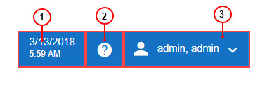
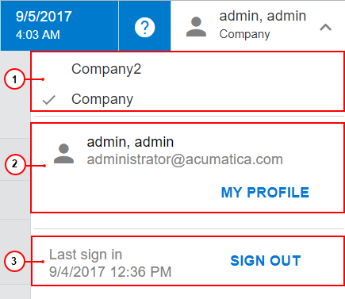

# Info Area {#_0efe709b-e7ea-442a-9027-d091745fae6b .concept}

The info area, in the right corner of the top pane on the Self-Service Portal screen in the user interface, includes a group of menus and buttons, as shown in the screenshot below. These menus and buttons communicate the status of your user account in the system and provide access to certain settings.

1.  Business date and time
2.  Help button
3.  User menu button

You can find more details about these items in the following sections.

## Business Date and Time {#section_t4t_43r_f3 .section}

Business date is used as the default date on Self-Service Portal forms and on documents that you create by using the forms. Business date and time, which you can see in the Info area, is specified in an Acumatica ERP instance to which Self-Service Portal is connected. You cannot change the business date and time on Self-Service Portal.

## Help Button { .section}

By clicking the Help button, you can open the Help menu, which overlaps the working area. The content of this menu depends on the item displayed in the working area when you click this button. For a detailed description of Help capabilities in Self-Service Portal, see [Help](SP__con_New_UI_Help.md).

## User Menu {#section_i3t_q3r_f3 .section}

The User menu button displays your first and last name \(last name first, with the names separated by a comma\) and the name of the company to which you signed in if multiple companies are configured in your Self-Service Portal instance. The following screenshot shows the items of the User menu.

The User menu includes the following sections:

1.  Companies
2.  My Profile
3.  Sign-In

The Companies section of the User menu contains the list of companies to which you can sign in if multiple companies are configured in your Self-Service Portal instance. The company you are currently signed in to is indicated with a check mark. You can switch to a different company by clicking the company name.

The My Profile section contains your username, your email address, and the **My Profile** button, which you click to open the [User Profile](SP_40_80_45.md) \(SP408045\) form. For more information about the settings of your profile, see [Managing Your User Profile](SP__mng_Your_User_Account.md).

The Sign-In section contains the date and time of your last sign-in to the system and the **Sign Out** button, which you click to sign out of the system.

**Parent topic:**[Self-Service Portal User Interface](../Portal/SP__con_Modern_UI.md)

