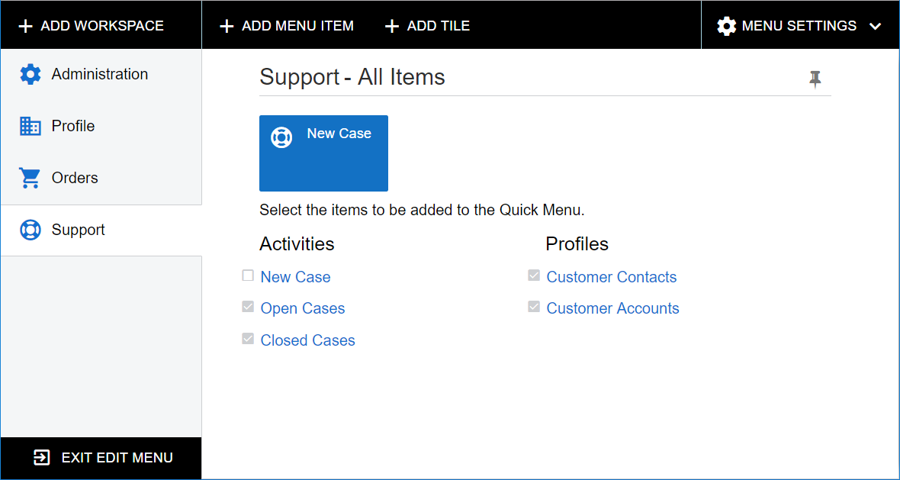
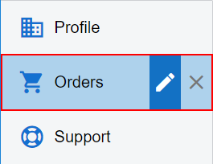

# Menu Editing Mode {#_e86ec3aa-e139-4975-9838-c5f082f3b77a .concept}

In the user interface of the Self-Service Portal, you open Menu Editing mode \(see the following screenshot\) by clicking the **Edit Menu** menu command on the configuration menu of the main menu. The **Edit Menu** menu command is available only to a user with the *Administrator* or *Portal Admin* role. In this mode, you can customize menu items for the whole system. For details, see **Customizing the User Interface** in the Acumatica ERP System Administration Guide.

The buttons that appear in Menu Editing mode are described in the following table.

|Button|Description|
|------|-----------|
|**Add Workspace**|Opens the [Table 6](#_95a29654-c27a-415c-a116-6beda47256a7) with the boxes blank so you can specify these parameters and add a workspace to the UI.|
|**Add Menu Item**|Opens the [Table 7](#_83c24440-34dd-4567-a7a1-201cc7f70437) for the selected workspace.

 The button is available when you first select a workspace in Menu Editing mode.

|
|**Add Tile**|Opens the [Table 8](#_f6ab99cf-b748-4ce2-988a-7d475512d12d) with the boxes blank so you can specify these parameters and add a tile to the selected workspace.

 The button is available when you first select a workspace in Menu Editing mode.

|
|**Menu Settings**|Opens the [Table 9](#_e5355f70-b167-4349-95ba-889544be7340) menu.|
|**Exit Menu Editing Mode**|Saves your changes and exits Menu Editing mode.|

## Editing and Deletion of Menu Items { .section}

In Menu Editing mode, you can delete or edit the properties of the following items: workspace, category, link to a form, and tile. When you point at an item, the toolbar pops up with the Edit and Delete buttons \(see the following screenshot, which shows the toolbar for the workspace title\).

In the following tables, you can find descriptions of the pop-up toolbars for each item type.

|Button|Description|
|------|-----------|
|Edit|Opens the [Table 6](#_95a29654-c27a-415c-a116-6beda47256a7), which displays the parameters of the workspace.|
|Delete|Deletes the workspace and the tiles that belong to the workspace from the system. The forms that belong to the workspace remain in the system.|

|Button|Description|
|------|-----------|
|Edit|Opens the [Table 10](#_8a42e596-1d63-4385-a6a7-ac30e302213b), which displays the parameters of the category.|
|Delete|Deletes the category from the system. The menu items under this category are moved to the **Other** category in each workspace.|

|Button|Description|
|------|-----------|
|Edit|Opens the [Table 11](#_650195f1-7d5b-495b-a9f8-9b2b190df004), which displays the parameters of the form. Changes to the form parameters are visible in all the workspaces to which the form belongs.|
|Delete|Deletes the link to the form from the current workspace. The form remains in the system.|

|Button|Description|
|------|-----------|
|Edit|Opens the [Table 8](#_f6ab99cf-b748-4ce2-988a-7d475512d12d), which displays the parameters of the tile.|
|Delete|Deletes the tile from the system. You cannot restore the tile after it is deleted.|

## Dialog Boxes of Menu Editing Mode { .section}

In this section, you will find descriptions of all dialog boxes that you can open by using the buttons of Menu Editing mode.

|Element|Description|
|-------|-----------|
|**Icon**|The icon that is displayed to the left of the workspace title. You can select an icon from the predefined list.|
|**Area**|The area under which the workspace is displayed on the **More Items** menu of the main menu. You can select an area from the predefined list.|
|**Title**|The title of the workspace. The title of the workspace should be unique among the workspaces in the system. If you type an existing title, the system displays a warning and does not create or update the workspace.|
|The dialog box contains the following buttons.|
|**OK**|Saves your changes and closes the dialog box.|
|**Cancel**|Closes the dialog box without saving your changes.|

|Button|Description|
|------|-----------|
|**Add**|Adds to the workspace links to the forms you have selected.|
|**Add &amp; Close**|Adds to the workspace links to the forms you have selected and closes the dialog box.|
|**Cancel**|Closes the dialog box without adding links to the selected forms to the workspace.|

|Element|Description|
|-------|-----------|
|**Icon**|The icon that is displayed on the tile button. You can select an icon from the predefined list.|
|**Title**|The title of the tile. The title of the tile should be unique among the tiles in the system. If you type an existing title, the system displays a warning and does not create or update the tile.|
|**Form**|The Self-Service Portal form that is opened when a user clicks the tile. You can select a form from the predefined list. When you are selecting a form, you can type the first characters of the form ID or title, and the system filters the list by these characters.|
|**Parameters**|The form-specific parameters of the address line that the system adds to the form link when a user clicks the tile.|
|The dialog box contains the following buttons.|
|**OK**|Saves your changes to the parameters of the tile and closes the dialog box.|
|**Cancel**|Closes the dialog box without saving your changes to the parameters of the tile.|

|Button|Description|
|------|-----------|
|**Reset to Default Menu Settings**|Resets the settings of the whole menu \(the main menu items and the workspace items\) to the default settings.|
|**Add Category**|Opens the [Table 10](#_8a42e596-1d63-4385-a6a7-ac30e302213b) with blank boxes.|

|Element|Description|
|-------|-----------|
|**Title**|The title of the category. The title of the category should be unique within the categories defined in the system. If you type an existing title, the system displays a warning and does not create or update the category.|
|The dialog box contains the following buttons.|
|**OK**|Saves your changes and closes the dialog box.|
|**Cancel**|Closes the dialog box without saving your changes.|

|Element|Description|
|-------|-----------|
|**Category**|The category under which the form is displayed in the workspace.|
|**Title**|The title of the form. You can specify a unique title, or you can specify a form title that exists in the system because forms are identified by their IDs, not titles.|
|The dialog box contains the following buttons.|
|**OK**|Saves your changes and closes the dialog box.|
|**Cancel**|Closes the dialog box without saving your changes.|

**Parent topic:**[Self-Service Portal User Interface](../Portal/SP__con_Modern_UI.md)

