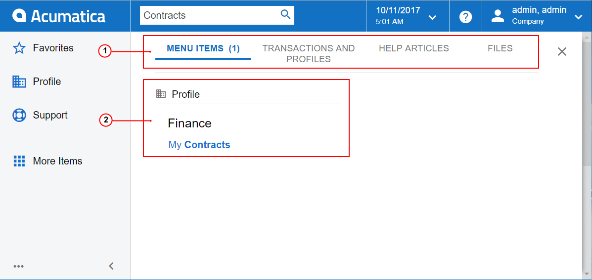

# Search {#_0d443ea0-8938-436d-bf9e-578902062b52 .concept}

By searching in the Self-Service Portal, you can quickly open a form \(or a record on a form\), find a file, or find a help topic. This topic contains information on performing searches in the Self-Service Portal.

## Search Form { .section}

To begin a search, you type a text string in the **Search** box. The system opens the Search form in the working area, on top of the page \(such as a dashboard or a form\) that was opened when you started your search. The form is shown in the following screenshot.

1.  Search filter tabs
2.  Search results

You can look through the search results on the Search form and go back to the page you had opened before you performed the search. For example, you can start to enter data on some Self-Service Portal form, search for some information, and then go back to the form and continue to enter data because your previous changes have been preserved.

## Search Filter Tabs { .section}

By default, the search in the Self-Service Portal is performed in form titles. You can switch to one of the search filter tabs to change the scope of the search. The following tabs are available:

-   **Menu Items**: On this tab, you can scan for specific forms by name or ID.
-   **Transactions and Profiles**: On this tab, you can look for specific system records, such as customers, vendors, prospects, employee accounts, and notes attached to records.
-   **Help and Support**: This tab lists search results in all guides and help topics. When you click a link to a Help topic, the topic is opened in a separate tab of a browser. If you want to open the Help topic over the working area, you should press Ctrl and click the link.
-   **Files**: On this tab, you can view files attached to system records.

When you type a text string in the **Search** box and switch between the search filter tabs, your text string is preserved, and search results are automatically displayed for this text string.

## Search Results { .section}

In Self-Service Portal, an intelligent search is implemented. The system performs a flexible search, considering all possible forms of the text string that you have entered in the **Search** box, and then lists the search results from the most relevant to the least relevant.

The system narrows the search results based on the access rights of the user who performs the search. If you don't have permissive access rights to particular data \(such as contracts\), these objects do not appear in the search results, even though they match the search criteria. Your access rights to file attachments are determined by your rights to the entities to which the files are attached.

Search results displayed on the **Transactions and Profiles** tab prioritizes records of the following entity types:

|Entity|Data access class|
|------|-----------------|
|Business account|`PX.Objects.CR.BAccount`|
|Customer|`PX.Objects.AR.Customer`|
|Payroll employee|`PX.Objects.PR.PREmployee`|
|Contact|`PX.Objects.CR.Contact`|
|Vendor|`PX.Objects.AP.Vendor`|
|Employee|`PX.Objects.EP.EPEmployee`|
|Lead|`PX.Objects.CR.CRLead`|
|Inventory item \(stock or non-stock\)|`PX.Objects.IN.InventoryItem`|

## Search Tips { .section}

Keep the following tips in mind when you use the search capabilities in the Self-Service Portal:

-   To search for all possible forms of a particular word or phrase, you type it as is without any additional characters. For example, if you type *invoice* in the **Search** box, the system displays all strings that contain *invoice*, *invoices*, and *invoiced*.
-   To search for an exact match of a particular word or phrase, you enclose it in quotation marks. For example, if you type *“Western Star Trucks”* in the **Search** box, the system returns only the customer with this exact name.
-   To search for a particular string everywhere in the system \(in form titles, help topics, system entities, and files\), you type the string in the **Search** box and then switch to each of the filtering tabs.

**Parent topic:**[Self-Service Portal User Interface](../Portal/SP__con_Modern_UI.md)

