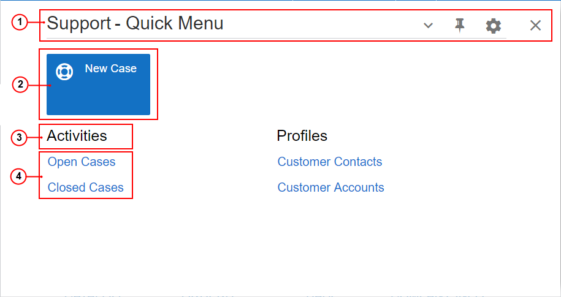
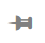
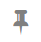

# Workspaces {#_21178c90-d04b-4f3f-bba6-7092d454de7f .concept}

In the Self-Service Portal, a workspace is a menu that contains links to the forms of a particular functional area of the product. In the following screenshot, the basic elements of a workspace are shown.

1.  Workspace title bar
2.  Tiles
3.  Category
4.  Links to forms

The system displays the list of forms in a workspace in one of the following views:

-   **Quick Menu** \(default; shown in the screenshot above\): In this view, the most commonly used forms are displayed.
-   **All Items**: In this view, all forms added to the workspace are displayed.

On the workspace title bar, the system displays the view name. To toggle between these views, you click this title bar.

You can personalize the list of forms displayed in the quick menu of a workspace for you \(that is, your user account\) when you switch to **Configuration** mode. The changes you make affect the current user session and all future sessions. For details, see [Personalizing the Interface](SP__mng_Personalizing_Modern_UI.md).

If your user account is assigned the *Administrator* role, you can switch to Menu Editing mode and customize the workspaces and menu items for all users in the system. For details on the user interface elements of Menu Editing mode, see [Menu Editing Mode](SP__con_New_UI_Menu_Editing_Mode.md). For more information about customizing the menu elements in the Self-Service Portal, see **Customizing the User Interface** in the Acumatica ERP System Administration Guide.

## Workspace Title Bar { .section}

In the workspace title bar, you can find the workspace title, the view in which the list of workspace items are displayed \(**Quick Menu** or **All Items**\), and workspace title buttons \(which are described in the following table\).

|Button|Icon|Description|
|------|----|-----------|
|Pin||Pins the workspace to the main menu panel.|
|Unpin||Unpins the workspace from the main menu panel.|
|Workspace Configuration||Opens the workspace in **Configuration** mode. In this mode, you can select the forms that are displayed on the Quick Menu of the workspace.|
|Close Workspace||Closes the workspace and displays the page opened in the working area.|
|**Exit**| |Saves your changes and closes **Configuration** mode for the workspace, returning you to the mode in which you were viewing the workspace.

 This button appears only if you are viewing a menu in **Configuration** mode.

|

## Tiles { .section}

A tile is a special button on a workspace that you click to open a form with predefined settings \(or, for a data entry form, with most settings blank so you can define a new entity\).

Predefined workspaces contain tiles with the most popular actions and forms for the workspace. You can make a tile your favorite by clicking  in the lower right corner of the tile.

If your user account is assigned the *Administrator* role, you can manage the tiles in a workspace for all system users. For details, see **Customizing the User Interface** in the Acumatica ERP System Administration Guide.

## Categories { .section}

In each workspace, categories are used to group items by type, which makes it easier for users to find needed items. For example, the **Activities** category contains forms you can use to create and view cases. The system provides a predefined group of categories.

If your user account is assigned the *Administrator* role, you can manage the groups of categories in the system. For more information, **Customizing the User Interface** in the Acumatica ERP System Administration Guide.

## Favorite Reports and Forms { .section}

In the workspace, you can add a form to your favorites by pointing to the form name and clicking  to the left of the form name. Forms that you have added to favorites are marked with .

**Parent topic:**[Self-Service Portal User Interface](../Portal/SP__con_Modern_UI.md)

