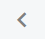

# To Use the Maximum Screen Space {#_71d51bd1-b2eb-474b-97fd-36945c1ad5ec .task}

In this topic, you will learn how to use the maximum screen space for the working area in the Acumatica Self-Service Portal by changing the size of the main menu panel in two ways: by collapsing it to be the size of a button, and by reducing its width.

## To Collapse the Main Menu Panel { .section}

You can collapse the main menu panel so that it takes up a minimum of a space on the screen. Do the following:

1.  In the bottom left corner of the main menu panel, click the **Open Configuration Menu** \(\) button.
2.  Click **Collapse to Top**.

    The main menu panel is collapsed, and the **Menu** button is added in the top left corner of the screen.

## To Reduce the Width of the Main Menu Panel { .section}

Now, you will display the compact view of the icons and workspace names. Do the following:

1.  In the top left corner of the screen, click **Menu**. The main menu panel opens.
2.  In the bottom right corner of the main menu panel, click the **Collapse Main Menu Panel** \(\) button.

    Notice that the width of the main menu panel decreases, providing more space in the working area. You can click **Expand Main Menu Panel** to restore the main menu panel to its previous width.

You have collapsed the main menu panel in the Self-Service Portal and reduced its width.

**Parent topic:**[Personalizing the Interface](../Portal/SP__mng_Personalizing_Modern_UI.md)

