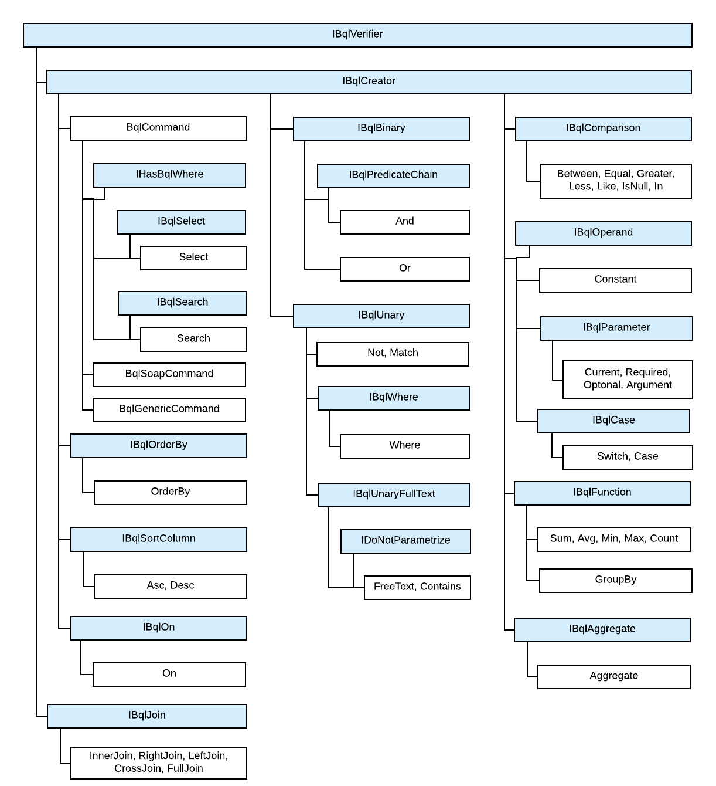

# The Classes That Compose BQL Statements {#_5dcf2b9e-ab3a-4ba6-a25d-3f2c28c3cf8a .concept}

This topic contains an overview of the classes that you use to compose business query language \(BQL\) statements inside PXSelect and to define attributes of DACs.

## Overview of the Classes { .section}

Almost all classes that compose BQL statements are derived from the IBqlCreator interface, which inherits from the IBqlVerifier interface. These interfaces provide the following key methods:

-   IBqlCreator.AppendExpression\(\): Used during a BQL command preparation to translate a BQL statement into an SQL tree expression, which is then produces the SQL text to be sent to the database maintenance server. For more information on how this method is used during BQL statement execution, see [Translation of a BQL Command to SQL](AD__con_BQL_Translation_to_SQL.md#).
-   IBqlVerifier.Verify\(\): Used during the merge of the records with PXCache to evaluate a condition on a record retrieved from the database or calculate an expression with the record. For details on the merge, see [Merge of the Records with PXCache](AD__con_Merge_of_Records_with_PXCache.md).

Depending on the purpose of each BQL class, the class also implements the methods of the interfaces derived from the IBqlCreator interface. For example, the aggregation functions—such as Sum, Avg, Min, and Max—implement the methods of the IBqlFunction interface.

The high-level overview of BQL class inheritance is illustrated in the following diagram. For descriptions of the interfaces and classes, see the API Reference.



The sections below describe the classes derived from the BqlCommand class.

## Select Classes { .section}

The Select classes, which are derived from the BqlCommand class, represent BQL commands and select all bound fields of the DAC and the unbound fields with specific attributes, such as PXDBCalced.

**Tip:** More specific, the Select classes select all DAC fields that are decorated with the attributes that subscribe to the PXCommandPreparing event. For details on which fields are selected, see [Translation of a BQL Command to SQL](AD__con_BQL_Translation_to_SQL.md#).

In a BQL expression based on Select, the first type parameter is a DAC, as shown in the following sample BQL statement.

```language-csharp
Select<Product>
```

The Select classes can parse themselves into SQL and provide methods for modifying the BQL command. However, you cannot directly use the Select class to execute the BQL query. Typically, you use Select in attributes in DACs, such as the PXProjection attribute.

## Search Classes { .section}

The Search classes, which are derived from the BqlCommand class, select one field of a DAC \(while the Select classes select multiple fields\).

In a Search-based statement, the first type parameter is a DAC field, as shown in the following sample BQL expression. This expression selects the Product.unitPrice field.

```language-csharp
Search<Product.unitPrice>
```

These classes can parse themselves into SQL and provide methods for modifying the BQL command. However, you cannot directly use the Search class to execute the BQL query. Typically, you use Search in attributes in DACs, such as the PXSelector attribute. \(PXSelectorAttribute requires a Search class and not a Select because the lookup control, which is configured by this attribute, displays precisely one field \(usually a key field\), which is what Search returns.\)

**Parent topic:**[Creating Traditional BQL Queries](../StudioDeveloperGuide/AD__mng_Traditional_BQL.md)

