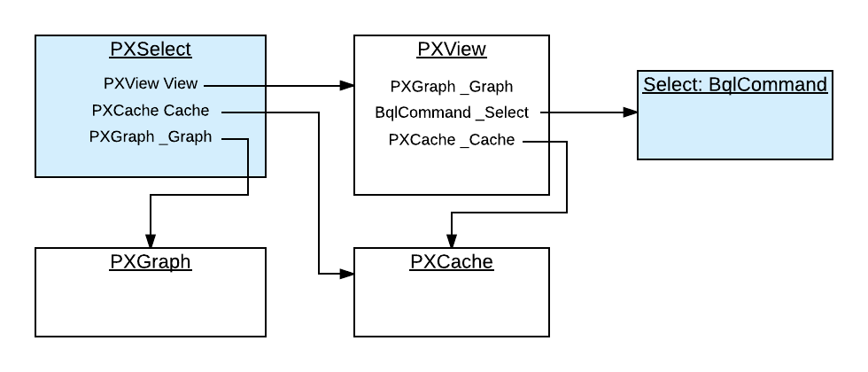

# PXSelect Classes {#_7d3035af-dac2-47fe-bbe6-b733565697cf .concept}

In traditional business query language \(BQL\), you define a data view or request database data in code by using one of the PXSelect classes \(that is, the classes derived from PXSelectBase\).

## PXSelect Classes { .section}

The instances of PXSelect classes are complex objects containing the following:

-   A reference to the PXView object instantiated to process the data query
-   A reference \(through the PXView object\) to the Select object, which is the business query language \(BQL\) command to be executed
-   A reference to the graph
-   A reference to the cache of the data access class \(DAC\) type that is specified in the first type parameter of PXSelect

That is, through the PXSelect classes, you can execute the BQL command and interact with the cache, as illustrated in the following diagram.



**Tip:** Do not confuse the PXSelect classes with the Select classes. PXSelect is an aggregate of the data view, cache, and graph. You can use PXSelect classes to read, write, update, and delete records in the scope of a graph. Select classes simply represent BQL commands. You cannot read records by using a BQL command without instantiating a data view. For more information on the Select classes, see [The Classes That Compose BQL Statements](AD__con_BQL_Commands.md#).

## Types of PXSelect Classes { .section}

The first type parameter of all PXSelect classes is a data access class \(DAC\) generally bound to a database table. The resulting SQL query selects records from this table. Other type parameters \(such as Where, OrderBy, Join, and Aggregate\) are optional and represent clauses that can be added to the basic select statement.

Depending on the clauses that will be used in a query, you select the appropriate variant of the PXSelect class.

For example, if you need to use the Where, OrderBy, and Join clauses, you can use the PXSelectJoin&lt;Table, Join, Where, OrderBy&gt; class to create the query, as shown in the following BQL sample code.

```
PXSelectJoin<Table1,
    LeftJoin<Table2, On<Table2.field2, Equal<Table1.field1>>>,
    Where<Table1.field3, IsNotNull>,
    OrderBy<Asc<Table1.field1>>>
```

**Tip:** Acumatica Framework translates this statement to the following SQL query, where `[list of columns]` is the list of columns of the joined tables.

```
SELECT [list of columns] FROM Table1
    LEFT JOIN Table2 ON Table2.Field2 = Table1.Field1
    WHERE Table1.Field3 IS NOT NULL
    ORDER BY Table1.Field1 
```

Acumatica Framework explicitly enumerates the columns of the database table in the SQL query. For details on which columns are enumerated, see [Translation of a BQL Command to SQL](../Shared/../StudioDeveloperGuide/AD__con_BQL_Translation_to_SQL.md#).

For more information on how to use the BQL clauses, see [To Select Records By Using Traditional BQL](AD__how_Construct_Statement.md#).

If you need to retrieve data as it is currently stored in the database, you use one of the PXSelect classes that has Readonly in its name, such as the PXSelectReadonly&lt;Table&gt; class, or any of the PXSelect classes that use aggregation, such as the PXSelectGroupBy&lt;Table, Aggregate&gt; class. Otherwise, the data retrieved from the database can be merged with the data currently stored in the cache. For more information on how the data is merged with the cache, see [Merge of the Records with PXCache](AD__con_Merge_of_Records_with_PXCache.md).

## The List of PXSelect Classes { .section}

Acumatica Framework provides the following PXSelect classes:

-   [PXSelect&lt;Table, Where, OrderBy&gt;](https://help.acumatica.com/Help?ScreenId=ShowWiki&pageid=a8fdf1f8-cf42-0218-fd4a-d17581302864)
-   [PXSelect&lt;Table, Where&gt;](https://help.acumatica.com/Help?ScreenId=ShowWiki&pageid=3dd1dc7c-8da6-7d00-3581-a7f972b93868)
-   [PXSelect&lt;Table&gt;](https://help.acumatica.com/Help?ScreenId=ShowWiki&pageid=03257354-864a-7b57-f926-b7d49838b9ed)
-   [PXSelectGroupBy&lt;Table, Aggregate&gt;](https://help.acumatica.com/Help?ScreenId=ShowWiki&pageid=5cd767b5-31bf-2c70-a88b-dfc848a6273f)
-   [PXSelectGroupBy&lt;Table, Where, Aggregate, OrderBy&gt;](https://help.acumatica.com/Help?ScreenId=ShowWiki&pageid=6764c52b-4177-4a38-7d8f-e620d18eb8d6)
-   [PXSelectGroupBy&lt;Table, Where, Aggregate&gt;](https://help.acumatica.com/Help?ScreenId=ShowWiki&pageid=046c04bb-4bd7-4cfd-1670-c07fe124aecb)
-   [PXSelectGroupByOrderBy&lt;Table, Aggregate, OrderBy&gt;](https://help.acumatica.com/Help?ScreenId=ShowWiki&pageid=eb5710c8-9153-6943-a556-1e87f8f7c794)
-   [PXSelectGroupByOrderBy&lt;Table, Join, Aggregate, OrderBy&gt;](https://help.acumatica.com/Help?ScreenId=ShowWiki&pageid=618540fb-dbac-d936-17e9-37d95869bd0c)
-   [PXSelectJoin&lt;Table, Join, Where, OrderBy&gt;](https://help.acumatica.com/Help?ScreenId=ShowWiki&pageid=22b2b4d8-d492-e81b-e29f-03adc991ddf8)
-   [PXSelectJoin&lt;Table, Join, Where&gt;](https://help.acumatica.com/Help?ScreenId=ShowWiki&pageid=17f73b33-3e16-3434-f1ee-2c6e756b009e)
-   [PXSelectJoin&lt;Table, Join&gt;](https://help.acumatica.com/Help?ScreenId=ShowWiki&pageid=1e28d236-ba79-7287-8c41-d47ca5703c43)
-   [PXSelectJoinGroupBy&lt;Table, Join, Aggregate&gt;](https://help.acumatica.com/Help?ScreenId=ShowWiki&pageid=2d09df8f-ba71-69ba-0340-5089baa24c16)
-   [PXSelectJoinGroupBy&lt;Table, Join, Where, Aggregate, OrderBy&gt;](https://help.acumatica.com/Help?ScreenId=ShowWiki&pageid=d5109923-5ce3-576b-a424-553398a6f173)
-   [PXSelectJoinGroupBy&lt;Table, Join, Where, Aggregate&gt;](https://help.acumatica.com/Help?ScreenId=ShowWiki&pageid=0ed6ab68-d8b2-4b0e-4334-0beea6b76a31)
-   [PXSelectJoinOrderBy&lt;Table, Join, OrderBy&gt;](https://help.acumatica.com/Help?ScreenId=ShowWiki&pageid=177f43f3-8bc5-7445-6f23-d91f271b8e72)
-   [PXSelectOrderBy&lt;Table, OrderBy&gt;](https://help.acumatica.com/Help?ScreenId=ShowWiki&pageid=ee1e945e-5abe-ec43-b820-0832862731db)
-   [PXSelectReadonly&lt;Table, Where, OrderBy&gt;](https://help.acumatica.com/Help?ScreenId=ShowWiki&pageid=7989b729-a9ca-0c26-09a8-620b7d0fec32)
-   [PXSelectReadonly&lt;Table, Where&gt;](https://help.acumatica.com/Help?ScreenId=ShowWiki&pageid=3968f96a-d7de-19d2-7ec2-1afab8a79c01)
-   [PXSelectReadonly&lt;Table&gt;](https://help.acumatica.com/Help?ScreenId=ShowWiki&pageid=94b09354-528e-8db8-96d0-74e82ac2986f)
-   [PXSelectReadonly2&lt;Table, Join, Where, OrderBy&gt;](https://help.acumatica.com/Help?ScreenId=ShowWiki&pageid=5460ca63-f1d0-2d7e-fd6d-10a0bd997ffa)
-   [PXSelectReadonly2&lt;Table, Join, Where&gt;](https://help.acumatica.com/Help?ScreenId=ShowWiki&pageid=ba407ee6-bda6-234a-5cd9-25dd7c179e60)
-   [PXSelectReadonly2&lt;Table, Join&gt;](https://help.acumatica.com/Help?ScreenId=ShowWiki&pageid=ab59df2e-0381-b445-6fed-96e282290f73)
-   [PXSelectReadonly3&lt;Table, Join, OrderBy&gt;](https://help.acumatica.com/Help?ScreenId=ShowWiki&pageid=a83c4045-dde9-8a5d-a74e-83b23bbabd94)
-   [PXSelectReadonly3&lt;Table, OrderBy&gt;](https://help.acumatica.com/Help?ScreenId=ShowWiki&pageid=49e6942c-d409-d7f5-9b50-27eea9d274fb)

**Parent topic:**[Creating Traditional BQL Queries](../StudioDeveloperGuide/AD__mng_Traditional_BQL.md)

