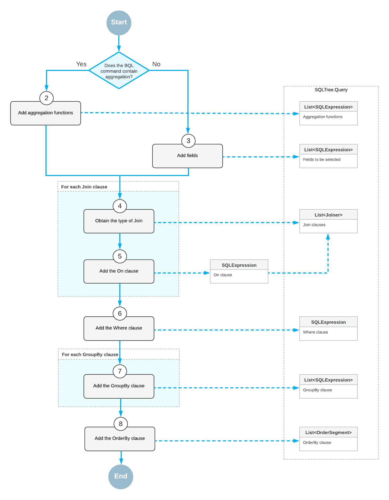
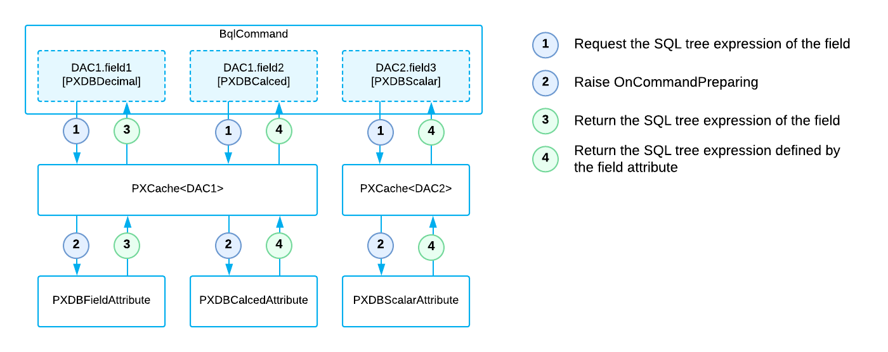

# Translation of a BQL Command to SQL {#_5bc68600-61ab-4a49-958c-da5d732b2ac2 .concept}

When the system executes a delayed query and calls the PXView.GetResult method to retrieve the data from the database, the system converts the business query language \(BQL\) command \(PX.Data.BqlCommand\) to the SQL query tree \(PX.Data.SQLTree.Query\), applies the needed restrictions on the SQL query tree \(such as company and branch restrictions\), and then converts the SQL query tree to the text of the SQL command for the target database type. This process is described in detail in the following sections.

## Translation of a BQL Command to an SQL Query Tree {#_04b426bc-32b9-4925-8f60-cdad274abeb6 .section}

To request the SQL query tree of the command, the system recursively calls the following methods:

1.  PXView.GetResult
2.  PXGraph.ProviderSelect
3.  PXDatabaseProviderBase.Select
4.  BqlCommand.GetQuery

The BqlCommand.GetQuery method calls the BqlCommand.GetQueryInternal method, which uses other methods as follows to prepare the SQL query tree:

1.  If the BQL command contains aggregation, the BqlCommand.AppendAggregatedFields method appends to a new Query instance the SQL expressions \(PX.Data.SQL.SQLExpression\) that correspond to the fields that are surrounded with appropriate aggregation functions. If the BQL command does not contain aggregation, the BqlCommand.AppendFields method appends to a new Query instance the SQL expressions that correspond to the fields to be selected. The fields to be selected are the DAC fields that subscribe to the OnCommandPreparing event and are not restricted by PXFieldScope.
2.  For each `Join` clause, the IBqlJoin.AppendQuery method adds to the Query instance the Joiner instance that corresponds to the `Join` clause.

    The IBqlJoin.AppendQuery method obtains the type of `Join` and, for all classes in the On clause that implement the IBqlCreator interface, successively executes the IBqlCreator.AppendExpression method, starting from the On class and then proceeding with enclosed classes, such as the Where classes and comparison classes. For the DAC fields \(IBqlField-derived classes\), the BqlCommand.GetSingleExpression method obtains the SQL expression.

3.  For all classes in the `Where` and `GroupBy` clauses that implement the IBqlCreator interface, the system successively executes the IBqlCreator.AppendExpression method, which appends to the Query instance the SQL expression that corresponds to the classes. For the DAC fields \(IBqlField-derived classes\), the BqlCommand.GetSingleExpression method obtains the SQL expression.
4.  The IBqlOrderBy.AppendQuery method adds to the Query instance the list of OrderSegment instances that corresponds to the `OrderBy` clause.

    For each sorting class \(a IBqlSortColumn-derived class\) in the OrderBy clause, the IBqlSortColumn.AppendQuery method adds to the Query instance the OrderSegment instance that corresponds to the sorting column. For the DAC fields \(IBqlField-derived classes\), the BqlCommand.GetSingleExpression method obtains the SQL expression. If the original BQL statement does not specify ordering, the system adds to the Query instance sorting by the DAC key fields \(in ascending order\).

The following diagram shows the conversion of a BQL command to an SQL query tree.

## SQL Tree Expression of a Field { .section}

To obtain the SQL tree expression of each field of the BQL command, the BqlCommand instance creates a PXCache instance that corresponds to the data access class \(DAC\) to which the field belongs. The PXCache instance generates the OnCommandPreparing event with the specified PXDBOperation type \(which specifies the type of the database operation\). The attribute assigned to the DAC field \(that is, the attribute that implements the IPXCommandPreparingSubscriber interface\) handles the event and returns the PX.Data.SQLTree.SQLExpression instance that corresponds to the field or to the BQL statement that is defined by the field attribute. \(For example, the PXDBCalced and PXDBScalar attributes define BQL statements.\)

The following diagram shows how BqlCommand obtains the SQL tree expression for the fields of a BQL command.

## Translation of a BQL Command with Parameters to an SQL Query Tree {#_ff6436a7-d8a9-43c8-9201-d5ea9afbe2d5 .section}

Before the system requests the SQL query tree of a BQL command, the PXView object retrieves the values of the parameters used in the query as follows:

-   For a field with FromCurrent appended \(in fluent BQL\) or specified in the Current parameter \(in traditional BQL\), the PXView object retrieves the field value from the Current object of the PXCache object. If the current field value is `null`, the PXView object triggers the FieldDefaulting event handlers and retrieves the default value from the PXDefault attribute value \(if any\).

    **Note:** The default value is not retrieved if FromCurrent.NoDefault is appended to the field \(in fluent BQL\) or if the Current2 parameter is used \(in traditional BQL\).

-   For a field with AsOptional appended \(in fluent BQL\) or specified in the Optional parameter, if the explicit field value is specified, the PXView object triggers the FieldUpdating event, whose handlers can transform the external presentation of the field value to an internal value \(for example, transform `ProductCD` to `ProductID`\). If the field value is not specified, the PXView object retrieves the field value from the Current object of the PXCache object. If the current field value is `null`, the PXView object triggers the FieldDefaulting event and retrieves the default value from the PXDefault attribute value \(if any\).

    **Note:** The default value is not retrieved if AsOptional.NoDefault is appended to the field \(in fluent BQL\) or if the Optional2 parameter is used.

When BqlCommand creates the SQL query tree that corresponds to the BQL command, IBqlCreator.AppendExpression \(which is implemented by the ParameterBase&lt;Field&gt; class\) includes the parameters in the SQL query tree. After BqlCommand has created the SQL query tree that corresponds to the BQL command, the system inserts into the SQL query tree the actual values of the parameters retrieved by PXView.

## Translation of the SQL Query Tree to SQL Text {#_7334dc34-5bb3-4884-9b58-20054413bd59 .section}

A PXGraph instance stores information about the target database type in its SqlDialect property. SQLTree.Query has the Connection property, which is responsible for the conversion of the SQL query tree to the SQL text in the format of the target database. To convert the SQL query tree to text, the system does the following:

1.  Calls the SQLDialect.GetConnection method of the graph instance to retrieve the needed SQLTree.Connection.
2.  Passes this Connection instance to the SQLTree.Query.SQLQuery method, which converts the SQL query tree to the text for Microsoft SQL or MySQL, depending on the passed Connection.

**Parent topic:**[Querying Data in Acumatica Framework](../StudioDeveloperGuide/AD__mng_Querying_Data.md)

