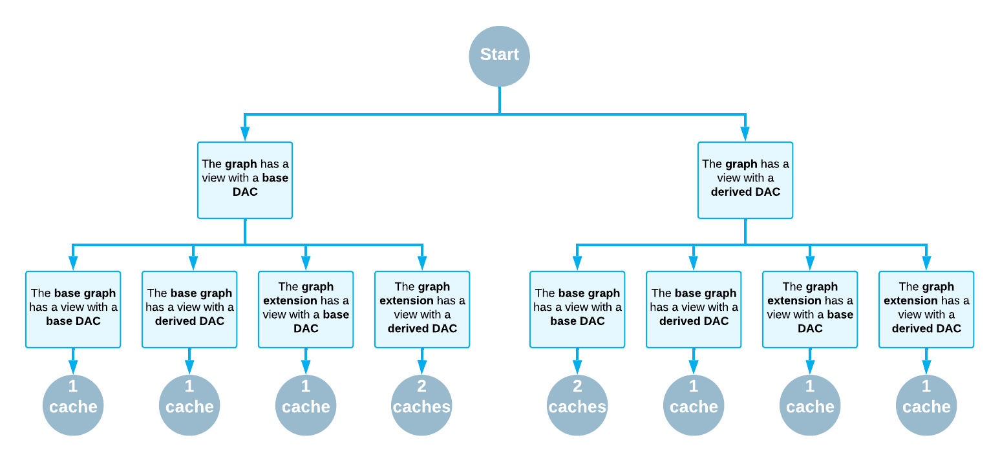

# Cache Mapping {#_a5fb7e46-c6e8-438a-b640-1fa9f56b9525 .concept}

In this topic, you can find information about how the Acumatica Framework maps data access class \(DAC\) types to graph caches and how to modify the default mapping.

## What Cache Mapping Is { .section}

For every DAC whose data is read from the database and modified by the application logic, PXGraph stores the graph cache.

**Tip:** The system uses the graph cache to track changes for the DAC but not for actual data caching. The graph cache keeps and tracks only the changed items but not all items retrieved from the database. It also keeps the information about DAC metadata for the platform, merges DAC extensions, and supports DAC fields that are dynamically added in code. The actual caching of the data from the database is performed in the *query cache*. For details about the query cache, see [Query Cache](BL__con_Query_Cache.md).

The graph cache has the PXCache&lt;SomeDAC&gt; type, where SomeDAC is a *cache item type*. A cache item type is a type of DAC items stored in the graph cache. You can request the graph cache that corresponds to the DAC by using the following code.

```
var cache = graph.Caches[typeof(APRegister)];
```

The type of `cache` in the code above is a base PXCache class, which hides the actual cache item type. The actual cache item type can be the same as the type of the DAC used to obtain the cache. However, if the base and derived DACs are used in the same graph, the cache item type can be different from the type of the DAC. For example, in the APInvoiceEntry graph, both the base APRegister DAC and the derived APInvoice DAC are used. However, the system creates only one `PXCache<APInvoice>` for both of them.

The graph maps DAC types to graph caches. Such mapping between a DAC type and its corresponding graph cache is called *cache mapping*. Acumatica Framework implicitly defines cache mappings during the graph initialization. Depending on the declaration order of graph views in the graph, the framework can use only one cache for base and derived DACs. You can also specify cache mappings explicitly.

## How Cache Mapping Works by Default: Base and Derived DACs in a Graph {#_f6ee2f4f-846c-4bd4-9a32-52f55bde65b7 .section}

During graph initialization, Acumatica Framework initializes caches and cache mappings for the main DACs \(that is, the first tables in the BQL query\) of all data views of the graph. Views use the PXCacheCollection.AddCacheMappingsWithInheritance method \(which maps a derived DAC type and all its base DAC types to the derived type\) to initialize cache mappings of their main DACs. Because the `AddCacheMappingsWithInheritance` method is used, the cache mapping depends on the order in which graph views are processed. The system processes the views in the order in which they are returned by .Net reflection, which almost always is the declaration order.

The system uses the following rules for cache mapping if the graph contains data views with base and derived DACs:

-   If the view with the base DAC is declared first in the graph, the system creates two caches \(one for the base DAC and one for the derived DAC\). For each DAC, cache mapping points to its own cache with the same cache item type.
-   If the view with the derived DAC is declared first in the graph, the system creates one cache for the derived DAC. For each DAC, the cache mapping points to the same cache with the derived item type.

## How Cache Mapping Works by Default: Example { .section}

Suppose that the application code contains the following DACs: the `BaseDac` DAC, and the `DerivedDac` DAC, which is derived from `BaseDac`. Also, suppose that a graph contains the following views: a view for the base DAC \(`PXSelect<BaseDac> baseView`\), and a view for the derived DAC \(`PXSelect<DerivedDAC> derivedView`\).

If `derivedView` is processed first, AddCacheMappingsWithInheritance adds cache mappings for the main DAC of `derivedView` \(which is `DerivedDAC`\) and the base DAC type \(which is `BaseDac`\) to a single `PXCache<DerivedDAC`&gt; cache. This means that the graph has only one cache for these two DACs.

If `baseView` is processed first, AddCacheMappingsWithInheritance adds cache mapping for the main DAC of `baseView` \(which is `BaseDac`\) to the `PXCache<BaseDac>` cache. When `derivedView` is processed, the method adds cache mapping for `derivedView`'s main DAC \(which is `DerivedDAC`\) to the `PXCache<DerivedDAC>` cache. However, the method does not add cache mapping for the base DAC type \(which is `BaseDac`\) because the cache mapping for `BaseDac` already exists. This means that the graph has two caches for these DACs.

## How Cache Mapping Works by Default: Graph Hierarchies { .section}

The views from a base graph are processed before the views from derived graphs. To conceptualize this, you can think of all views from base and derived graphs as being declared inside one graph. The views from the base graph will be declared first.

The views from the graph extension are processed after the views from the graph. If you think of all views from the graph and graph extension as being declared inside one graph, the views from the graph will be declared first.

If you think of all views from the whole graph hierarchy as being declared in a single graph, to find out the number of cache item types for the base and derived DACs, you can use the same rules as the rules for a single graph, which are described above. The following diagram illustrates these rules.



## How Default Cache Mapping Can Be Modified { .section}

To modify the default cache mapping, you override the virtual InitCacheMapping method of the graph and specify the new mapping in one of the following ways:

-   You add cache mappings by using the AddCacheMapping method, as shown in the following example.

    ```
    public override void InitCacheMapping(Dictionary<Type, Type> map)
    {
        base.InitCacheMapping(map);
     
        this.Caches.AddCacheMapping(typeof(INLotSerialStatus), typeof(INLotSerialStatus));
    }
    ```

    The AddCacheMapping method does not give you the ability to modify existing cache mappings. It checks whether a mapping for a DAC type already exists before adding a new cache mapping.

-   You map a derived DAC type and all its base DAC types to the derived type by using the AddCacheMappingsWithInheritance method, as the following code shows.

    ```
    public override void InitCacheMapping(Dictionary<Type, Type> map)
    {
        base.InitCacheMapping(map);
        
        Caches.AddCacheMappingsWithInheritance(this,typeof(VendorR));
        Caches.AddCacheMappingsWithInheritance(this,typeof(CRLocation)); 
    }
    ```

-   You edit the collection of cache mappings by using the map parameter of the method, as shown below.

    ```
    public override void InitCacheMapping(Dictionary<Type, Type> map)
    {
        base.InitCacheMapping(map);
        map.Add(typeof(CT.Contract), typeof(CT.Contract));
    }
    ```

    The use of the map parameter is more flexible than the execution of AddCacheMapping. In addition to adding new code mappings, you can delete or modify existing ones. However, you need to check whether the mapping already exists. For example, if you try to call `map.Add` to add mappings for the same DAC type in multiple places \(such as in `InitCacheMapping` overrides in base and derived graphs\), you will get the following exception: *An item with the same key has already been added*.


**Parent topic:**[Working with Data in Cache and Session](../StudioDeveloperGuide/AD__mng_Working_with_Cache_and_Session.md)

