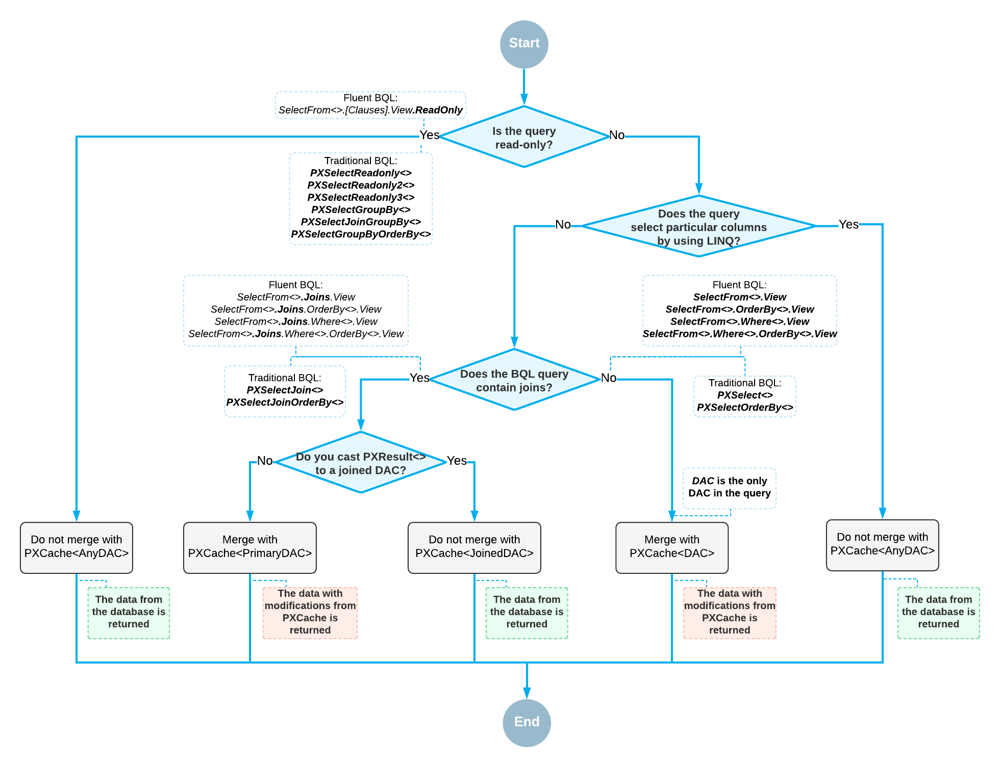

# Merge of the Records with PXCache {#_0ff0b223-66ff-4b55-af97-fe88580ec6e5 .concept}

For the queries defined with business query language \(BQL\) or with BQL and LINQ, the system merges the records retrieved from the database with the modified records stored in PXCache as follows:

1.  If the query is read-only, the result set is not merged with any PXCache object. The system returns the data records as they are currently stored in the database.

    **Note:** A query is read-only if the IsReadOnly property of the underlying PXView object is `true`. For example, the traditional BQL statements that use aggregation or are based on one of the PXSelectReadonly classes are read-only. The fluent BQL statements that have .ReadOnly appended are read-only.

2.  If the query is not read-only and contains filtering by data access class \(DAC\) fields by using LINQ \(that is, only the values in specific columns of the database tables are returned in the results of the query\), no merge with any PXCache object is performed.
3.  If the query is not read-only, does not contain filtering of DAC fields by using LINQ, and does not contain joins, the result set is merged with the contents of the appropriate PXCache object, and the system returns the result set updated with the modifications stored in PXCache.
4.  If the query is not read-only, does not contain filtering by DAC fields by using LINQ, and joins data from multiple tables, the result set is merged with only the PXCache object that corresponds to the first table of the BQL statement. The PXResultset&lt;&gt; object, which represents the result set, contains objects of the generic PXResult&lt;&gt; type. This type can be cast to the data access classes \(DACs\) that represent the joined tables. The instance of the primary DAC to which PXResult&lt;&gt; is cast contains the records from the database that are updated with the modifications stored in PXCache. Casting PXResult&lt;&gt; to a joined DAC returns the instance that contains values from the database and has no relation with the PXCache instances of the corresponding DAC types.

The following diagram illustrates the database records being merged with PXCache.

**Parent topic:**[Querying Data in Acumatica Framework](../StudioDeveloperGuide/AD__mng_Querying_Data.md)

