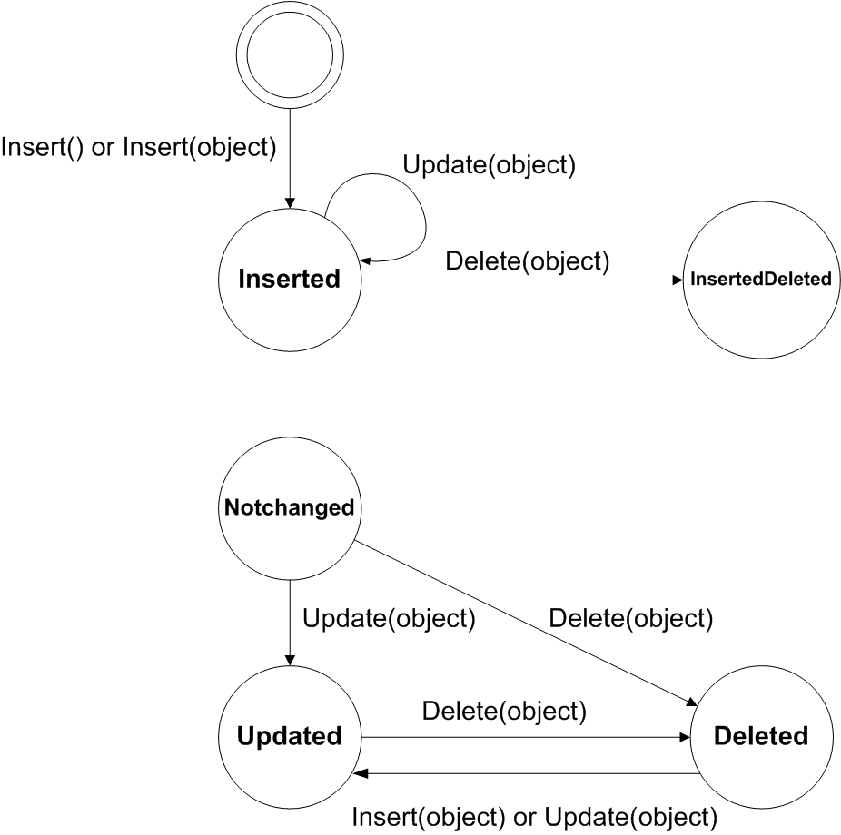

# Modification of Data in a PXCache Object {#_7098eac5-90f1-4043-aaaf-c64cb2bc95e5 .concept}

In this topic, you can find information about the statuses of data records in PXCache, the methods that can be used for data modification in PXCache, and the ways to invoke these methods.

## Modifying the Data with PCCache Methods { .section}

To modify data from code, you can use the following methods of a PXCache object:

-   Insert\(\) and Insert\(object\)
-   Update\(object\)
-   Delete\(object\)

For Insert\(object\), Acumatica Framework checks whether a data record with the specified key values already exists in the cache object. If the record exists, nothing is inserted into the cache, and the existing record is not modified in the cache; that is, the Insert\(...\) method returns null. If the record does not exist, the new record is inserted into the cache object; the method returns the new data record.

On Update\(object\), the framework checks whether a data record with such key values already exists in the cache object. If the record exists, it is updated. If the record does not exist in the cache, the framework retrieves the record with such keys from the database and places it into the cache. If there is no such record in the database, the framework invokes Insert\(\) for the record.

On Delete\(object\), the framework sets the Deleted status for the record if it exists in the cache object. It does this in three steps. First, the framework checks whether a data record with the key values of the provided object already exists in the cache. If the record does not exist in the cache, the framework retrieves the record with these keys from the database. If the record exists in the cache or in the database, the framework sets its status within the cache to Deleted. The record is not removed from the cache object.

The modified records remain in the cache object until the Persist\(\) method of the graph is invoked, or until the Cache.Clear\(\) method of the data view is invoked, which removes all records from the cache object. You can remove all records from all cache objects of the graph by invoking the Clear\(\) method of the graph object.

## Understanding the Statuses of Data Records in a PXCache {#section_vbk_5lw_lm .section}

For each of the data modification methods, the framework raises the corresponding sequence of events and changes the status of the record in the cache object as shown in the diagram below. Once it is retrieved from the database, a record has the Notchanged status until it is modified. An inserted record maintains the Inserted status even if it is updated. When the inserted record is deleted, it is assigned the specific InsertedDeleted status. If you want to make sure that a record has been marked as deleted within the current session, you have to check the record for both the Deleted status and the InsertedDeleted status. To obtain the status of the record, invoke the GetStatus\(\) method of the cache object for the needed DAC object. The status of the record is one of the following values of the PXEntryStatus enumeration:

-   Notchanged
-   Updated
-   Inserted
-   Deleted
-   InsertedDeleted



You can obtain the modified records from the collections of the PXCache object that correspond to the type of modification, as follows:

-   Cache.Inserted, which retrieves data records that have the Inserted status
-   Cache.Updated, which retrieves data records that have the Updated status
-   Cache.Deleted, which retrieves data records that have the Deleted status.

    **Note:** The Cache.Dirty collection is used to retrieve all data records that have the Inserted, Updated, or Deleted status.


Records that have other statuses \(such as InsertedDeleted\) are not retrieved by these collections. For more information on these statuses, see [PXCache&lt;TNode&gt; Class](https://help.acumatica.com/(W(69))/Help?ScreenId=ShowWiki&pageid=ec41a150-d69a-dbac-b18b-24b07c6d2d64).

**Note:** We do not recommend that you iterate through the Cached collection. For performance optimization, this collection may not retrieve all available data records.

## Updating a Data Record in a PXCache {#section_zvd_xlw_lm .section}

The framework raises the applicable events and updates the status of the record in the following cases as described:

-   When you invoke the Insert\(\), Update\(\), or Delete\(\) method of a PXCache object, the framework raises field-level events for each field when the Insert\(\) or Update\(\) method is invoked, and for only key fields when the Delete\(\) method is invoked; the framework then raises all row-level events for the data record.

    ```
    document.DocNbr = lastNumber;
    Documents.Update(document);
    ```

-   When you invoke the SetValueExt&lt;Field&gt;\(\) method of a cache object, the framework raises field-level events for the specified field only. The framework does not invoke row-level events and does not update the status of the record. You can update the status of the record manually by invoking the SetStatus\(\) method of the cache. However, you should be careful with skipped field-level and row-level events because changing the status manually may cause missing logic and incorrect data update.

    ```
    view.Cache.SetValueExt<Document.docNbr>(row, lastNumber);
    ```


**Note:** The following audit fields are not updated during the Update\(\) method call of the PXCache object:

-   CreatedByID
-   CreatedByScreenID
-   CreatedDateTime

The framework neither raises any event nor updates the status of the record in the following cases:

-   If you assign a new value to a field without invoking Update\(\)

    ```
    document.DocNbr = lastNumber;
    ```

-   If you assign a new value to a field by invoking the SetValue&lt;Field&gt;\(\) method of the cache object

    ```
    view.Cache.SetValue(row, LastNumberField.Name, lastNumber);
    ```


## Searching for a Data Record in a PXCache {#section_zgd_zlw_lm .section}

Searching for a data record in the cache is helpful when you want to check whether the data record has already been modified during the current user session. To search for a data record, you can use the Locate\(\) method, which returns the data record if it exists in the PXCache object. The Locate\(\) method searches for the record by key values. If the record does not exist, the method returns null. No query is executed to the database in the Locate\(\) method.

```
Account account = Accounts.Locate(record);
```

## Invoking PXCache Methods {#section_ubj_1mw_lm .section}

You can invoke data modification methods on a PXCache object through a data view. The methods are invoked on the PXCache object of the first DAC specified in the data view type \(main DAC of the data view\). The following code shows equivalent invocations of the Insert\(\) method on the PXCache object that stores `ShipmentLine` data records in a graph.

```
// ShipmentLines is a data view of the PXSelectBase<ShipmentLine> type
// defined in the graph.
// ShipmentLine is the main DAC of the ShipmentLines data view.

// Invocation through the data view
**ShipmentLines.Insert\(line\);**
// Invocation directly through the PXCache
**ShipmentLines.Cache.Insert\(line\);**
```

**Parent topic:**[Working with Data in Cache and Session](../StudioDeveloperGuide/AD__mng_Working_with_Cache_and_Session.md)

