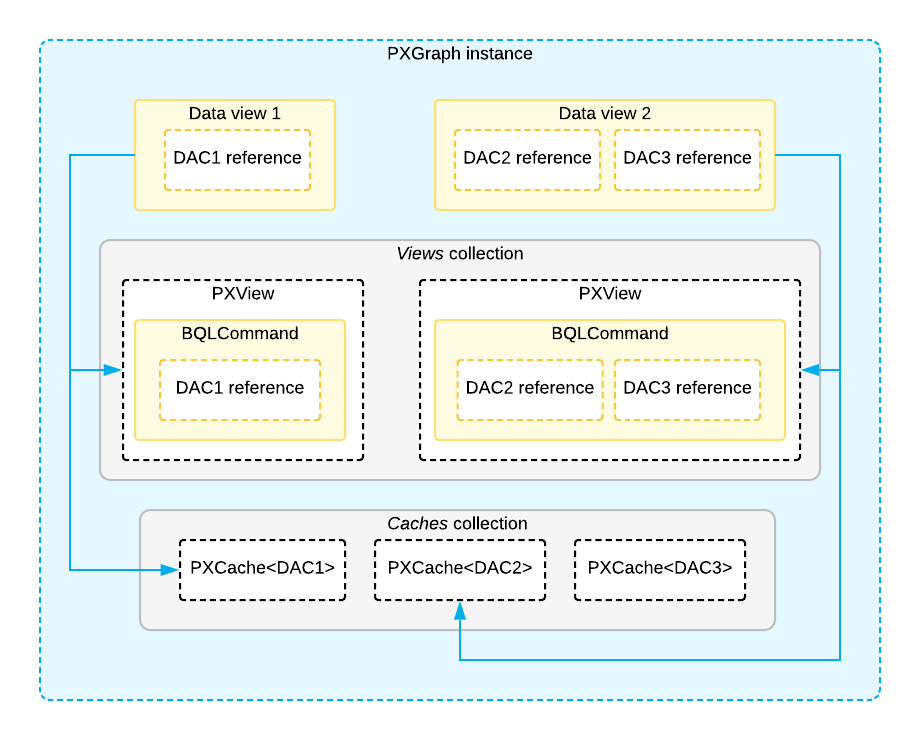

# PXView and PXCache of the Data View {#_ce8ee369-bc71-4e32-8969-067b26c63c00 .concept}

*Data views* are graph members that are used to retrieve and modify data records of a particular data access class \(DAC\). You use data views:

-   To provide data retrieval and manipulation functions for the UI
-   To retrieve and manipulate data from code

You define a data view with a class derived from the PXSelectBase class, such as SelectFrom&lt;&gt;.View in fluent BQL and PXSelect&lt;&gt; in traditional BQL. The first DAC of the data view is the main DAC of the data view. Below are the `Orders` and `OrderDetails` data views that are defined in the `SalesOrderEntry` graph. Both data views provide data for the UI. Acumatica Framework automatically instantiates the data views and invokes the Select\(\) method when either of these data views is requested by the client.

```
public class SalesOrderEntry : PXGraph<SalesOrderEntry, SalesOrder>
{
    // Provides an interface for manipulation of sales orders
    public SelectFrom<SalesOrder>.View Orders;

    // Provides an interface for manipulation of detail lines of
    // the specified order
    public SelectFrom<OrderLine>.
            Where<OrderLine.orderNbr.
                IsEqual<SalesOrder.orderNbr.FromCurrent>>.View OrderDetails;
}
```

When a graph executes a data view, the graph creates the following objects:

-   The PXView object, which contains the BQL command that corresponds to the data view
-   The PXCache&lt;DAC&gt; objects whose type parameter is defined by the data access classes \(DACs\) that are used in the BQL command

The PXView object uses the BQL command to retrieve data from the database and stores the retrieved data in the PXCache object. The data view stores references to the corresponding PXView object and the PXCache object of the main DAC of the data view, as shown in the following diagram.



PXCache&lt;DAC&gt; are objects that are created by the system to maintain data records that have not yet been saved to the database and the modifications to these data records. The system serializes the modified data records from all cache objects to the session between round trips and restores them on each new round trip.

**Important:** Do not confuse PXCache objects with the query cache, which stores data that has been retrieved from the database. A PXCache&lt;DAC&gt; object not only stores data records and modifications to them but also publishes events related to the DAC, serves as a change tracker, and performs other tasks that are not related to caching. For details, see [Query Cache](BL__con_Query_Cache.md).

Each data view is connected to a cache object by the main DAC of this data view. For example, the `Orders` data view from the example above is related to a cache object of `PXCache<SalesOrder>` type. To insert a new data record, update an existing one, or delete a data record, you use the data view methods, which invoke the corresponding cache methods.

Cache objects identify data records by their key fields, which are fields with the IsKey property set to true in a type attribute.

Cache objects hold the data records that are modified but not yet saved to the database. Each cache object holds the data records of a single DAC. In a graph, each data view corresponds to the cache object that works with the main DAC of the data view.

For data binding, you specify a data view in the DataMember property of a UI container control, such as a form, grid, or tab on the ASPX page.

**Parent topic:**[Querying Data in Acumatica Framework](../StudioDeveloperGuide/AD__mng_Querying_Data.md)

