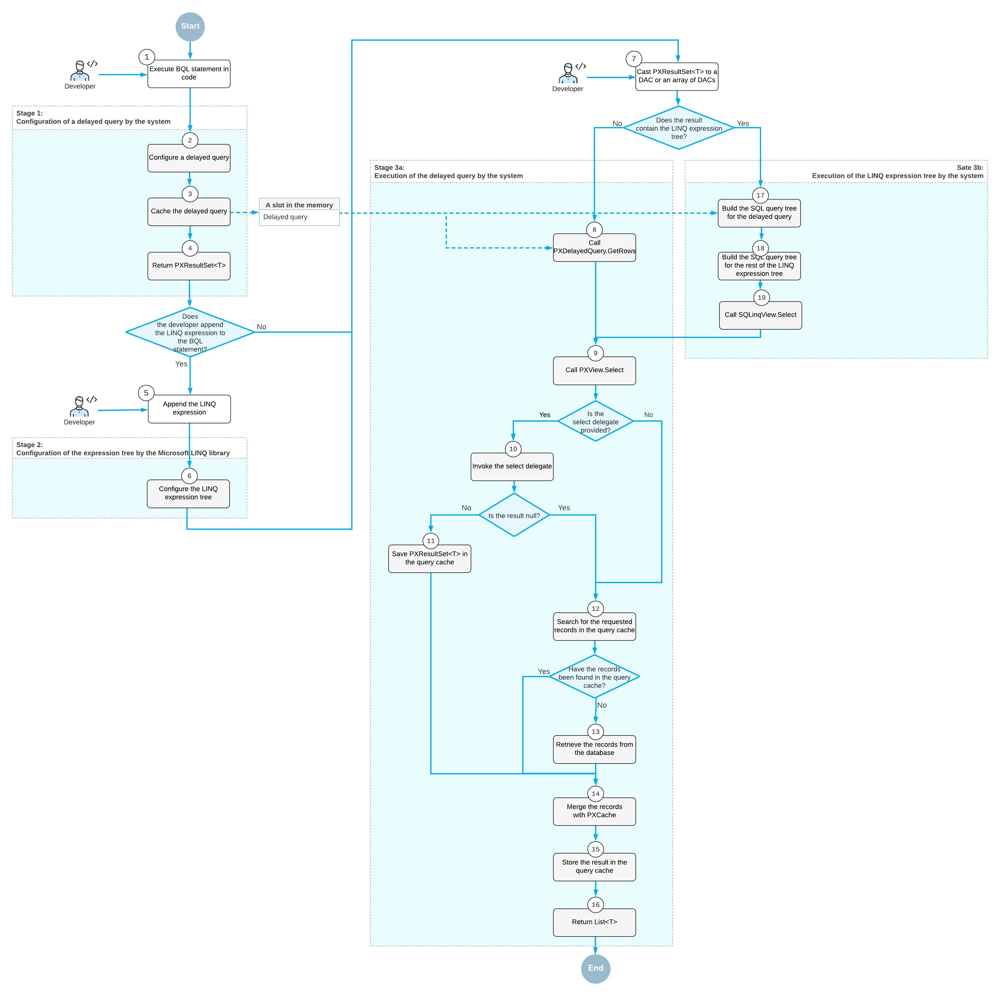

# Data Query Execution {#_acbf0567-2330-4b64-880d-fbe467d80e17 .concept}

The system executes a data query in the following stages, which are described in detail below:

-   Stage 1: When a developer executes a BQL statement in code, Acumatica Framework configures a delayed query.
-   Stage 2: If a language-integrated query \(LINQ\) statement is appended to the BQL statement, Microsoft LINQ configures the expression tree, which includes the delayed query.
-   Stage 3: When the developer casts the result of the query to a data access class \(DAC\) or an array of DACs, the system does the following:
    -   3a: If the result of the query contains the expression tree created by LINQ, the system configures the SQL query tree that corresponds to the LINQ expression tree, and executes the SQL query tree.
    -   3b: If the result of the query is created only by BQL, the system configures the SQL query tree for the delayed query and executes this query tree.

The whole process is illustrated in the following diagram.

## Configuration of a Delayed Query { .section}

In code, you execute a business query language \(BQL\) statement in one of the following ways:

-   You declare a data view \(a PXSelectBase-derived class\) as a member in a graph, and you specify this data view as the data member of the ASPX page control. The system uses this data view for basic data manipulation \(inserting a data record, updating a data record, and deleting a data record\) and executes the data view by calling the Select\(\) method.
-   You use the `static` Select\(\) method of a PXSelectBase-derived class with a graph object as the parameter.
-   You dynamically instantiate a PXSelectBase-derived class in code and execute it by using its Select\(\) method. \(You provide the graph object as a parameter to the class constructor.\)
-   You instantiate a class derived from the BqlCommand class \(such as a Select class in traditional BQL or FromSelect in fluent BQL\), create a PXView object that uses this BqlCommand class, create a graph object, and call one of the view's Select\(\) methods.

When the Select\(\) method is executed, Acumatica Framework does the following:

1.  Configures a delayed query by creating a PXDelayedQuery instance. The PXDelayedQuery instance contains a reference to a PXView object, which contains references to PXGraph and the BqlCommand object to be executed.
2.  Caches the delayed query by using the PXContext.SetSlot method. \(For details on the slots, see [Use of Slots to Cache Data Objects](AD__con_Using_Slots_to_Cache_Data.md#).\)
3.  Returns a PXResultset&lt;T&gt; object whose type parameter is set to the DAC specified as the type parameter of the SelectFrom class \(in fluent BQL\) or as the first type parameter of the PXSelect class \(in traditional BQL\). This result set contains information about the delayed query.

You can iterate through the result set in a `foreach` loop, obtaining either DAC instances or PXResult&lt;&gt; instances. A PXResult&lt;&gt; instance represents a tuple of joined records from the result set. PXResult&lt;&gt; can be cast to any of the DAC types joined in the BQL statement. For more information on the use of the PXResultset&lt;T&gt; class, see [To Process the Result of the Execution of the BQL Statement](AD__how_Process_Resultset.md#).

## Configuration of the LINQ Expression Tree { .section}

Because the PXResultset&lt;T&gt; class implements the IQueryable&lt;T&gt; interface, developers can modify PXResultset&lt;T&gt; by using LINQ. If the developer appends LINQ statements to a result set, Microsoft LINQ incorporates the result set as an instance of the SQLQueryable&lt;T&gt; class in the LINQ expression tree. The resulting expression tree is an instance of the SQLQueryable&lt;T&gt; class, which contains references to an instance of PXGraph, Microsoft LINQ expression tree, the base PXResultset&lt;T&gt;, and an instance of PX.Data.SQLTree.SQLQueryProvider.

## Execution of the Delayed Query {#_5b6caf40-4e02-4ca8-be53-d6c8996a4794 .section}

Once you cast the result of the execution of the Select\(\) method to a DAC or an array of DACs, or if you iterate through the DACs in the result by using the `foreach` statement, the system performs the following steps:

1.  The system calls the PXDelayedQuery.GetRows method for the delayed query of the result set. This method internally calls the PXView.Select\(\) method for the data view referred to in the delayed query.
2.  If the select delegate is provided, inside the PXView.Select\(\) method, the system invokes the select delegate by using the PXView.InvokeDelegate method and saves the result in the query cache of the graph. \(The query cache stores the result set obtained by the execution of a specific BQL command.\)
3.  Inside the PXView.Select\(\) method, the system searches for the requested records in the query cache by using the PXView.LookupCache method. If no records are found, the system requests data from the database by using the PXView.GetResult method. For details on the retrieval of records from the database, see [Translation of a BQL Command to SQL](AD__con_BQL_Translation_to_SQL.md#).
4.  The system merges the records retrieved from the database or from the query cache with the modified records stored in PXCache by using the PXView.MergeCache method. For details about the merge, see [Merge of the Records with PXCache](AD__con_Merge_of_Records_with_PXCache.md).
5.  The system saves the result of the query in the query cache by using the PXView.StoreCached method.
6.  The system returns the result as a `List<T>` type.

## Execution of the LINQ Expression Tree { .section}

Once you iterate over the LINQ expression tree, the system performs the following steps:

1.  The system calls the SQLQueryProvider.Execute\(\) method, which builds the `Remotion.Linq` expression tree based on the Microsoft LINQ expression tree and calls Remotion.Linq.QueryModel.Execute\(\) method with the PX.Data.SQLTree.SQLinqExecutor instance as a parameter.
2.  The system builds the SQL query tree from the Remotion.Linq.QueryModel by calling the SQLinqExecutor.ExecuteCollection&lt;T&gt;\(\) method. In this method, the system executes the SQLinqQueryModelVisitor.VisitQueryModel\(\) method, which does the following:
    1.  Calls the SQLinqQueryModelVisitor.VisitMainFromClause\(\) method, which builds the SQL query tree for the BQL statement that corresponds to the base PXResultset&lt;T&gt; of the query. This method internally calls the BqlCommand.GetQueryInternal method, which is described in [Translation of a BQL Command to an SQL Query Tree](AD__con_BQL_Translation_to_SQL.md#_04b426bc-32b9-4925-8f60-cdad274abeb6).
    2.  Builds the SQL query tree for the rest of the `Remotion.Linq` expression tree by calling the methods of SQLinqQueryModelVisitor for particular clauses and the columns included in the result of the query. If the system cannot build the SQL query tree for particular elements of the `Remotion.Linq` expression tree, the system falls back to the execution of the delayed query for the base BQL statement. For details about the fallback, see [Fallback to the LINQ to Objects Mode](AD__con_Fallback_to_LINQ2Objects.md).
3.  Within the SQLinqExecutor.ExecuteCollection&lt;T&gt;\(\) method, the system uses the built SQL query tree to compose an SQLinqView object and calls the SQLinqView.Select\(\) method. SQLinqView.Select\(\) internally calls the PXView.Select\(\) method, which executes the query as described in [Execution of the Delayed Query](#_5b6caf40-4e02-4ca8-be53-d6c8996a4794). For details about how the SQL query tree is translated to the SQL text that is passed to the database, see [Translation of the SQL Query Tree to SQL Text](AD__con_BQL_Translation_to_SQL.md#_7334dc34-5bb3-4884-9b58-20054413bd59).
4.  The system merges the records retrieved from the database with the modified records stored in PXCache. For details about the merge, see [Merge of the Records with PXCache](AD__con_Merge_of_Records_with_PXCache.md).
5.  The system returns the result as a `List<T>` type.

**Parent topic:**[Querying Data in Acumatica Framework](../StudioDeveloperGuide/AD__mng_Querying_Data.md)

