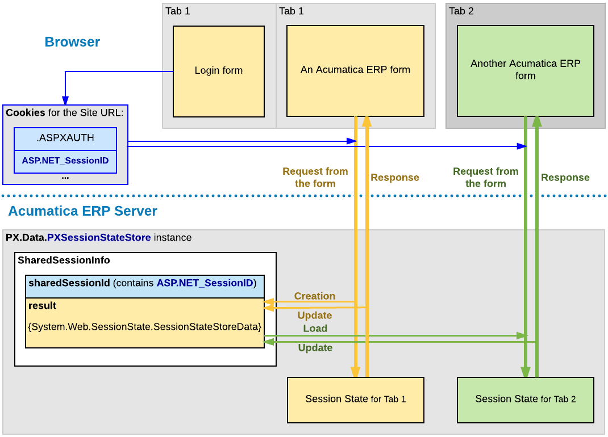

# Session {#_4009fc41-b1ec-4e2d-9940-c92a32d5ca9b .concept}

The Acumatica ERP server creates a separate session for each browser tab or window that opens an Acumatica ERP form.

The server creates the first session for a user after the user authorization when the starting form is loading. Then the server does the following:

-   Saves the user authorization data \(.ASPXAUTH\) and the session ID \(ASP.NET\_SessionID\) in the browser cookies for the website URL
-   Creates the shared session data to be used for the Acumatica ERP forms opened in new browser tabs and windows
-   Saves the shared session data in the storage that is specified in the website configuration

When the user opens a form of Acumatica ERP in a new browser tab, the server creates a new session that is based on the previous session data. To access the shared data, the server uses the session ID from the cookies, which are added to the request by the browser.

The following diagram shows how the server of Acumatica ERP manages the shared session data that is used for multiple sessions of a single user.

If the session data has been changed during the processing of a request, the server updates the data in the shared session data store. For example, if the user clicks **Copy** on a form toolbar to copy the form data, the data is stored in the shared session, so that it is accessible for the **Paste** action in another session of the same user.

To distinguish different sessions that have the same ASP.NET\_SessionID, the server adds to each new session a unique identifier that consists of the *W* character and a number value wrapped in parentheses. In the browser, you can see such an identifier in the site URL, as with the bolded part in the following example: *http://localhost/MySite/__\(W\(3\)\)__/Main?ScreenId=AR301000*.

**Parent topic:**[Working with Data in Cache and Session](../StudioDeveloperGuide/AD__mng_Working_with_Cache_and_Session.md)

