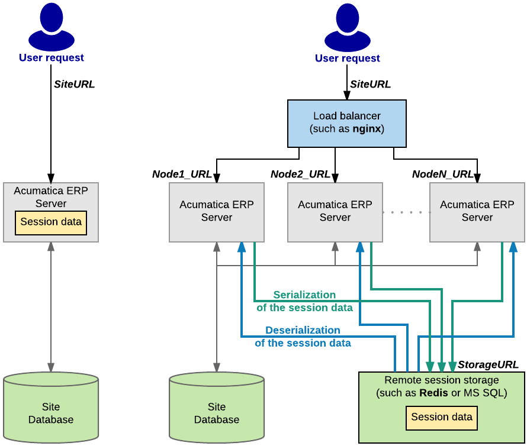

# Session Sharing Between Application Servers {#_18374228-1e14-48e1-bc40-4f3b526928ed .concept}

To achieve horizontal scalability and fault tolerance, an application written with Acumatica Framework can be configured to run in a cluster of application servers behind a load balancer. With this configuration, it is not possible to predict the application server that will receive the next request from the client. In this model, session specific data must be shared between the application servers.

The following diagram shows difference in storing session data on a stand-alone server and in a cluster. On a stand-alone Acumatica ERP server, session data is stored in the server memory. In a cluster of application servers, session data must be serialized and stored in a high-performance remote server, such as Redis or Microsoft SQL.

The cost of serialization and the amount of data that need to be shared between application servers is often the main challenge to scaling complex business applications horizontally.

Acumatica Framework implements the following techniques to address issues related to session-state management without sacrificing performance, fault tolerance, or scalability:

-   Objects on the application server are created on each request and disposed after the request execution. The application state is preserved in the session through the serialization mechanism.
-   Data serialized into the session is minimized to store only modified data \(inserted, deleted, held and modified records\). \(Serialization and retrieval times are directly proportional to the size of the serialized data.\)
-   The rest of the data is extracted from the database on demand and built around the session data. \(A custom algorithm that extracts only the data required for the current request execution from the database is implemented.\)
-   A custom serialization mechanism is implemented to serialize only relevant data and reduce the amount of service information. \(The standard serialization mechanism implemented in the Microsoft .NET platform is generic and cannot be optimized when used for a specific task.\)
-   Hash tables, constraints, relations, and indexes concerned with the execution of business logic are created strictly on demand. This technique allows the user to avoid execution of these operations on each request if not needed. \(Creation of indexes, constrains, hash tables, and relations consumes a significant amount of CPU and runtime memory.\)

**Parent topic:**[Working with Data in Cache and Session](../StudioDeveloperGuide/AD__mng_Working_with_Cache_and_Session.md)

