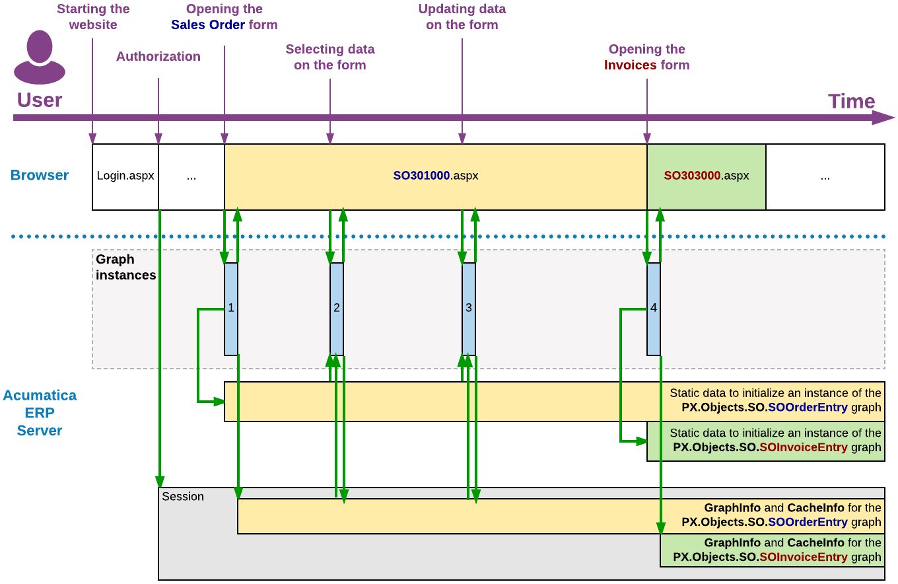
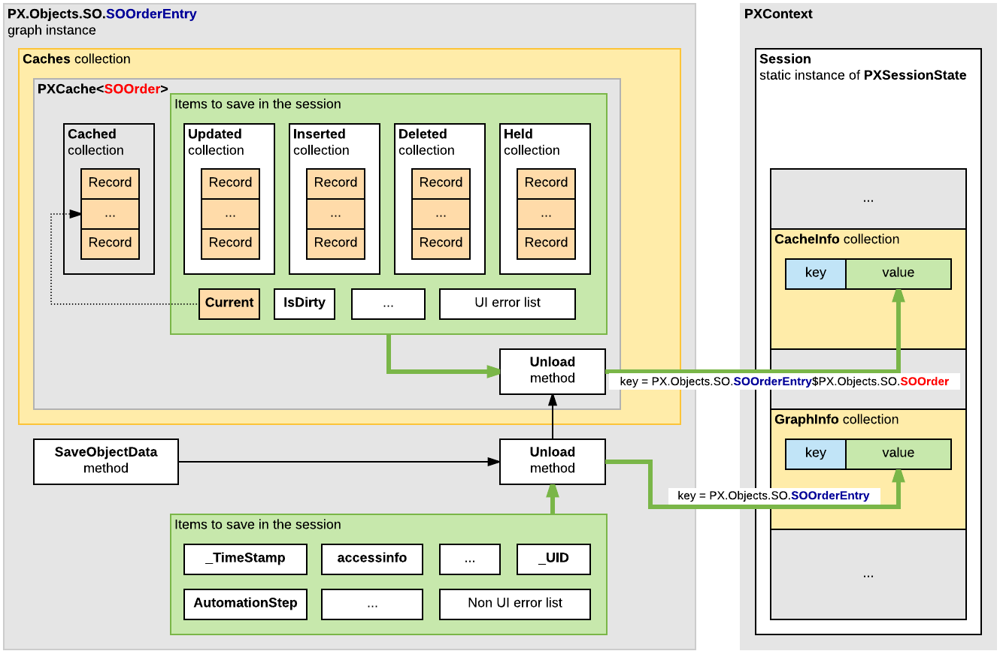

# Storing of Graph Data in the Session {#_7de20fae-aa20-407b-976d-38f05fb4083c .concept}

Acumatica ERP keeps all modified data records in the cache. Therefore, you do not change a data record in the database directly when you modify its value in the user interface.

**Note:** The system commits the changes to the database in the following cases:

-   The user clicks **Save**.
-   A request is sent through the web services APIs.
-   The Actions.PressSave method is invoked on the graph instance.
-   The PXAutoSaveAttribute attribute is defined for a data access class. As a result, the PXCache&lt;&gt;.Unload method automatically stores in the database all the changes of the appropriate data records at the end of each round trip.

A graph instance exists on the server only while a user request is being processed, and it is destroyed right after this processing. The following diagram shows that a graph instance is created to process a user request on the Acumatica ERP server and destroyed once processing is completed.



In the diagram above, the blue rectangles labeled 1, 2, 3, and 4 indicate the lifetime of graph instances. After a graph instance completes the processing of a request, the system stores the graph state in the session. It also stores the inserted, deleted, held, and modified records of the cache that are required to restore the state and data of the graph for the processing of the subsequent user request on the same Acumatica ERP form.

**Note:** On a stand-alone Acumatica ERP server, session data is stored in the server memory. In a cluster of Acumatica ERP servers, session data must be serialized and stored in external high-performance session state storage. \(For more information on storing session data in a cluster, see [Session Sharing Between Application Servers](AD__con_Session_Sharing.md).\)

For a user request on an Acumatica ERP form, the following operations are executed in the system:

1.  The application server creates a graph instance that is specified in the TypeName property of the PXDataSource control of the form. \(For more information about the initialization of graph views, caches, actions, and event handlers, see [Initialization of an Event Handler Collection](BL__con_Execution_of_Event_Handlers.md#_57644a4b-f2b5-4ff0-bf72-622bf84d90f7).\)
2.  If the user session contains graph data that has been stored during a previous request, the system loads the graph state and the cache data from the session.
3.  The graph instance processes the requested data on the data view that is specified in the ASPX code in the DataMember property of the control container for the data to be processed. To process the data, the system invokes the ExecuteSelect, ExecuteInsert, ExecuteUpdate, or ExecuteDelete method of the graph, based on the request type. The invoked method implements the logic of the appropriate scenario to add the request data to the cache and to execute the event handlers defined for the data fields and records in the cache. \(See [Data Manipulation Scenarios](BL__con_Events_Scenarios.md) for details.\) The cache then merges the data retrieved from the database with the data restored from the session, and the application accesses the data as if the entire data set had been preserved from the time of the previous request.
4.  The graph instance returns the request results to the PXDatasource control of the form.
5.  The system stores in the session the graph state and the modified data of the cache.

    **Note:** Because the graph instance is no longer being used by the application server, the .NET Framework garbage collector then clears the memory allocated for the graph instance.


While a graph is instantiated, all the cached data of the graph is saved in the appropriate PXCache objects that are created in the graph instance based on the data access class \(DAC\) declarations. To preserve the modified entity data between user requests, the cache controller saves the Updated, Inserted, Deleted, and Held collections of each PXCache object in the session.

The following diagram shows how the graph state and cache data are stored in the Session object.



In the diagram above, notice the following:

-   The items of the graph instance are stored in the GraphInfo collection of the Session object as a key-value pair, where the key is equal to the full name of the graph.
-   The items of a PXCache object are stored in the CacheInfo collection of the Session object as a key-value pair, where the key consists of the following parts separated by the *$* symbol:
    1.  The full name of the graph
    2.  The full name of the DAC

**Note:** When you instantiate a graph from code, the system will not load data from the session, because you may want to perform redirection or other processing. You can direct the system to load this data by using the PXPreserveScope class, as the following code snippet shows.

```
using (new PXPreserveScope())
{
  GraphName graph = PXGraph.CreateInstance<GraphName>();
  graph.Load();
  ...
}
```

**Parent topic:**[Working with Data in Cache and Session](../StudioDeveloperGuide/AD__mng_Working_with_Cache_and_Session.md)

