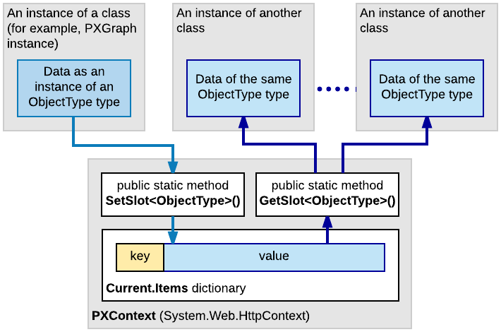
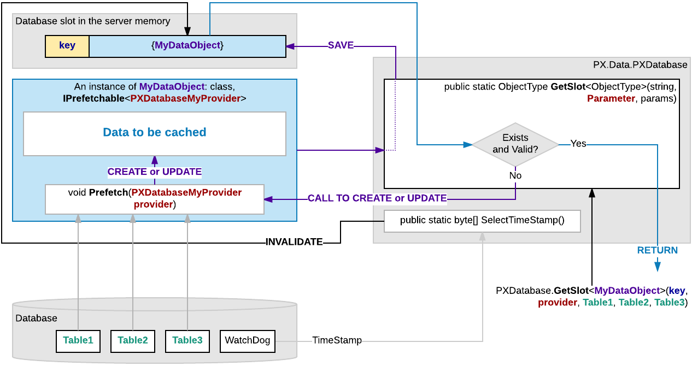

# Use of Slots to Cache Data Objects {#_7d60ac9e-ff6c-40fc-a593-52e1545493fe .concept}

If you have to cache a data object from your code, you can use the slots provided by the PXContext and PXDatabase classes. By using these slots, you can cache any type of data object without restrictions.

A slot provided by the PXContext class exists in the memory of the application server only during the current HTTP request. Therefore, you can use these slots for quick data exchange while the server processes a single request.

A slot of the PXDatabase class is stored in the server memory until you clear the slot. Therefore, you can use such a slot to cache a data object for a long time—for example, to read the cached data during a future HTTP request.

If a PXDatabase slot is used to cache the data that is obtained from the database tables, you can use a special API to automatically update the data in the slot when any of these tables has been changed.

For detailed information on using slots, see the sections of this topic.

## Caching Data in PXContext Slots {#_d38fe24d-5e23-4635-8ade-ede9f4dca92b .section}

If you need to keep a data object during a single HTTP request, we recommend that you cache the object in a slot provided by the PXContext class.

You can use the following public static methods of the class to save a data object in a slot.

|Method|Description|
|------|-----------|
|`public static ObjectType SetSlot<ObjectType> (ObjectType value)`|Stores the specified data object under the key that is created on the base of the object type.|
|`public static ObjectType SetSlot<ObjectType> (string key, ObjectType value)`|Stores the specified data object under the key that is defined by the first parameter.|

The following example shows how you can save the `MyData` object in the slot of the current HTTP context under the key that is the same as the object type.

```
PXContext.SetSlot<MyDataType>(MyData);
```

To get a data object that is cached in the current HTTP context, you can use the following methods of the PXContext class.

|Method|Description|
|------|-----------|
|`public static ObjectType GetSlot<ObjectType>()`|Returns the data object that is cached under the key that is created on the base of the object type.|
|`public static ObjectType GetSlot<ObjectType> (string key)`|Returns the data object that is cached under the specified key.|

The following example shows how you can get from the slot of the current HTTP context the `MyData` object that is cached under the *MyData22* key.

```
var MyData = PXContext.GetSlot<MyDataType>("MyData22");
```

The following diagram illustrates how you can use a data object cached by using a slot provided by the PXContext class.



You do not need to delete the data saved in the PXContext class slots, because the system deletes these slots from the server memory along with the data of the current HTTP context created for the current request.

## Caching Data in PXDatabase Slots {#_020dad6c-309a-4ecf-acd9-684fb03a39b3 .section}

If you need to keep a data object in the server memory for a long time, we recommend that you cache the object in a slot provided by the PXDatabase class.

You can use the following public static methods of the class to cache a data object in a slot and to get the cached object from the slot.

|Method|Description|
|------|-----------|
|`public static ObjectType GetSlot<ObjectType> (string key, params Type[] tables)`|If the PXDatabase slots contain a valid data object of the specified type saved under the key defined by the first parameter, returns this data object. Otherwise, the method creates a new object of the specified type, saves this empty object in the slot under the key defined by the first parameter, and returns the data object that is used by the calling code to save the needed data. The list of the table types specified in the params parameter is used to invalidate the slot if any table of the list has been changed in the database.**Note:** If this method is used to cache a data object of an `ObjectType` class inherited from the IPrefetchable&lt;&gt; interface, the GetSlot&lt;&gt; method invokes the Prefetch method of the object without a parameter.

|
|`public static ObjectType GetSlot<ObjectType, Parameter> (string key, Parameter parameter, params Type[] tables)`|Is used for caching a data object of an `ObjectType` class inherited from the IPrefetchable&lt;&gt; interface to provide automatic update of the object in the slot. If the PXDatabase slots contain a valid data object of the specified type saved under the key defined by the first parameter, the method returns this data object. Otherwise, the method does the following:1.  Creates a new object of the specified type
2.  To create or update data in the object, invokes the Prefetch method with the parameter specified in the second parameter
3.  Saves this object in the slot under the key defined by the first parameter
4.  Returns the data object to the calling method

The list of the table types specified in the params parameter is used to invalidate the slot in the case if any table of the list has been changed in the database. The use of this method is described below in the [Automatically Updating Data in a PXDatabase Slot](#_469c7eaf-0f4b-4cad-97f4-f4676e32419e) section.|

The following example shows how you can use the GetSlot&lt;ObjectType&gt; \(string key, params Type\[\] tables\) method to cache data under the *MyData* key in the slot of the PXDatabase class.

```
...
  Dictionary<string, string[]> dict = 
    PXDatabase.GetSlot<Dictionary<string, string[]>>(
      "MyData", typeof(Table1), typeof(Table2), typeof(Table3));
  lock (((System.Collections.ICollection)dict).SyncRoot)
  {
...
    List<string> myList = new List<string>();
...
    string key = "myListKey";
    dict[key] = myList.ToArray();
  }
...
```

After the data object has been cached, you can access the object by using the following instruction.

```
Dictionary<string, string[]> dict = 
          PXDatabase.GetSlot<Dictionary<string, string[]>>(
            "MyData", typeof(Table1), typeof(Table2), typeof(Table3));
```

You can clear a slot provided by the PXDatabase class by means of the following public static methods of the class.

|Method|Description|
|------|-----------|
|`public static void ResetSlot<ObjectType> (string key, params Type[] tables)`|Sets to *null* the value of the slot that has the specified key.|
|`public static void ResetSlots()`|Sets to *null* the value of each slot that is provided by the PXDatabase class.|

The following example shows how you can clear the slot created in the example above.

```
PXDatabase.ResetSlot<MyDataType>(
            "MyData", typeof(Table1), typeof(Table2), typeof(Table3));
```

## Automatically Updating Data in a PXDatabase Slot {#_469c7eaf-0f4b-4cad-97f4-f4676e32419e .section}

If a data object that is to be cached depends on data in the database, we recommend that you inherit the object class from the IPrefetchable&lt;&gt; interface and develop in this class the Prefetch method, to provide automatic updating of data in the object. Then the `GetSlot<ObjectType, Parameter>(string key, Parameter parameter, params Type[] tables)` method of the PXDatabase class will use the Prefetch method to update the data in the slot, if required. \(See the description of the method in [Caching Data in PXDatabase Slots](#_020dad6c-309a-4ecf-acd9-684fb03a39b3).\)

For example, suppose that you need to develop a data provider that selects data from multiple tables of the database and caches the data in PXDatabase slots. To do this, you can develop the provider class based on the following code.

```
public abstract class MyProvider : ProviderBase
{
  // Here you can add abstract definitions for all the methods of 
  // the PXDatabaseMyProvider class
}

public class PXDatabaseMyProvider : MyProvider
{

  private class MyDataObject : IPrefetchable<PXDatabaseMyProvider>
  {
    public MyDataType MyData = new MyData();

    public void Prefetch(PXDatabaseMyProvider provider)
    {
      // Here you can implement the code to generate data of the MyData object.
    }
  }

  private MyDataObject MyDataObj
  {
    get
    {
      return PXDatabase.GetSlot<MyDataObject, PXDatabaseMyProvider>(
        "MYDATA_SLOT_KEY",
               this, typeof(Table1), typeof(Table2), typeof(Table3)
               /* ,... Add here the types of all tables, any change in which 
               should make the slot invalid. */ );
    }
  }

  // Here you need to add the code for all the methods that are defined 
  // in the MyProvider abstract class.
  // These methods can be used to manage the MyData object.
...
}
```

The code above contains declarations of the following classes:

-   The `MyProvider` abstract class, which derives from the System.Configuration.Provider.ProviderBase public abstract class and is used to define implementation of the `PXDatabaseMyProvider` class.
-   The `PXDatabaseMyProvider` class, which contains the following:
    -   The `MyDataObject` private class, which derives from the IPrefetchable&lt;PXDatabaseMyProvider&gt; interface and contains the following members:
        -   The `MyData` data object to be cached
        -   The Prefetch method, which creates or updates the data object
    -   An implementation of the methods that are declared in the `MyProvider` abstract class and used to manage to the `MyData` object. To access the data object stored in the database slot, in these methods, you can use the `MyDataObject` property of the `PXDatabaseMyProvider` class, as the following instruction shows.

        ```
        MyDataObject data = MyDataObj;
        ```


For the code above, the following diagram shows how the data object is cached and automatically updated in the PXDatabase slot.



**Note:** If you have discovered that a PXDatabase slot returns legacy data, you can invoke the SelectTimeStamp\(\) public static method of the PXDatabase class to invalidate all the PXDatabase slots that contain data obtained from the database tables that have been changed. Then the GetSlot method invokes the Prefetch method and updates the data in the slot.

**Parent topic:**[Working with Data in Cache and Session](../StudioDeveloperGuide/AD__mng_Working_with_Cache_and_Session.md)

