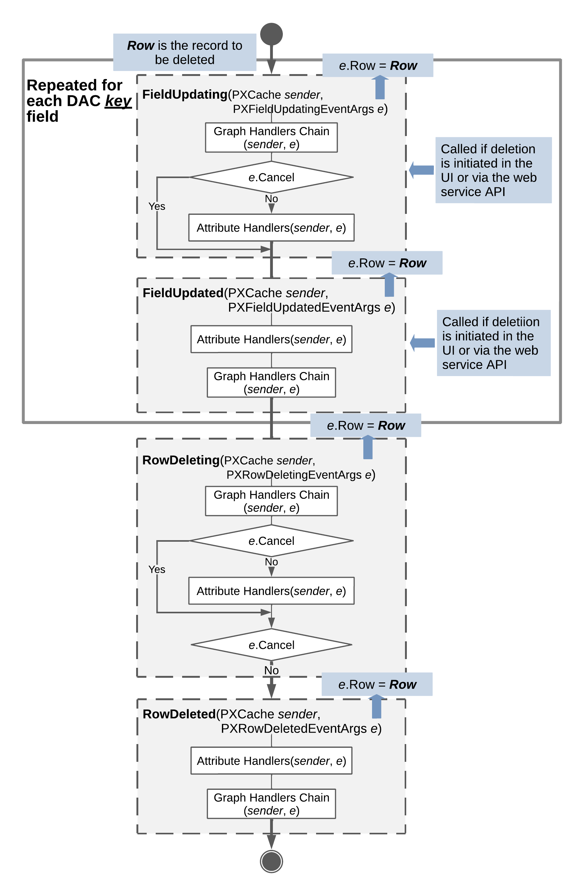

# Sequence of Events: Deletion of a Data Record {#_0d160007-252e-44f8-a9cd-25b40b786dc1 .concept}

The figure below illustrates the sequence of events raised during the deletion of a data record.

A data record is deleted when a user deletes the record on the user interface, the deletion request is sent through the Web Service API, or the `Delete()` method of a data view is invoked in code. As a result of the deletion, the data record gets the Deleted status if it already exists in the database, or the InsertedDeleted status if the record has just been inserted into the PXCache object and deletion from the database is not required. The data record is later available through the Deleted and Dirty collections of the PXCache object.

If the deletion has been initiated by a user on the UI or through the web services API, the following field events are raised for each key data field before any other events are raised:

1.  `FieldUpdating`
2.  `FieldUpdated`

Next, regardless of how the deletion was initiated, data record events are raised as follows:

1.  `RowDeleting` is raised. At this point, the developer can still stop the deletion by throwing a PXException instance or by setting `e.Cancel` to `true`. Note that throwing an exception will interrupt the code execution and roll back any changes. However, setting `e.Cancel` to `true` will allow code execution to continue, and the PX.Cache.Delete will return `null`. This option provides the developer with the opportunity to use their custom business logic to handle the failed record deletion sequence. In the `e` variable representing event data, `e.Row` holds the data record being deleted.
2.  If `e.Cancel` does not equal `true` then `RowDeleted` is raised, and `e.Row` still holds the data record.

The data record will be reverted to the previous state and the RowDeleted event will not be raised if the delete operation is canceled.

**Parent topic:**[Working with Events](../StudioDeveloperGuide/BL__mng_Working_With_Events.md)

