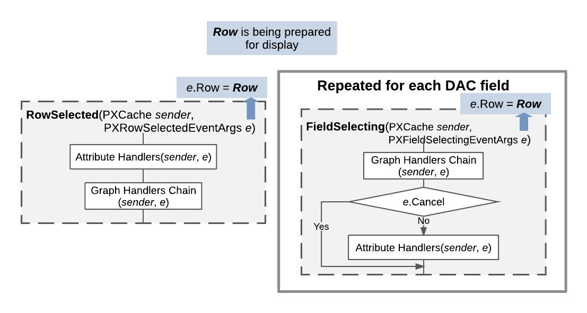

# Sequence of Events: Display of a Data Record {#_02e8c036-30e7-4cca-86bd-b0dc47626793 .concept}

Each time a data record is displayed in the user interface or retrieved through the Web Service API, the `RowSelected` and `FieldSelecting` events are raised for each data field. For both events, the `e.Row` property of event arguments holds the data record that is being displayed or retrieved.

The diagram below illustrates this process in more detail.

**Parent topic:**[Working with Events](../StudioDeveloperGuide/BL__mng_Working_With_Events.md)

