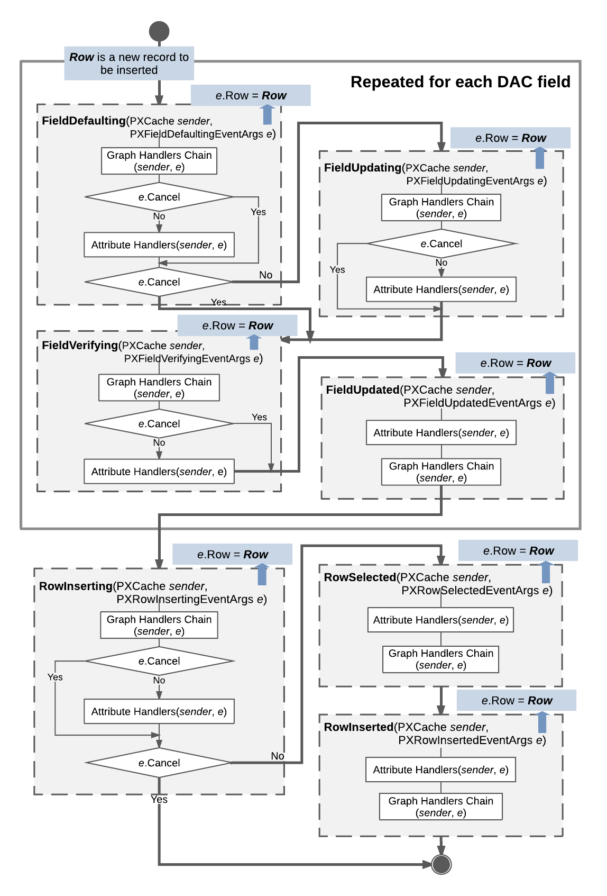

# Sequence of Events: Insertion of a Data Record {#_5fb67bf3-6db4-498d-983c-e4fe28a65d11 .concept}

The figure below illustrates the sequence of events raised during the insertion of a data record.

The system inserts a data record as an instance of a data access class \(DAC\) when a user creates a new data record in the user interface, a request to insert a record is sent to the web services API, or the `Insert()` method of a data view is called in code. The data record is actually inserted into the PXCache object that corresponds to the DAC of the data record. The inserted data record has the Inserted status and is available through the Inserted and Dirty collections of the PXCache object.

When a data record is inserted, data field events are raised for each data field in the following order:

1.  `FieldDefaulting`
2.  `FieldUpdating` if the `e.Cancel` property equals true
3.  `FieldVerifying` if the value being inserted into the data field is not the default value
4.  `FieldUpdated` if the value being inserted into the data field is not the default value

Next, the following data record events are raised:

1.  `RowInserting` \(If the `e.Cancel` property is `true`, no further events are raised.\)
2.  `RowSelected`
3.  `RowInserted`

The instance of the inserted data record is available in the `e.Row` property of event arguments.

**Parent topic:**[Working with Events](../StudioDeveloperGuide/BL__mng_Working_With_Events.md)

