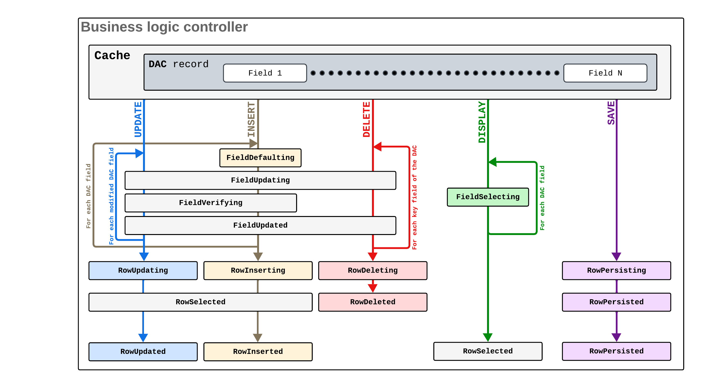

# Data Manipulation Scenarios {#_d9cf6274-f5c8-43e7-9d13-9b423113d67e .concept}

Most events are raised within common scenarios related to the manipulation of data records. The scenarios are invoked by Acumatica Framework when users perform certain actions in the user interface, when the corresponding requests are made to the web services API, and when special methods are executed within the business logic controller \(BLC\).

The following diagram shows how different types of event handlers are invoked.

For details on how Acumatica Framework processes the basic data operations, see the following topics:

-   [Sequence of Events: Insertion of a Data Record](BL__con_Events_Insert.md)
-   [Sequence of Events: Update of a Data Record](BL__con_Events_Update.md)
-   [Sequence of Events: Deletion of a Data Record](BL__con_Events_Delete.md)
-   [Sequence of Events: Display of a Data Record](BL__con_Events_Display.md)
-   [Sequence of Events: Saving of Changes to the Database](BL__con_Events_Persist.md)

**Parent topic:**[Working with Events](../StudioDeveloperGuide/BL__mng_Working_With_Events.md)

