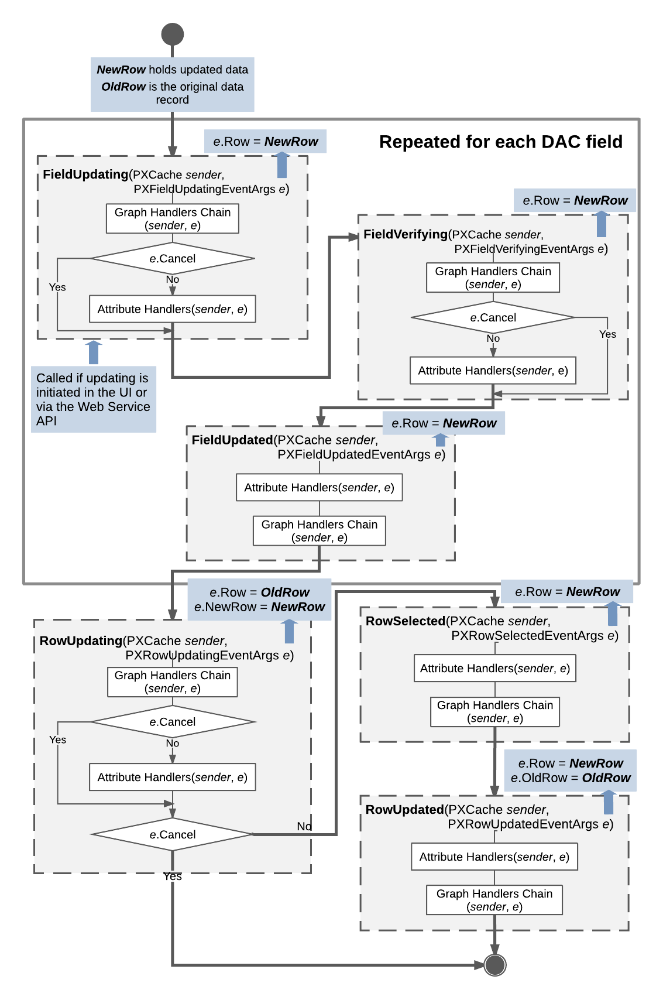

# Sequence of Events: Update of a Data Record {#_8f77ddc6-374b-4ad9-be20-a282febf88f8 .concept}

The figure below illustrates the sequence of events raised during the update of a data record.

A data record is updated when a user modifies the data record on the user interface, the request is sent through the Web Service API, or the `Update()` method is invoked on the data view. Updated data records, which the system gives the Updated status, are later available through the Updated and Dirty collections of the appropriate PXCache object.

The RowUpdating event is fired before the update happens, while the RowUpdated event is fired after the update. The developer can handle these events and has access to the updated data record and the previous version of the data record that is kept in the PXCache object. The actual update happens between these two events when the data record is copied to the PXCache object.

When a data record is updated, the following data field events are raised for each updated data field:

1.  `FieldUpdating`
2.  `FieldVerifying`
3.  `FieldUpdated`

Next, data record events are raised as follows:

1.  `RowUpdating` is raised. At this moment, in the `e` variable, which represents event data, `e.Row` holds the data record version from the cache, while `e.NewRow` holds the updated data record. You can still stop the update by throwing a PXException instance.
2.  If `e.Cancel` does not equal `true`:
    1.  `RowSelected` is raised. Only the updated data record can be accessed through `e.Row`.
    2.  `RowUpdated` is raised. `e.Row` now holds the updated instance, while `e.OldRow` holds a copy of the old data record with the previous values.

**Parent topic:**[Working with Events](../StudioDeveloperGuide/BL__mng_Working_With_Events.md)

