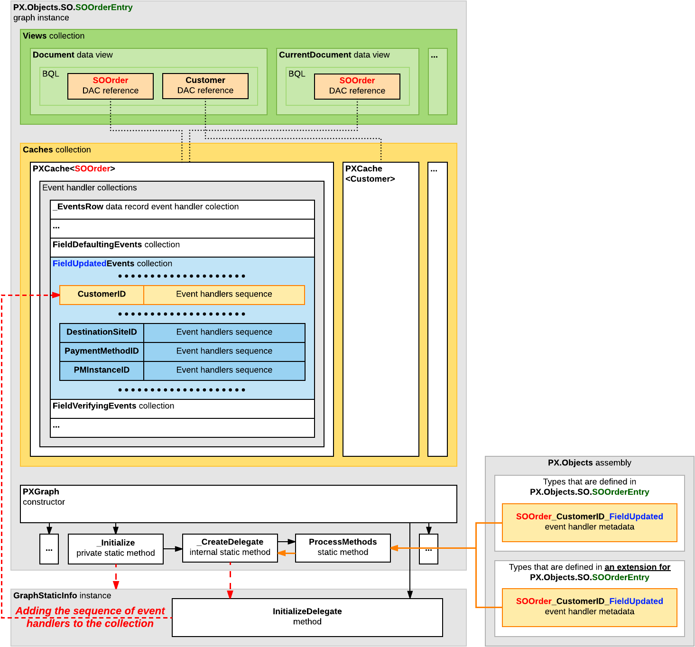

# Execution of Event Handlers {#_4a062f32-f55b-4e0e-bc04-aa38683a69b5 .concept}

In this topic, you can find information about how event handlers are executed and how to add and remove event handlers at runtime.

## Execution of Event Handlers { .section}

All event handlers for a particular event share the same PXCache instance that has raised this event. The system creates a PXCache instance to control the modified data records of a particular data access class \(DAC\) type. The PXCache instance is always available as the first argument in an event handler; the second argument provides the specific data that corresponds to the event.

Once an event is raised, the order in which the associated event handlers are executed may differ. For some events, the chain of graph event handlers is executed before the attribute event handlers are; the attribute event handlers are executed only if the Cancel property of the event arguments does not equal true after the execution of the graph event handlers.

For other events, the attribute event handlers are executed first, and the graph event handlers are executed next.

## Dynamic Addition of Event Handlers { .section}

A business logic controller \(BLC\) includes the collections of graph event handlers for all events except CacheAttached. Each of these collections holds event handlers for a particular event and has the same name as the event. \(You can find more information about how these collections are initialized in the [Initialization of an Event Handler Collection](#_57644a4b-f2b5-4ff0-bf72-622bf84d90f7) section in this topic.\) By using the methods of these collections, you can add and remove graph event handlers in code at runtime.

A method added as an event handler must have the signature of a graph event handler, but does not need to follow the naming convention for graph event handlers. If you want to add a method as an event handler, you invoke the `AddHandler<>()` method on the corresponding collection. For example, if the event is related to a row, it is invoked as follows.

```
RowEventName.AddHandler<DACName>(MethodName);
```

The event is invoked as follows if it is related to a field.

```
FieldEventName.AddHandler<DACName.fieldName>(MethodName);
```

As an alternative to the `AddHandler<>()` method, you can use its strongly typed version, `AddAbstractHandler<>()`, to add a method as an event handler. Thus, if the event is related to a row, it is invoked as follows.

```
RowEventName.AddAbstractHandler<DACName>(MethodName);
```

If the event is related to a field, it is invoked as follows.

```
FieldEventName.AddAbstractHandler<DACName, DACName.fieldName>(MethodName);
```

When the `AddHandler<>()` or `AddAbstractHandler<>()` method is invoked, event handlers are added to the collection as follows:

-   To the beginning of the collection for any event whose name ends with *ing* except the RowSelecting event
-   To the end of the collection for any event whose name ends with *ed* and for the RowSelecting event

To remove a handler, you should invoke the `RemoveHandler<>()` method. Alternatively, you can invoke its strongly typed version, `RemoveAbstractHandler<>()`.

## Initialization of an Event Handler Collection {#_57644a4b-f2b5-4ff0-bf72-622bf84d90f7 .section}

On each round trip, the PXGraph\(\) constructor does the following while it initializes a graph instance:

1.  Creates the Cashes, Views, and Actions collections and other required collections. All of these collections are initially empty.
2.  If the graph instance is being created on the Acumatica ERP server for the first time:
    1.  Obtains the metadata of this graph from the appropriate assembly \(which is PX.Objects for most graphs in the application\).
    2.  By using the metadata, emits the InitializeDelegate method, which is designed to subscribe event handlers and to initialize graph views, caches, and actions. To process the metadata for the fields declared in the graph, the constructor invokes the PXGraph.ProcessFields static method. To process the metadata of the methods that are defined in the graph, the constructor invokes the PXGraph.ProcessMethods static method.

        **Note:**

        The ProcessMethods method processes the metadata of the methods that are declared in the graph and all extensions of the graph. According to the naming convention for event handlers, the *\_* symbol is a separator, so this method tries to split the name of each processed method into segments. If the name of the processed method has fewer than two segments or more than three segments, the processed method is skipped.

        If the name of the processed method adheres to the naming convention for record event handlers, the processed method is added to the \_EventsRow collection of the PXCache&lt;DACName&gt; object that is instantiated in the graph instance based on the DAC declaration. For example, the SOOrder\_RowSelected event handler is added to the \_EventsRow collection of the PXCache&lt;SOOrder&gt; cache object as an element with the RowSelected key.

        If the name of the processed method adheres to the naming convention for field event handlers, the processed method is added to the *EventName*Events collection of the PXCache&lt;DACName&gt; object. For example, the SOOrder\_CustomerID\_FieldUpdated
 event handler is added to the FieldUpdatedEvents collection of the PXCache&lt;SOOrder&gt; cache object as an element with the CustomerID key.

    3.  Saves the graph metadata and the InitializeDelegate emitted method in the Acumatica ERP server memory as the GraphStaticInfo static object shared for the entire application instance.
3.  From the GraphStaticInfo static object, invokes the InitializeDelegate method, which initializes graph views, caches, and actions; the method also adds event handler delegates to the appropriate event handler collections of the relevant PXCache objects.

The following diagram shows how an instance of the PX.Objects.SO.SOOrderEntry graph uses the PX.Objects assembly metadata to add the SOOrder\_CustomerID\_FieldUpdated\(\)
 event handler \(described in the graph and graph extensions\) to the FieldUpdatedEvents collection of the PXCache&lt;SOOrder&gt; cache object.



In the collection, the CustomerID field name is used as a key, and the delegate of the event handler sequence for the field processing is used as a value.

**Parent topic:**[Working with Events](../StudioDeveloperGuide/BL__mng_Working_With_Events.md)

