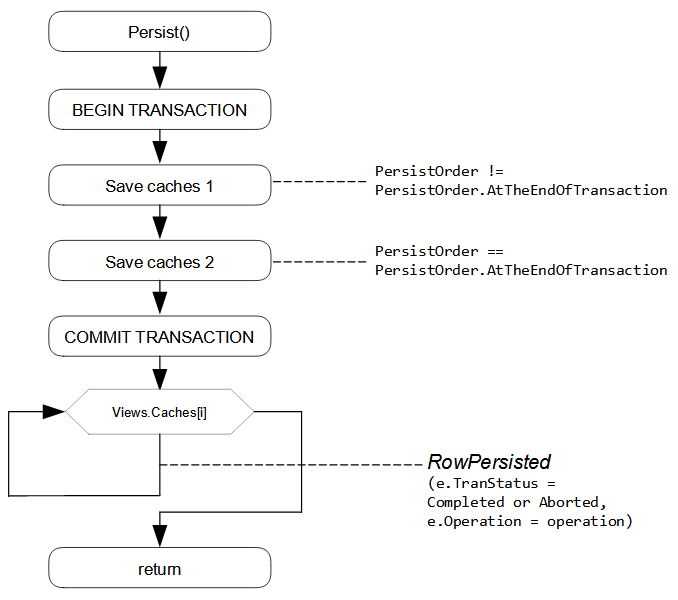
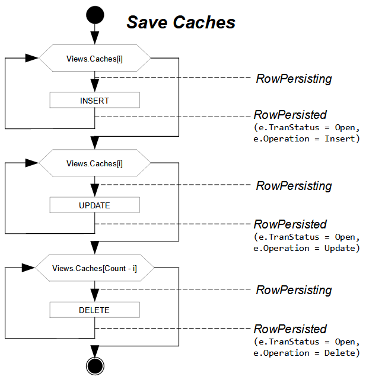

# Saving of Changes to the Database {#_91f58a54-6929-4a5f-aeba-7f79d16f62db .concept}

A graph provides transactional saving of changes from all cache objects to the database. The graph commits the data to the database when you invoke the Actions.PressSave\(\) method of the graph or when the user clicks **Save** in the UI. In both cases, the Persist\(\) method of the graph is invoked. The Actions.PressSave\(\) method also verifies that the Save action exists in the graph and is enabled. The Save action then invokes the Persist\(\) method.

**Note:** To save changes on the form to the database, you should use the Actions.PressSave\(\) method. To save changes without the user clicking the **Save** button, you can use the Persist\(\) method. You should not invoke the Persist\(\) method on the current graph instance. \(You can invoke this method for only a graph instance created in a background operation.\)

The graph commits changes from all cache objects within a single database transaction. If any row modification fails, the entire transaction is rolled back, and no changes from any cache object are persisted.

In the Persist\(\) method, the system starts the database transaction \(see the diagrams below\). Within the transaction, the collection of cache objects is divided into two groups:

-   DACs that are not marked with the `PXDBInterceptorAttribute` attribute or its descendant, or have attributes with the `PersistOrder` property not equal to *PersistOrder.AtTheEndOfTransaction*
-   DACs whose attributes have the `PersistOrder` property equal to *PersistOrder.AtTheEndOfTransaction* \(for example, DACs that are marked with the `PXAccumulatorAttribute` attribute\).

For each group, the graph iterates the collection of cache objects three times: for inserted records, for updated records, and for deleted records. First, all new records from all cache objects are inserted, and then all modified records are updated. Finally, within the same transaction, all deleted records are removed from the database. The graph iterates the collection of caches so that all master records are saved and then all detail records are saved.

**Note:** For new records and updated records, the graph iterates the collection of caches in the order in which the data views are declared in the graph. That's why in the graph, the master data view must be declared before the detail data view. For deleted records, the graph iterates the collection of caches in the reverse order. The graph access the caches through the Views.Caches collection, which is formed from the main DACs of all data views declared in the graph.

In each iteration, the framework raises the RowPersisting event for a data record, executes the appropriate SQL command for this data record within the transaction, and then raises the RowPersisted event with the *Open* transaction status.

When the SQL commands have been executed successfully for all modified \(inserted, updated, or deleted\) data records, the graph commits the transaction. Regardless of the result of the transaction, the graph raises the RowPersisted event, in which you can check the status of the transaction. A successful transaction has the Completed status. If an error or exception has occurred during the transaction, the transaction returns the Aborted status. If the transaction fails, the modified data remains in cache objects. On the RowPersisted event for an aborted transaction, you can revert changed records to the default values.

When the RowPersisting event is raised, you can cancel the saving of a particular row to the database by setting the e.Cancel property to `true` in the graph handler for the event. For the sequence of events raised for each modified row within the Persist\(\) method of the graph, see [Sequence of Events: Saving of Changes to the Database](BL__con_Events_Persist.md).

**Parent topic:**[Working with Events](../StudioDeveloperGuide/BL__mng_Working_With_Events.md)

