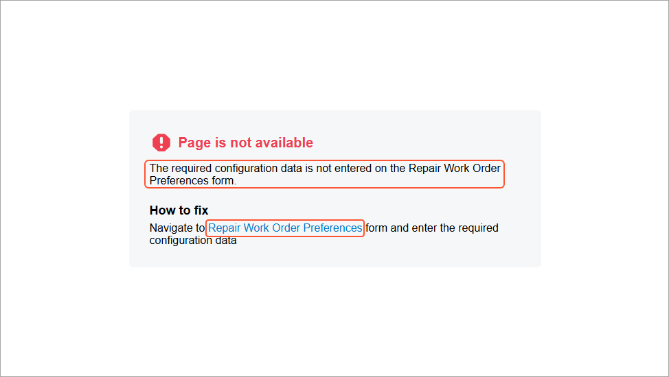

# Configuration Parameters of the Application \(Setup Forms\) {#_e8ee0bad-780a-4489-8dce-48395e6757f2 .concept}

The configuration parameters of an application may include business settings, initial values, options, and modes that can be enabled or disabled. Configuration parameters are stored in *setup tables*. Each major part of an application can use its own setup tables. For example, in Acumatica ERP, the `ARSetup` and `APSetup` tables hold the configuration settings for the accounts receivable and accounts payable parts of the application, respectively. Administrators specify these settings on the [Accounts Receivable Preferences](../UserGuide/AR_10_10_00.md) \(AR101000\) and [Accounts Payable Preferences](../UserGuide/AP_10_10_00.md) \(AP101000\) forms, respectively.

A setup data access class \(DAC\) never has key fields. When a user navigates to a setup form, the system displays the first retrieved data record. If no record is retrieved, the framework creates a new record that is saved to the database when the user clicks **Save** on the form. The next time the form is opened, the previously inserted record is retrieved. **Save** and **Cancel** are the only buttons that are necessary on a setup form.

A record from a setup table represents a consistent set of configuration parameters—that is, all fields of the record are specified and cannot be `null` \(the administrative user cannot save the record without all elements being specified, whether with default settings or those the user has specified\). You do not have to verify that each parameter has been specified in the setup record before use of this record. Instead, you just verify the existence of the setup record; its existence implies that all required parameters have been specified. If the configuration parameters have not been specified and a user tries to navigate to a form that uses these configuration parameters, you can return a specific error page that provides the link to the setup form where a user can specify the configuration parameters \(see the following screenshot\).



In an Acumatica Framework-based application, the configuration parameters are used as data fields of a `Setup` class. To define and use a `Setup` class, you perform the following steps:

1.  Create a `Setup` table in the database. \(You add a prefix to the `Setup` name according to [Naming Conventions for Tables \(DACs\) and Columns \(Fields\)](DA__con_Table_Column_Naming_Conventions.md).\) Add to this table columns that represent configuration parameters.
2.  Define a `Setup` data access class with the same name as the name of the `Setup` database table. In the data access class, add the PXDefault attribute to the required configuration parameters.
3.  Create an edit form for the `Setup` data record.

    You should configure the UI of the setup form so that an administrative user can insert and edit only one record, which represents the configuration of this part of the application. Define only two actions, `Save` and `Cancel`, for this page.

4.  Add the [PXPrimaryGraph](https://help.acumatica.com/(W(4))/Help?ScreenId=ShowWiki&pageid=842ed8f6-e659-45ef-3083-6696cf1fecaf) attribute to the `Setup` DAC. In the attribute, specify the graph used by the setup form.

To display the error page for missing configuration data in the UI when the user tries to navigate to a form that depends on configuration parameters, you do the following:

1.  In the graph where you want to use configuration parameters, define the PXSetup data view as follows.

    ```
    public class ReceiptEntry : PXGraph<ReceiptEntry, Document>
    {
        public PXSetup<Setup> AutoNumSetup;
        ...
    }
    ```

2.  In the graph constructor, obtain the current record from the PXSetup data view, as the following code shows.

    ```
    public ReceiptEntry()
    {
        Setup setup = AutoNumSetup.Current;
    }
    ```


## Configuration Parameters in a Multitenant Application { .section}

Each tenant may have its own configuration parameters that are identified by the company ID in the setup table. To support multitenant configuration, the setup table should contain the `CompanyID` column as the primary key in the database. The `CompanyID` field is not declared in DACs. This column is transparently handled by the framework, which retrieves records by the needed `CompanyID` only.

The application template provides two tenants by default: the System tenant and the active one. The System tenant is read-only and has a `CompanyID` of 1. The second tenant, which is active, is used for all new and updated objects. The active tenant has a `CompanyID` of 2. The configuration parameters are saved to the setup table with the `CompanyID` of 2. Each new tenant that you add to the application gets the next sequential ID: 3, 4, and so on.

**Parent topic:**[Creating Setup Forms](../StudioDeveloperGuide/BL__mng_Creating_Forms.md)

