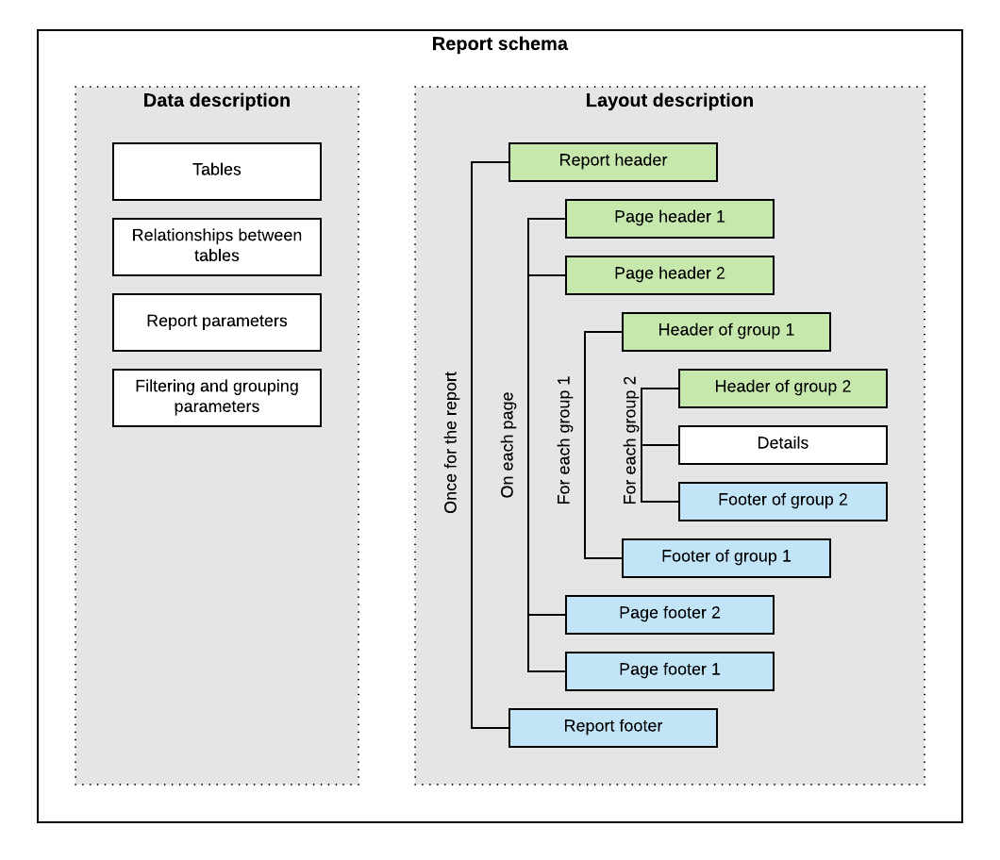
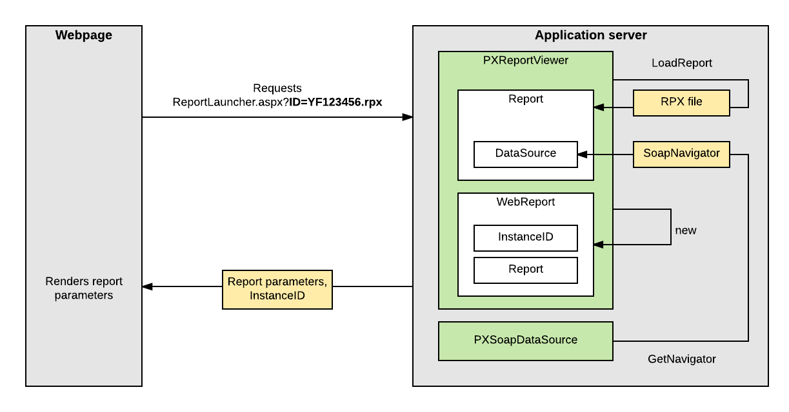

# Display of Reports {#_45dbe9ed-94a0-4183-80f8-eede0415b5ae .concept}

In this topic, you can find information about how Acumatica ERP displays reports that are created with the Acumatica Report Designer.

## What a Report Is { .section}

A report is an RPX file \(which is created with the Acumatica Report Designer\) that contains the report schema in XML format—that is, the description of the data that should be displayed in the report and the description of the report layout.\(See the following diagram.\) The description of the data of the report includes the following: the database tables that provide data for the report, the relationships between these tables, the parameters that can be specified before the report is run, and the filtering and grouping parameters. The report layout is a tree of headers, details, and footers.



Reports can be saved in files on disk, or in the UserReport table of the database of an Acumatica ERP instance. \(The UserReport table uses the file name of the report as a key and stores the schema of the report in XML format in the Xml column.\)

The saved report can be published on an Acumatica ERP site—that is, added to the site map and to any applicable workspaces so that the users can work with the report.

For details on creating reports with the Acumatica Report Designer, see the [S130 Reporting: Inquiry, Report Writing, Dashboards](https://openuni.acumatica.com/courses/reporting/s130-inquiries-reports-and-dashboards/) training course.

Acumatica ERP provides the following ways to run a report that you have created by using the Acumatica Report Designer:

-   From a report form, which is added to the site map, when the user clicks the **Run Report** button on the form toolbar
-   From a maintenance or entry form, when the user clicks the action button whose name is associated with the report name

## How the Report Is Launched from the Report Form {#_ae3acf88-4440-4fac-a524-4fe7e8a7f0ac .section}

When a user opens the report form, the webpage performs the POST HTTP request to the `ReportLauncher.aspx` page, passing the name of the report file as the ID query string parameter of the request, as shown in the following example.

```
http://localhost/AcumaticaDB/frames/ReportLauncher.aspx?id=YF123456.rpx&HideScript=On
```

The `ReportLauncher.aspx` page contains the PXReportViewer control, whose JavaScript objects and functions are designed to obtain the report data and display the data on the form, and the PXSoapDataSource control, which is used to retrieve data for the report.

On the server side, an instance of the PX.Web.UI.PXReportViewer class processes the request as follows:

1.  Loads the report schema from the file on disk or from the database \(by using the LoadReport method\) to a PX.Reports.Controls.Report object \(which stores the report schema in memory and provides the methods for working with this schema\).
2.  If the report schema is loaded successfully, performs the following:
    1.  Instantiates a PX.Reports.Web.WebReport object that will store data of the launched report and assigns an instance ID to WebReport.
    2.  Binds the Report object to the data source that is specified by the PXSoapDataSource control of the ASPX page. The PX.Web.UI.PXSoapDataSource class instantiates a SoapNavigator object, which will be then used to retrieve data for the report from the database.

The server returns an XML response with the report parameters to display and with the ID of the instance of WebReport in the session. The browser displays the report parameters and other options on the report form.

The following diagram illustrates how the report form is launched.



## How the Report Data Is Retrieved {#_84960e46-15bb-492e-b167-a5a09b8e7163 .section}

After the user has selected the values of the parameters of the report and clicked the **Run Report** button on the form toolbar of the report form, the webpage sends the GET request to `PX.ReportViewer.axd` on the server with the ID of the WebReport instance in the session \(which was created when the report was launched\), as shown in the following example.

```
http://localhost/AcumaticaDB/PX.ReportViewer.axd?
  InstanceID=10bf4a13a38c4af39cafc80926e407f2&OpType=Report
  &PageIndex=0&Refresh=True
```

To process the request, the server invokes the Render method of the WebReport class, which launches the generation of the report as a long-running operation in a separate thread.

To retrieve the data of the report from the database, the system uses the PX.Data.Reports.SoapNavigator object \(to which a reference is stored in the Report object\). SoapNavigator instantiates a PXGraph object \(without a type parameter\) and composes a BQL command as an instance of the PX.Data.Reports.BqlSoapCommand class. BqlSoapCommand inherits from the PX.Data.BqlCommand class and is optimized for retrieving data for the reports. BqlSoapCommand has the IndexReportFields method, which uses the [PX.Data.PXDependsOnFieldsAttribute](https://help.acumatica.com/(W(1))/Main?ScreenId=ShowWiki&pageid=d89d1d7c-1dd4-c7e5-36c0-524ea3f80117) attribute to get the dependent fields of the report recursively. For details on how BQL commands are used to retrieve data from the database, see [Translation of a BQL Command to SQL](AD__con_BQL_Translation_to_SQL.md).

The system processes the data and creates a ReportNode object. That is, the system creates the sections of the report based on the data retrieved from the database and on the report schema from the Report object, and calculates all formulas inside the sections. Then the system uses the resulting ReportNode object, which contains all sections with all needed values, to render data in the needed format.

## How the Report Data Is Displayed { .section}

After the long-running operation has completed, the PXReportViewer control displays the report on the report form.

If a report is displayed in HTML format and the user turns the pages of the report, the webpage sends the GET request to `PX.ReportViewer.axd`. The query string parameters of the request are the ID of the report in the session and the number of the page, as shown in the following request URL.

```
http://localhost/AcumaticaERP/PX.ReportViewer.axd?
  InstanceID=008f2a8afb1a4998ade98bc64fc30ad9&OpType=Report
  &PageIndex=0
```

The format in which the report is displayed \(either PDF or HTML\) is specified in the OpType query string parameter of the request, as shown in the following request URL.

```
http://localhost/AcumaticaERP/PX.ReportViewer.axd?
  InstanceID=008f2a8afb1a4998ade98bc64fc30ad9&OpType=PdfReport&Refresh=True
```

If a user turns the pages of the report or changes the format of the report, the system creates the results of the report from the ReportNode object stored in the session by using the renderer for the needed format. That is, the system does not retrieve the data of the report from the database and does not processes this data to create a ReportNode object once again.

## How the Report Is Launched from the Maintenance or Entry Form {#_1535b822-2515-4dd0-a31e-c527b7317ff0 .section}

On a form, when a user clicks the action button to generate a report, the data source control of the form creates a request to the Acumatica ERP server to execute the action delegate defined for the button. The server creates an instance of the graph, which provides the business logic for the form and invokes the action delegate method. The action delegate obtains from the form the data required to define the report parameters and throws an exception of the PX.Data.PXReportRequiredException type with the report ID and these parameters. The system processes the exception, saves the report parameters to the session, and redirects the user to the `ReportLauncher.aspx` page.

The `ReportLauncher.aspx` page loads the report schema and instantiates a WebReport object, as described in [How the Report Is Launched from the Report Form](#_ae3acf88-4440-4fac-a524-4fe7e8a7f0ac). Instead of retrieving the values of report parameters from the webpage, the system opens the report with the parameters stored in the session. The system retrieves data for the report, as described in [How the Report Data Is Retrieved](#_84960e46-15bb-492e-b167-a5a09b8e7163).

**Parent topic:**[Maintaining Reports](../StudioDeveloperGuide/CC__mng_Working_with_Reports.md)

