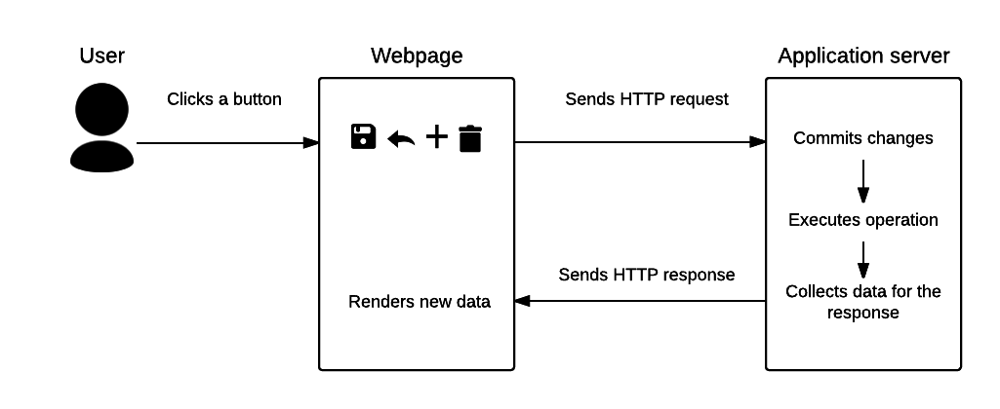
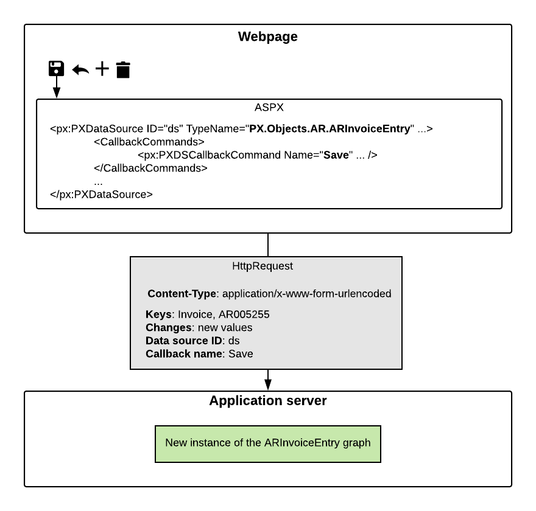
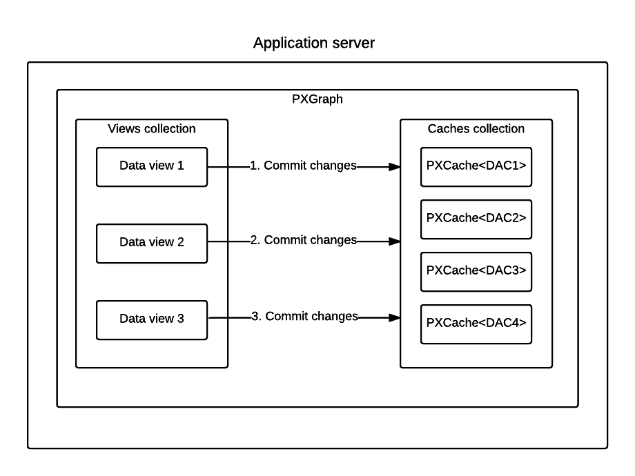

# Processing of a Button Click {#_a23d3b80-e763-46da-9beb-c1447ceae4b3 .concept}

When a user clicks a button on an ASPX page, such as the **Save** button on the toolbar of a form, the webpage creates a postback HTTP request to the server. When processing the request, the application server does the following: commits changes \(if required by the operation initiated by the user\), executes the operation, and collects data for the response. Then the application server sends the response to the webpage, which renders the new data.

The following diagram illustrates this process, which is described in more detail in the sections of this topic.



## Sending of the HTTP Request { .section}

When the user clicks a button on a webpage, the page creates an HTTP request to the server. The request includes the following information:

-   The values of the key fields of the record currently displayed on the page
-   The changes that have been made to the data on the page
-   The information on the command that was initiated by the user—the data source ID and the callback name

The PXDataSource.TypeName property defines the graph that processes data for the page. When the application server receives the request, the server creates a new instance of the graph to process the data of the request. The properties of PXDSCallbackCommand indicate which operations should be performed on the server in addition to the operation initiated by the user.

The diagram below shows how the HTTP request is sent to the server.



## Commitment of Changes to the Cache { .section}

If the callback command initiated by the user has the CommitChanges property set to `true` \(which is the default setting\) or the CommitChangesIDs property specified, the server commits the changes before executing the command. The graph instance commits the changes to the cache in the order in which the data views are defined in the graph, as shown in the following diagram.



## Execution of the Command { .section}

After the changes have been committed, the graph instance executes the operation initiated by the user, such as saving data to the database. You can find details on the sequence of events raised when data is inserted, updated, deleted, or saved to the database in [Data Manipulation Scenarios](BL__con_Events_Scenarios.md).

## Collection of the Data for the Response { .section}

When the command execution is completed, the application server does the following:

1.  If the RepaintControls or RepaintControlIDs property of PXDSCallbackCommand specifies any controls to be repainted after the command is executed, the application server includes in the response all information that is necessary to repaint these controls on the webpage. \(By default, the value of the PXDSCallbackCommand.RepaintControls property is All, which means that all controls on the page are repainted.\)
2.  The application server executes the Select method for each data view of the graph.

## Sending of the HTTP Response and Rendering of the Controls { .section}

The application server sends the response to the page. The response includes data in XML format; the parameters that are necessary for the controls to be repainted are specified in JSON format, as shown in the following fragment of the response.

```
<Controls>
  <Control ID="ctl00_phF_form_edDocType" 
           Props="{items:&quot;INV|Invoice|1;DRM|Debit Memo|1;CRM|
                   Credit Memo|1;FCH|Overdue Charge|1;SMC|Credit WO|1&quot;,
                   value:&quot;FCH&quot;}" />
  <Control ID="ctl00_phF_form_edRefNbr" Props="{value:&quot;AR005254&quot;}" />
  ...
</Controls>
```

The scripts in the browser \(the scripts from PX.Web.UI.Scripts\) find the controls to be repainted by IDs and repaint these controls by using the data provided in the response. Most of the scripts in PX.Web.UI.Scripts contain a class that works with one control. For example, `px_textEdit.js` includes the PXTextEdit class, which works with the PXTextEdit control.

## Exceptions to the Process { .section}

For the buttons not found on the main toolbar, the process described in this topic may slightly differ.

For example, for the table toolbar buttons, which perform actions on particular rows of grids, the scripts translate the data in XML format, which is returned in the response, to HTML format by using XSLT.

For the buttons in dialog boxes \(the PXSmartPanel control\), no commit of changes is performed. Whether data is selected from the database depends on the particular dialog box. The data that is returned from the server is in HTML format.

**Parent topic:**[Overview of ASPX Pages in Acumatica Framework](../StudioDeveloperGuide/CW__mng_Overview.md)

