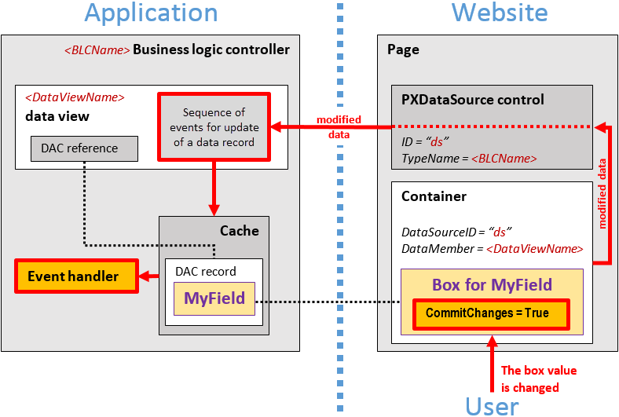

# Use of the CommitChanges Property of Boxes {#_596c3620-e3d5-4d2f-9c19-3b65486a2761 .concept}

If you need to process the value in a box every time the user changes this value, you need to set the CommitChanges property of the box to *True* to enable callbacks for the box.

If callback is enabled for a box in a container on a page, the user has changed the box value, and focus is no longer on the box on the page, the container immediately collects all the modified data and a callback is created to pass the data to the PXDataSource control of the page \(see the diagram below\).

The PXDataSource control creates a remote procedure call to the application server to execute the *Update* operation with the modified data on the data view that is specified as the DataMember property for the container. The data view executes the sequence of events for update of a data record \(for details, see [Sequence of Events: Update of a Data Record](BL__con_Events_Update.md)\) on the data in the cache object of the business logic controller. The cache object raises the events that you can handle to process the modified data.

**Parent topic:**[Configuring Boxes](../StudioDeveloperGuide/CW__mng_Configuring_Boxes.md)

