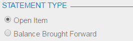
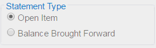

# Use of the RenderStyle Property of PXGroupBox {#_a06a9841-555c-4622-963d-642f096b8ca3 .concept}

To define the style of a group box on the form, you have to select a value of the RenderStyle property of the PXGroupBox element in the ASPX code, as follows.

```
<px:PXGroupBox ... RenderStyle="StyleName" ...>
```

The Acumatica Framework supports the following RenderStyle values for the PXGroupBox element.

|Name|Description|Example|
|----|-----------|-------|
|Fieldset|Indicates that the group of radio buttons can be displayed with a caption in the same style as in a grouping layout rule.||
|RoundBorder|The default value. Indicates that the group of radio buttons can be displayed with a caption in a rounded border.||
|Simple|Indicates that the group of radio buttons can be displayed without a caption and border.||

**Parent topic:**[Configuring Boxes](../StudioDeveloperGuide/CW__mng_Configuring_Boxes.md)

