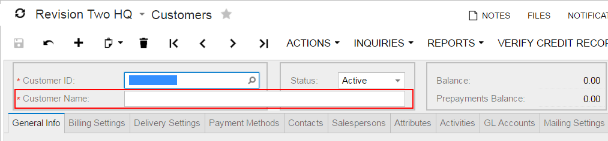

# Use of the ColumnSpan Property of PXLayoutRule {#_41c31abf-2297-4c31-b5c2-848b95f9288f .concept}

You specify the ColumnSpan property value for a PXLayoutRule component by manually typing the number of columns spanned by the first control placed below the rule.

## Example { .section}

As an example of the use of the ColumnSpan property, the form container on the [Customers](../UserGuide/AR_30_30_00.md) \(AR303000\) form has three columns of boxes, and there is a layout rule with the ColumnSpan property set to *2* in the first column. This property forces the system to make the box span two columns, as shown in the following screenshot.

## Dependencies { .section}

A PXLayoutRule component with the ColumnSpan property value specified is handled as follows:

-   The LabelsWidth property value is always inherited from the previously declared PXLayoutRule component that has the StartRow or StartColumn property value set to *True*.
-   If a value for the ColumnWidth or ControlSize property is specified for the component, this value is ignored.

**Parent topic:**[Configuring Layout and Size](../StudioDeveloperGuide/CW__mng_Configuring_Layout.md)

