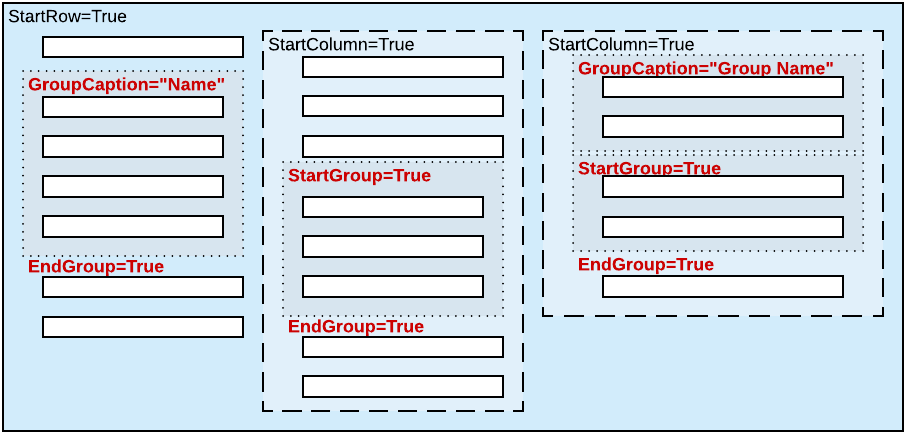

# Use of the GroupCaption, StartGroup, and EndGroup Properties of PXLayoutRule {#_1341b9b1-1868-4544-9737-6c521506965f .concept}

You can organize controls in a container within groups to make users' work more logical.

## Grouping of Controls { .section}

To group multiple controls within a column, generally you have to add two PXLayoutRule components that have the following properties set to define the first and the last controls in the group, respectively:

-   GroupCaption and EndGroup: To create a group with the caption specified in the GroupCaption property
-   StartGroup and EndGroup: To create a group without a caption

**Tip:** You can specify both the GroupCaption property and the StartGroup property for a PXLayoutRule component that starts a group.

For example, by specifying the GroupCaption property value for the corresponding PXLayoutRule components placed above a control, you start the group of controls and set up the header for the group. You should also add a PXLayoutRule component with the EndGroup property value set to *True* below \(in the code\) the last control that is included in the group.

You end a group by using a PXLayoutRule component with a GroupCaption, StartGroup, or EndGroup property specified. Therefore, if there is another group that starts immediately below a group, you can omit the layout rule that ends the upper group, as shown in the third column of the row displayed in the example in following diagram.

## Dependencies { .section}

The system works as follows for all PXLayoutRule components with the GroupCaption or StartGroup property value specified:

-   If the GroupCaption, StartGroup, or EndGroup property is set for a PXLayoutRule component, the system ignores the ColumnWidth property value specified for the component.
-   The default values for the ControlSize and LabelsWidth properties are inherited from the previously declared PXLayoutRule component with the StartRow or StartColumn property value set to *True*. You can override these property values, if necessary, by specifying the ControlSize and LabelsWidth property values in the layout rule that starts a group. \(See [Predefined Size Values](CW__con_LayoutRules_Properties_Predefined.md) for details.\)

**Parent topic:**[Configuring Layout and Size](../StudioDeveloperGuide/CW__mng_Configuring_Layout.md)

