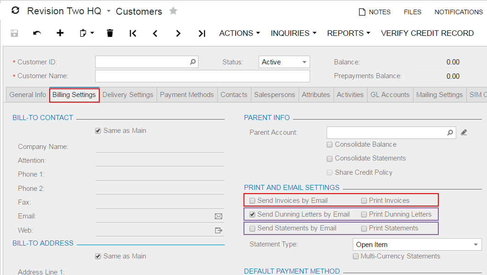

# Use of the Merge Property of PXLayoutRule {#_325b7979-f32d-40eb-920b-7880245e8a26 .concept}

Horizontal alignment is performed for the controls that are placed between a layout rule with the Merge property set to *True* and the next layout rule. Therefore, to cancel merging for all of the following controls, you have to add a PXLayoutRule component with or without the Merge property specified.

## Example { .section}

As an example of the use of the Merge property, the **Billing Settings** tab item on the [Customers](../UserGuide/AR_30_30_00.md) \(AR303000\) form has three pairs of merged check boxes in the **Print and Email Settings** group. This property forces the system to render the boxes in one column, as shown in the following screenshot.

## Dependencies { .section}

A PXLayoutRule component with the Merge property value set to *True* is handled as follows:

-   If the ColumnWidth property value is set for the same PXLayoutRule component, the value is ignored.
-   The default values for the ControlSize and LabelsWidth properties are inherited from the previously declared PXLayoutRule component with the StartRow or StartColumn property value set to *True*. You can override these property values, if necessary, by specifying the ControlSize and LabelsWidth property values from the predefined list of options. \(See [Predefined Size Values](CW__con_LayoutRules_Properties_Predefined.md) for details.\)

**Parent topic:**[Configuring Layout and Size](../StudioDeveloperGuide/CW__mng_Configuring_Layout.md)

