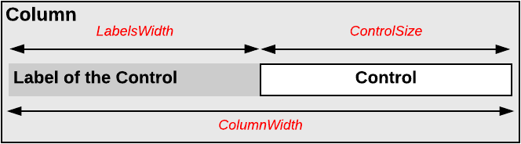

# Use of the ColumnWidth, ControlSize, and LabelsWidth Properties of PXLayoutRule {#_40e018a5-16cc-4395-a59f-481b53a5254f .concept}

You can use the PXLayoutRule components to define the sizes for every control \(that is, its input area\) and its label within a column, group, or merged set of controls.

## Required Properties { .section}

Every PXLayoutRule component that has the StartRow or StartColumn property value set to *True* must have one of the following sets of properties defined:

-   LabelsWidth and ControlSize
-   LabelsWidth and ColumnWidth

The following diagram illustrates the meaning of the LabelsWidth, ControlSize, and ColumnWidth properties.

**Tip:** You should not set property values for both ColumnWidth and ControlSize for the same PXLayoutRule component; in this case, the system would use the value of the ControlSize property.

## Setting of the Size { .section}

Please note the following points about setting the sizes of controls and their labels:

-   The values of the ColumnWidth, ControlSize, and LabelsWidth properties must be defined exclusively for every PXLayoutRule component; they are never inherited from the previously declared one.
-   You can change the size of a single control or its label by defining values for the Size, Width, and LabelsWidth properties of the control. Property values that are set for a control have a higher priority than the property values of the PXLayoutRule component.
-   You can assign a predefined size abbreviation \(such as *XXS*, *L*, or *XL*\) for the ColumnWidth, LabelsWidth, and ControlSize properties of a layout rule and the LabelsWidth and Size properties of a control. \(See [Predefined Size Values](CW__con_LayoutRules_Properties_Predefined.md) for details.\)
-   The PXDateTimeEdit and PXNumberEdit control types have a predefined Width property value, which you cannot change by setting the ColumnWidth or ControlSize property values for the appropriate PXLayoutRule component. To change the width of this control, set a value for the Size or Width property of the control.

**Parent topic:**[Configuring Layout and Size](../StudioDeveloperGuide/CW__mng_Configuring_Layout.md)

