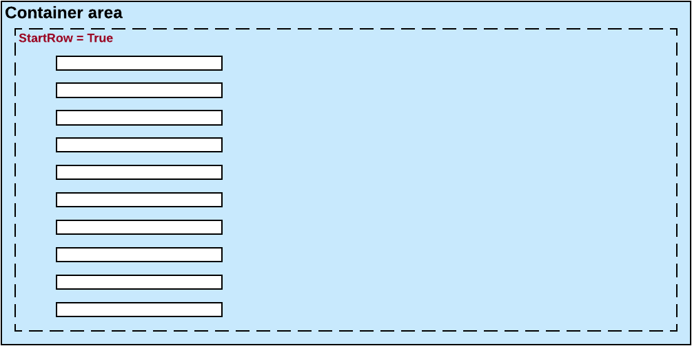
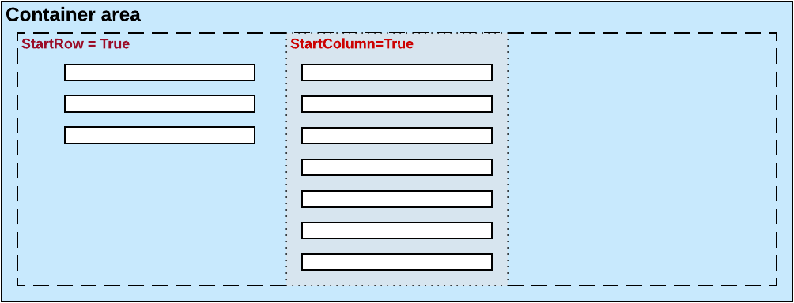
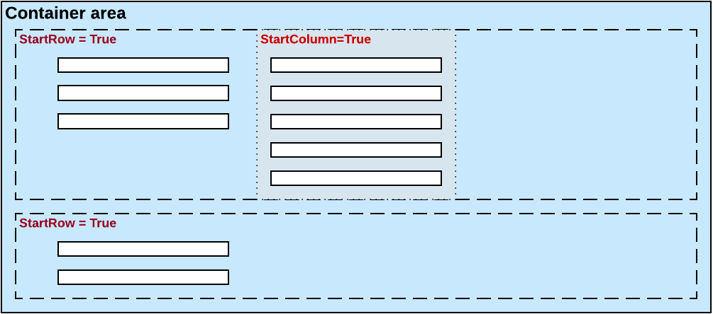

# Use of the StartRow and StartColumn Properties of PXLayoutRule {#_0edb26d6-414d-4bbb-8c30-ed1d2e65e0b8 .concept}

In this topic, you can find information how to organize controls on an ASPX page into rows and columns.

## Default Layout { .section}

By default, the system places all the controls of a container into a column within the first row, as shown in the diagram below. To do this, the system initially sets to *True* the StartRow property value for the uppermost PXLayoutRule component in a container.

The controls continue to be placed within a single column until you add a layout rule with the StartColumn or Merge property value set to *True*.

**Important:** For the proper layout, the StartRow property value must be set to *True* for the uppermost PXLayoutRule component of a container.

## Splitting of Controls into Columns { .section}

You can place controls in multiple columns within a row by adding PXLayoutRule components with the StartColumn property value set to *True*. This property creates a new column of controls within the current layout row, as the following diagram shows.

The first control under this rule is the highest control in the column.

## Splitting of Controls into Rows { .section}

Every new PXLayoutRule component that has the StartRow property value set to *True* initializes a new independent placeholder of controls, which are placed in a single column by default. To place controls in multiple columns within the new row, you should include in the placeholder a new layout rule with the StartColumn property value set to *True*, as shown in the following diagram.

## Sizes of Rows and Columns { .section}

Because the values of the ColumnWidth, ControlSize, and LabelsWidth properties are never inherited from the previously declared PXLayoutRule component, you might need to define these properties exclusively for every new row and column.

**Parent topic:**[Configuring Layout and Size](../StudioDeveloperGuide/CW__mng_Configuring_Layout.md)

