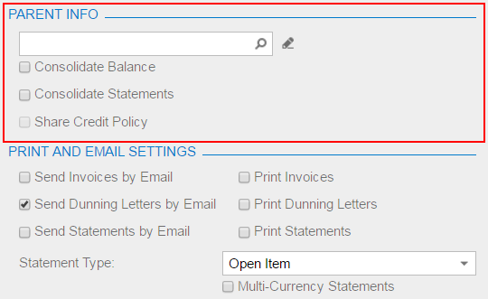

# Use of the SuppressLabel Property of PXLayoutRule {#_618baa6a-524a-4e0b-bf1a-dfe28c1205e8 .concept}

Every control for a data field contains both a label and the input area of the control. The label is displayed left of the input area, except with check boxes; the label of a check box is displayed right of the input area of the check box. When you add a check box to a form, the check box control is automatically aligned both left and right with other input controls in the appropriate column. As a result, the area of the form left of a check box is empty.

## SuppressLabel Property { .section}

To hide the labels of the controls placed within a column, you should set the SuppressLabel property value of the PXLayoutRule component of the column to *True*. Then within the column, all check boxes are placed without any space to the left of the input control, and the labels of other controls are hidden.

**Note:** If needed, you can left-align a check box in the column by setting to *True* the AlignLeft property of the control.

The SuppressLabel property affects all of the controls of the group that are placed under the PXLayoutRule component with the *True* value of this property. The SuppressLabel property value must be defined for every PXLayoutRule component for the controls placed beneath the component and included in the same column; this property is never inherited from the previously declared property.

**Note:** The SuppressLabel property value is never applied to PXLayoutRule components that have the ColumnSpan property value specified.

## Example { .section}

The **Parent Info** group on the **Billing Settings** tab item on the [Customers](../UserGuide/AR_30_30_00.md) \(AR303000\) form is initially displayed with **Parent Account** displayed, as shown in the following screenshot.

If you set the SuppressLabel property of the group layout rule to *True*, the label of the **Parent Account** box is hidden and all check boxes are displayed without any space to the left of the check boxes, as shown in the following screenshot.

**Parent topic:**[Configuring Layout and Size](../StudioDeveloperGuide/CW__mng_Configuring_Layout.md)

