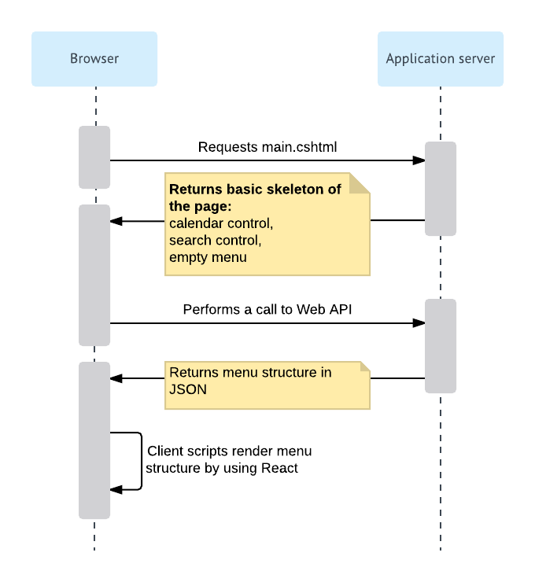
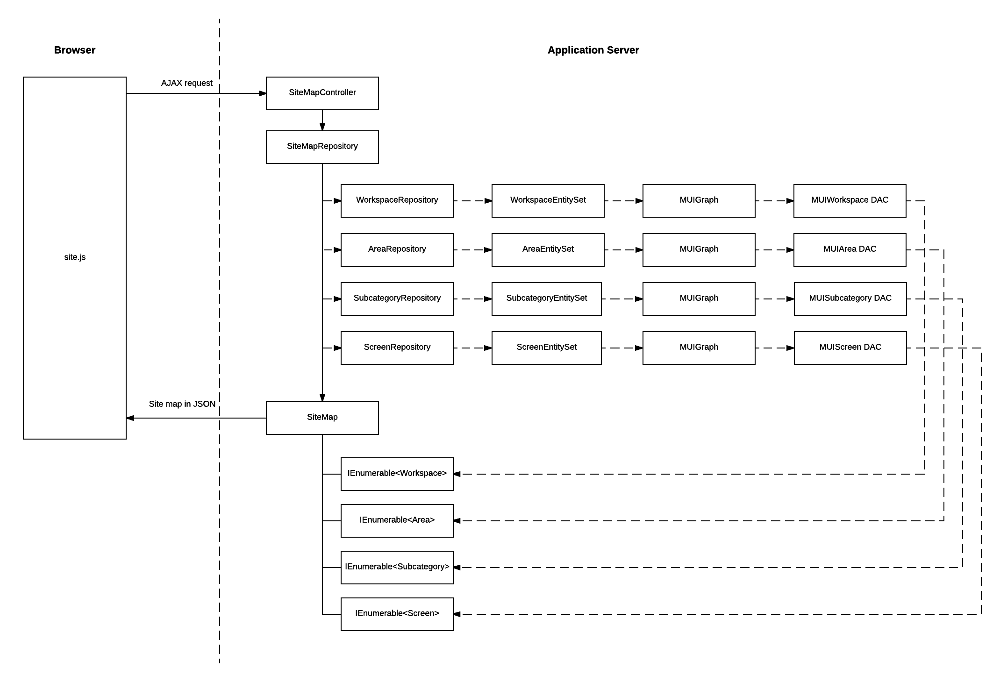

# Technical Overview of the User Interface {#_28874cf9-a344-4590-9f3d-70a67318b7c4 .concept}

In this topic, you can find a technical overview of the user interface of Acumatica ERP.

## Technologies in the UI { .section}

The user interface of Acumatica ERP includes the following frames:

-   The navigation frame, which is a webpage frame that can be used for navigation between Acumatica ERP forms.
-   The Acumatica ERP form, which is located in the inner frame, which is completely independent of the navigation frame.

The webpage renders the navigation elements of the navigation frame and the forms separately by using different technologies. The work of Acumatica ERP forms is based on the ASP.NET Web Forms technology, while the navigation frame uses the ASP.NET MVC technology with the Razor view engine.

The server side of the navigation frame uses the ASP.NET Core framework. The client side uses the React library, which is a JavaScript library, to render main menu items, workspaces, tiles, and other navigation elements.

## Work of the Navigation Frame { .section}

The following diagram shows how the browser renders the elements of the navigation frame. This process is described in more detail in the remaining sections of this topic.

## Request of main.cshtml { .section}

The browser retrieves `main.cshtml`, which is an ASP.NET MVC view, by sending the HTTP GET request. On the server side, this request is processed by the MainController.Main\(\) method \(PX.Web.UI.Frameset.Controllers\), which creates a System.Web.Mvc.ViewResult object that renders a view to the response. The returned view contains the basic skeleton of the webpage, which includes the calendar control, the search control, and the empty menu.

## Request of the Menu Structure { .section}

The getSiteMap function in `site.js` uses jQuery to send an AJAX request to the application server. On the server side, this request is processed by the SiteMapController class \(PX.Web.UI.Frameset.WebApi.Controllers\).

**Note:** To match the incoming request to the appropriate processing classes, the system uses the ASP.NET MVC attribute routing. For example, the SiteMapController class is annotated with the `[FramesetRoutePrefix("sitemap")]` attribute, which defines the `"frameset/sitemap"` route.

To get the site map structure, the SiteMapController class uses the SiteMapRepository class, which implements the ISiteMapRepository interface. The SiteMapRepository class fetches different entities of the navigation frame and assembles them in one structure, which is then passed to the browser. The system serializes the structure to JSON format by using the standard ASP.NET Core classes.

The SiteMapRepository class uses other classes that have the Repository suffix in their names, such as TileRepository and WorkspaceRepository, to retrieve the entities that are used in the navigation frame. These classes are completely independent from the database. To fetch the entities from the database, the Repository classes use the classes that implement the IEntitySet interface \(PX.Web.UI.Frameset.Model\), such as ScreenEntitySet. The classes use the MUIGraph graph to fetch data from the database. \(The graph performs only simple data operations, and does not contain any complicated business logic\). For each entity, there is a DAC that is used to access data in the database. The DACs correspond to the following database tables, which are used to store data for the elements of the navigation frame.

|Table|Description|
|-----|-----------|
|MUIWorkspace|Stores information about the workspaces in the application.|
|MUIFavoriteWorkspace|Stores information about the workspaces that have been pinned to the main menu. The workspaces that are not included in this list are displayed when a user clicks the **More Items** menu item.|
|MUIArea|Stores information about the areas to which workspaces belong. Areas are used to group workspaces in the **More Items** menu by types.|
|MUISubcategory|Stores information about the categories of Acumatica ERP forms. Categories are used to group forms in a workspace by types.|
|MUIScreen|Stores information about the locations of the Acumatica ERP forms in the user interface. The table is connected to the SiteMap table by the NoteID column.|
|MUIPinnedScreen|Stores information about the Acumatica ERP forms pinned to workspaces.|
|MUIFavoriteScreen|Stores information about the Acumatica ERP forms that have been added to favorites.|
|MUITile|Stores information about the tiles in workspaces. A tile is a special button on a workspace that you click to open a form or report with predefined settings.|
|MUIFavoriteTile|Stores information about the tiles that have been added to favorites.|
|MUIUserPreferences|Stores information about the position of the main menu, which can be on the left of the browser page \(default\) or on the top of the browser page.|

The following diagram illustrates the process of retrieving data for the navigation frame.

## Rendering of the Elements of the Navigation Frame { .section}

The main script that is used to render the navigation frame is `site.js`. It contains classes that use the React library to render elements of the navigation frame. Each such class includes the render method, which uses React classes to render the element. The following tables lists the main classes and their methods.

|Class|Description|
|-----|-----------|
|MenuModules|Renders the main menu \(which contains the list of workspaces\).

 In addition to the render method, the class has the following methods:

-   onClick: Processes the clicking of the Edit and Delete buttons for the items of the main menu in Menu Editing mode.
-   onClickFav: Processes the clicking of the Pin button in a workspace.
-   onDragStart, onDragOver, onDragLeave, and onDrop: Process operations related to dragging the items of the main menu in Menu Editing mode.

|
|TopLinks|Renders the tiles in the workspaces.

 In addition to the render method, the class has the following methods:

-   onClick: Processes the clicking of the Edit and Delete buttons for the tiles in Menu Editing mode and clicking of the Favorite button.
-   onDragStart, onDragOver, onDragLeave, and onDrop: Process operations related to dragging the tiles in Menu Editing mode.

|
|MenuColumn|Renders a list of forms in a workspace.

 In addition to the render method, the class has the following methods:

-   onClick: Processes the clicking of the Edit and Delete buttons for a form in a workspace in Menu Editing mode.
-   onClickFav: Processes the clicking of the Favorite icon for a form in a workspace.
-   onClickPin: Processes the clicking of a check box when a user selects a form in a workspace in Menu Editing mode.

|
|ModuleMenu|Renders all lists of forms in a workspace.

 In addition to the render method, the class has the following methods:

-   getItemsInCol, arrangeLinks, and arrangeLinks2: Arrange links to forms in lists.
-   onDragStart, onDragOver, onDragLeave, and onDrop: Process operations related to dragging the links to forms in a workspace in Menu Editing mode.

|

The `site.js` script also contains webpage event handlers, such as handlers for button-clicking events, which use jQuery to handle the events.

## Customization of the User Interface { .section}

An administrator can configure the user interface to fit the work purposes of the organization, as described in [Customizing the User Interface](../UserGuide/SA_Customizing_UI_Mapref.md) in the System Administration Guide.

To change the styles of the elements of the navigation frame, the developer can change the CSS related to these elements.

If a developer has added a new form or report to the Acumatica ERP site in a customization project, the location of the form in the user interface is included in the customization project along with the *SiteMap* customization project item, which is created either automatically or manually for the new item. For details, see [To Add a New Custom Form to a Project](../CustomizationPlatform/CG_GL_Items_Screens_AddingCustom.md) and [To Add a Custom Analytical Report to a Project](../CustomizationPlatform/CG_GL_Items_AnaliticalReports_Adding.md) in the Customization Guide. For the custom generic inquiries and dashboards, the information about the location in the user interface is included in the *GenericInquiryScreen* and *Dashboard* customization project items, respectively.

**Parent topic:**[Overview of ASPX Pages in Acumatica Framework](../StudioDeveloperGuide/CW__mng_Overview.md)

