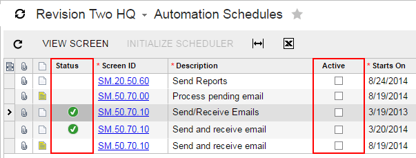

# Use of the Type Property of PXGridColumn {#_01146ab8-cc7a-4142-a626-95fbb3de4b50 .concept}

The Acumatica Customization Platform supports the following values for the Type property of a column in a grid.

|Value|Description|
|-----|-----------|
|*NotSet*|The default value. An indicator that the field value is displayed in the column as a plain string that is formed based on the field data format.|
|*CheckBox*|An indicator that the field value is displayed in the column as a check box, which is selected if the field value is *True*.|
|*HyperLink*|An indicator that the field value is displayed in the column as a hyperlink.|
|*DropDownList*|An indicator that the column cell is rendered as a drop-down list that contains all the values specified for the referred data field.|
|*Icon*|An indicator that the field value contains an image URL and is displayed in the column as the referred image.|

## Example { .section}

The following code fragment defines the grid columns on the [Automation Schedule Statuses](../UserGuide/SM_20_50_30.md) \(SM205030\) form.

```
...
<px:PXGridColumn AllowUpdate="False" DataField="LastRunStatus" Width="40px"
  Type="Icon" TextAlign="Center" />
<px:PXGridColumn DataField="ScreenID" DisplayFormat="CC.CC.CC.CC" 
  Label="Screen ID" LinkCommand="AUScheduleExt_View" />
<px:PXGridColumn DataField="Description" Label="Description" Width="200px" />
<px:PXGridColumn AllowNull="False" DataField="IsActive" Label="Active" 
  TextAlign="Center" Type="CheckBox" Width="60px" />
...
```

In the code, the Type property for the *LastRunStatus* data field \(which corresponds to the **Status** column shown in the screenshot below\) is set to *Icon*. Because the field value contains the image URL, the column cell displays the referred image.

For the *IsActive* data field \(which corresponds to the **Active** column\), the Type property is set to *CheckBox*. As you can see in the screenshot, the column cells are rendered as check boxes.



**Parent topic:**[Configuring Tables](../StudioDeveloperGuide/CW__mng_Configuring_Tables.md)

