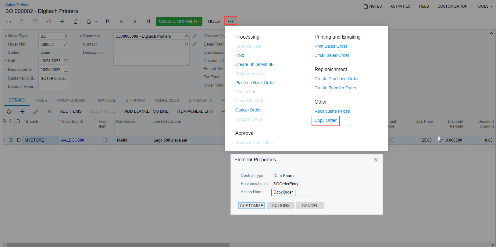
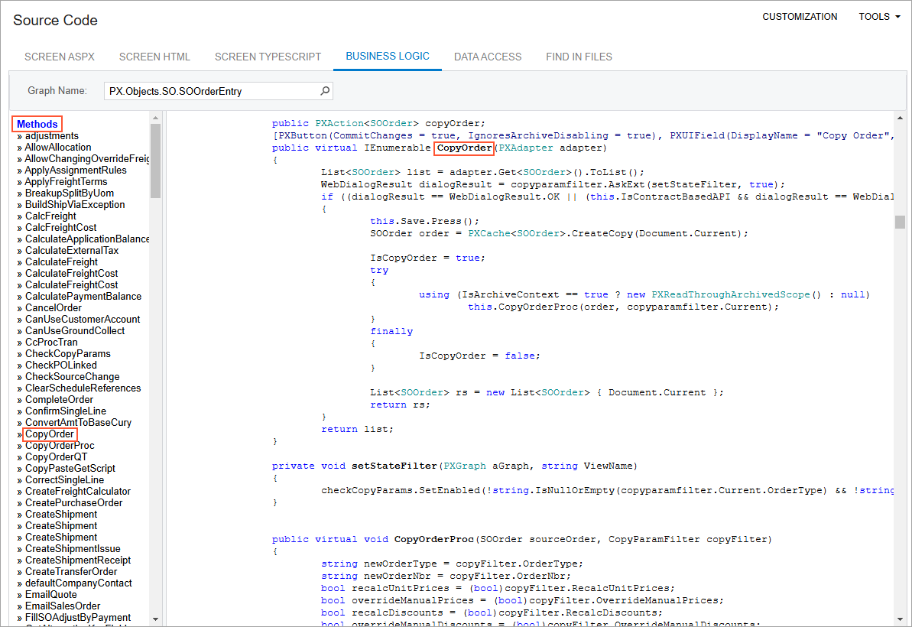

# Action Customization: Customization of an Action {#_3e5693da-8e64-4586-9b82-dcfdda267e2c .concept}

If you need to customize an action represented by a button on a toolbar or a command on the More menu, proceed as follows:

1.  To find the declaration of the action, you do the following:

    1.  Open the form in the browser, and make the button or command visible on the form \(if this is not already the case when the form is opened\).
    2.  On the form title bar, click **Customization** &gt; **Inspect Element** to open the [Element Inspector](../UserGuide/AU_ElementInspector.md).
    3.  On the form, click the button on the toolbar whose action you want to modify to open the [Element Properties Dialog Box](../UserGuide/AU_ElementInspector.md#_8ce780b0-243f-480c-8b4c-ed6431116e3f).

        **Note:** If the action is only represented by a command on the More menu, open the More menu to display the command and use the keyboard shortcut Ctrl+Alt+Click to inspect the command in the More menu, as shown in the following screenshot.

        

    4.  In the dialog box, click **Actions &gt; View Business Logic Source** to open the source code of the graph whose name is displayed in the **Business Logic** box of the dialog box.

        **Note:** In an instance of Acumatica ERP, the repository with the original C\# source code of the application is kept in the `\App_Data\CodeRepository` folder of the website.

    5.  In the **Methods** list of the [Source Code](../UserGuide/SM_20_45_70.md) browser, which opens for the graph, find and click the action name to display the action delegate method in the work area of the browser, as the following screenshot shows.

        

    6.  If you cannot find the action, try to find the action declaration in the base class of the graph.
    **Note:** If the button or command has an unique name, you can also find the action declaration in the Source Code Browser, as described in [To Find Source Code by a Fragment](../CustomizationPlatform/CG_GL_Stages_Explore_FindCode.md), by using the button or command name as a code fragment.

2.  Explore the action declaration in the source code of the original graph.
3.  Select and copy the action declaration.
4.  Create an extension for the graph, as described in [Graph Extensions: Creating a Graph Extension Through the UI](CodeCustomization_GraphExtension_CreateInEditor.md), if needed.
5.  In the graph extension, paste the action declaration, and develop the needed code to change the behavior and appearance of the action.

**Parent topic:**[Customizing Actions](../StudioDeveloperGuide/CodeCustomization_ActionsCustomization_Mapref.md)

