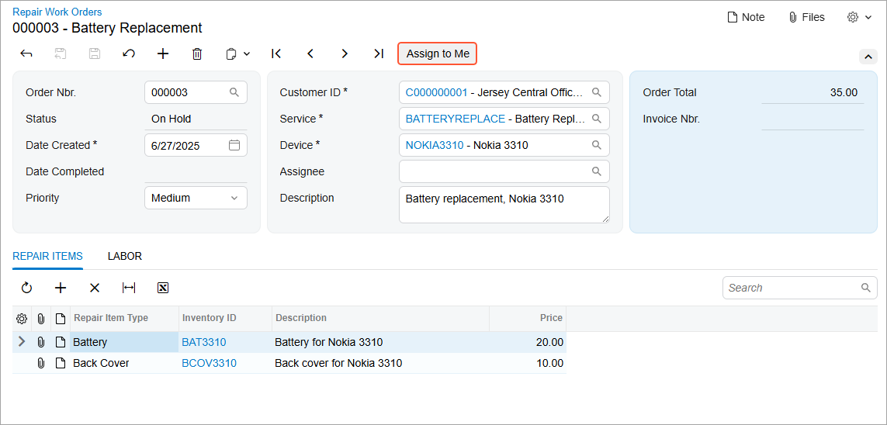
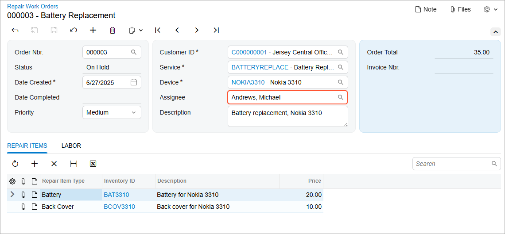

# Action Definition: To Define an Action for a Form {#_777fa87d-73a3-4cdd-bd6c-57c0f68519fb .task}

The following activity will walk you through the process of implementing an action for a form. The action will be represented by a button on the form toolbar of the form and the equivalent command on the More menu.

## Story { .section}

Suppose that you are a developer working on the Repair Work Orders \(RS301000\) form in the *PhoneRepairShop* customization project. You need to create an action that gives users the ability to assign the selected repair work order to themselves and add the corresponding button to the form toolbar. You’ll define an action in the graph of the form and configure the associated button \(on the form toolbar\) and its equivalent command \(on the More menu\). The button and command will be visible only if the repair work order has the *On Hold* or *Ready for Assignment* status and available if the **Assignee** box doesn’t already contain the current user's name.

When the user clicks the button or command, the contact ID associated with the current user, which is specified in the **Linked Entity** box of the [Users](../UserGuide/SM_20_10_10.md) \(SM201010\) form, will be inserted into the **Assignee** box. \(If the user has selected an assignee before clicking the button or command, it will be overridden.\) The clicking of the button or command will not affect the status of the repair work order.

## Process Overview { .section}

In this activity, you’ll perform the following steps:

1.  Creating the `AssignToMe` action, the associated **Assign to Me** button on the form toolbar, and the command with the same name on the More menu
2.  Configuring the availability and visibility of the **Assign to Me** button and the corresponding command on the More menu
3.  Testing the **Assign to Me** button and the associated action

## System Preparation { .section}

Make sure that you’ve configured your instance by performing the [Test Instance for Customization: To Deploy an Instance with Custom Maintenance and Data Entry Forms](CodeCustomization_PrepareInstance_Activity_DeployInstanceT230.md) prerequisite activity.

## Step 1: Implementing the AssignToMe Action { .section}

In this step, you’ll implement the `AssignToMe` action. The associated button will be placed on the form toolbar and the equivalent command on the More menu \(under the default **Other** category\).

**Tip:** Commands on the More menu are listed under categories. You can change the category of the command by changing the value of the Category property of the PXButton attribute.

To implement the `AssignToMe` action, do the following:

1.  In Visual Studio, open the `RSSVWorkOrderEntry.cs` file.
2.  After the `Graph constructor` region of the `RSSVWorkOrderEntry` class, insert the following code.

    ```language-csharp
            #region Actions
            public PXAction<RSSVWorkOrder> AssignToMe = null!;
            [PXButton]
            [PXUIField(DisplayName = "Assign to Me", Enabled = true)]
            protected virtual void assignToMe()
            {
                // Get the current order from the cache.
                RSSVWorkOrder row = WorkOrders.Current;
    
                // Assign the contact ID associated with the current user
                row.Assignee = PXAccess.GetContactID();
    
                // Update the data record in the cache.
                WorkOrders.Update(row);
    
                // Trigger the Save action to save changes in the database.
                Actions.PressSave();
            }
            #endregion
    ```

    **Tip:** You don’t need to set the CommitChanges property of the PXButton attribute to `True` because CommitChanges is `True` by default for PXButton.

3.  Save your changes.

## Step 2: Specifying the Availability and Visibility of the Assign to Me Button and Command \(with RowSelected\) { .section}

The **Assign to Me** button on the form toolbar \(and the equivalent command on the More menu\) should be:

-   Visible for only orders with the *On Hold* or *Ready for Assignment* status
-   Available if the **Assignee** box does not already contain the employee name of the user who is currently signed in

To satisfy these conditions, you should specify the `Enabled` and Visible properties of the `AssignToMe` action. Do the following:

1.  In Visual Studio, open the `RSSVWorkOrderEntry.cs` file.
2.  Add the handler for the RowSelected event for the `RSSVWorkOrder` DAC, as shown in the following code.

    ```language-csharp
            // Manage visibility and availability of the actions.
            protected virtual void _(Events.RowSelected<RSSVWorkOrder> e)
            {
                if (e.Row == null) return;
                RSSVWorkOrder row = e.Row;
            }
    ```

3.  In the `_(Events.RowSelected<RSSVWorkOrder> e)` event handler, add the following code to the end of the method.

    ```language-csharp
                AssignToMe.SetEnabled((row.Status ==
                    WorkOrderStatusConstants.ReadyForAssignment ||
                    row.Status == WorkOrderStatusConstants.OnHold) &&
                    WorkOrders.Cache.GetStatus(row) != PXEntryStatus.Inserted);
    ```

    In the code above, you’ve checked the `WorkOrders` object status in the PXCache to disable the **Assign to Me** button and command until the repair work order is saved in the database.

4.  In the `_(Events.RowSelected<RSSVWorkOrder> e)` event handler, add the following code to the end of the method.

    ```language-csharp
                AssignToMe.SetVisible(row.Assignee != PXAccess.GetContactID());
    ```

5.  Save your changes.
6.  Rebuild the project.

## Step 3: Testing the Assign to Me Button and the Associated Action { .section}

To test the `AssignToMe` action and the **Assign to Me** button, do the following:

1.  In Acumatica ERP, open the Repair Work Orders \(RS301000\) form.
2.  Create a work order, and specify the following settings:
    -   **Customer ID**: *C000000001*
    -   **Service**: *Battery Replacement*
    -   **Device**: *Nokia 3310*
    -   **Description**: `Battery replacement, Nokia 3310`
3.  Save your changes.

    The new repair work order \(for example, *000003*\) has been created.

    Notice that the **Assign to Me** button is displayed on the form toolbar, as shown below.

    

4.  On the form toolbar, click the **Assign to Me** button.

    In the **Assignee** box, notice that the employee name associated with the current user is now specified; the employee name associated with the user was copied from the **Linked Entity** box of the [Users](../UserGuide/SM_20_10_10.md) \(SM201010\) form. Also, notice that the **Assign to Me** button is no longer displayed on the form toolbar.

    


**Parent topic:**[Defining Actions](../StudioDeveloperGuide/CodeCustomization_ActionsDefinition_Mapref.md)

