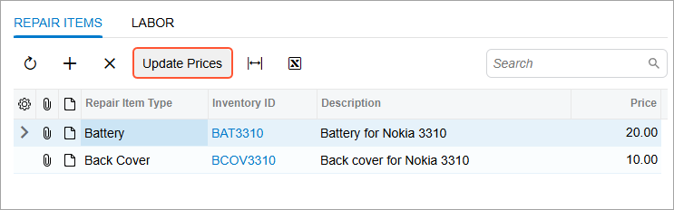

# Action Definition: To Define an Action for a Table {#_93a7fc12-6345-46b7-a10a-a511dce674d0 .task}

The following activity will walk you through the process of implementing an action for a table, which is represented by a button on the table toolbar.

## Story { .section}

Suppose that you need to give the users the ability to update the following prices on the Repair Work Orders \(RS301000\) form after entering new prices on the Services and Prices \(RS203000\) form:

-   The base prices of repair items on the **Repair Items** tab
-   The default prices of labor items on the **Labor** tab

You need to define an action for each tab, along with the associated button on the table toolbar of the tab. These buttons will be available only if no invoice has been created for the repair work order selected on the form.

## Process Overview { .section}

In this activity, you’ll implement actions with buttons on the table toolbar of the **Repair Items** and **Labor** tabs of the Repair Work Orders \(RS301000\) form by performing the following steps:

1.  Creating an action and the associated **Update Prices** button on the table toolbar of the **Repair Items** tab
2.  Creating an action and the associated **Update Prices** button on the table toolbar of the **Labor** tab
3.  Testing the **Update Prices** buttons and the associated actions

## System Preparation { .section}

Make sure that you have configured your instance as described in [Test Instance for Customization: To Deploy an Instance with Custom Maintenance and Data Entry Forms](CodeCustomization_PrepareInstance_Activity_DeployInstanceT230.md).

## Step 1: Implementing the UpdateItemPrices Action { .section}

In this step, you will implement the `UpdateItemPrices` action in the `RSSVWorkOrderEntry` graph.

You’ll specify the availability of the button related to the action in the RowSelected event handler of the same graph by using the SetEnabled\(\) method of PXAction&lt;&gt;. You’ll hide the button from the form toolbar and the corresponding command from the More menu by setting the DisplayOnMainToolbar property of the PXButton attribute to *false*.

To implement the `UpdateItemPrices` action, do the following:

1.  In the Actions region of the `RSSVWorkOrderEntry` graph, add the `UpdateItemPrices` action, as the following code shows.

    ```language-csharp
            public PXAction<RSSVWorkOrder> UpdateItemPrices = null!;
            [PXButton(DisplayOnMainToolbar = false)]
            [PXUIField(DisplayName = "Update Prices", Enabled = true)]
            protected virtual void updateItemPrices()
            {
                var order = WorkOrders.Current;
                if (order.ServiceID == null || order.DeviceID == null) return;
                var repairItems = RepairItems.Select();
                foreach (RSSVWorkOrderItem item in repairItems)
                {
                    RSSVRepairItem origItem = SelectFrom<RSSVRepairItem>.
                        Where<RSSVRepairItem.serviceID.IsEqual<@P.AsInt>.
                        And<RSSVRepairItem.deviceID.IsEqual<@P.AsInt>>.
                        And<RSSVRepairItem.inventoryID.IsEqual<@P.AsInt>>>.
                        View.Select(this, 
                            order.ServiceID, order.DeviceID, item.InventoryID).
                        FirstOrDefault();
                    if (origItem != null)
                    {
                        item.BasePrice = origItem.BasePrice;
                        RepairItems.Update(item);
                    }
                }
                Actions.PressSave();
            }
    ```

    In the action method, you’ve selected a repair item specified on the Services and Prices \(RS203000\) form and assigned its price to a repair item specified on the Repair Work Orders \(RS301000\) form. \(In the *T220 Data Entry and Setup Forms* training course, a similar scenario is implemented in the RowUpdated event handler of the RSSVWorkOrderEntry graph.\)

    In the action method, you don’t need to update the `RSSVWorkOrder.OrderTotal` field, which contains the total price of the work order. The value is updated automatically because the PXFormula attribute is specified for the `RSSVWorkOrderItem.BasePrice` field.

2.  In the `RowSelected` event handler, specify that the button associated with the action should be available only when no invoice has been created for the order, as the following code shows.

    ```language-csharp
                UpdateItemPrices.SetEnabled(WorkOrders.Current.InvoiceNbr == null);
    ```

3.  Rebuild the project.

## Step 2: Placing the Update Prices Button on the Repair Items Tab { .section}

In this step, you’ll place the **Update Prices** button on the table toolbar of the **Repair Items** tab. To place the button, in the `RS301000.ts` file, you will specify the PXActionState property with the name of the `UpdateItemPrices` action in the `RSSVWorkOrderItem` view class.

Thus, to place the **Update Prices** button on the table toolbar of the **Repair Items** tab, you should modify the `RS301000.ts` file of the Repair Work Orders \(RS301000\) form. Do the following:

1.  Click the `RS301000.ts` file on the [Modern UI Files](../UserGuide/AU_20_46_00.md) page of the Customization Project Editor.
2.  In the **Edit File** dialog box, which opens, add PXActionState to the list of imports.
3.  In the `RSSVWorkOrderItem` view class, specify the PXActionState property with the name of the `UpdateItemPrices` action. The `RSSVWorkOrderItem` view class should look as follows after you’ve completed these steps.

    ```language-javascript
    @gridConfig({
    	preset: GridPreset.Details
    })
    export class RSSVWorkOrderItem extends PXView {
        UpdateItemPrices: PXActionState;
    
        RepairItemType: PXFieldState;
        InventoryID: PXFieldState<PXFieldOptions.CommitChanges>;
        InventoryID_description: PXFieldState;
        BasePrice: PXFieldState;
    }
    ```

4.  Save your changes by clicking the **Save** button of the dialog box.
5.  Publish the customization project.

## Step 3: Placing the Update Prices Button on the Labor Tab—Self-Guided Exercise { .section}

In this self-guided exercise, you will implement the `UpdateLaborPrices` action in the `RSSVWorkOrderEntry` graph. You’ll configure the availability of the button associated with the action on the form in the `RowSelected` event handler of the same graph, hide the button from the form toolbar \(and the corresponding command from the More menu\), and place the button on the **Labor** tab of the Repair Work Orders \(RS301000\) form.

In the action method, you’ll select a labor item specified on the Services and Prices \(RS203000\) form and assign its price to a labor item specified on the Repair Work Orders \(RS301000\) form.

In the `RowSelected` event handler, you’ll make the `UpdateLaborPrices` action enabled when no invoice has been created for the order.

To perform this step, use the skills you’ve learned in Steps 1 and 2 of this activity.

**Tip:** You can find the code changes made in this step in the `Customization\T230\CodeSnippets\Activity2.1_Step3` folder, which you’ve downloaded from Acumatica GitHub.

## Step 4: Testing the Update Prices Buttons and Associated Actions { .section}

In this step, you will test the **Update Prices** buttons that you’ve added to the **Repair Items** and **Labor** tabs of the Repair Work Orders \(RS301000\) form. To test the buttons and the underlying actions, do the following:

1.  Modify the original repair and labor items by doing the following:
    1.  On the Service and Prices \(RS203000\) form, open the record with the following settings:
        -   **Service**: *Battery Replacement*
        -   **Device**: *Nokia 3310*
    2.  On the **Repair Items** tab, in the row with the *BAT3310* inventory ID, enter `25` in the **Price** column.
    3.  On the **Labor** tab, in the row with the *CONSULT* inventory ID, enter `10` in the **Default Price** column.
    4.  Save your changes.
2.  Update the prices by doing the following:
    1.  Open the Repair Work Orders \(RS301000\) form.
    2.  Select a repair work order for the *Battery Replacement* service and the *Nokia 3310* device. On the **Repair Items** tab, make sure that the **Update Prices** button is displayed, as shown below.

        

    3.  On the **Repair Items** tab, notice the old price of the repair item with the *BAT3310* inventory ID.
    4.  On the table toolbar, click **Update Prices**.

        Notice that the item price has been updated and the **Order Total** in the Summary area of the form has been updated.

    5.  On the **Labor** tab, notice the old price of the labor item with the *CONSULT* inventory ID.
    6.  On the table toolbar, click **Update Prices**.

        Notice that the item price has been updated and the **Order Total** has been updated.


**Parent topic:**[Defining Actions](../StudioDeveloperGuide/CodeCustomization_ActionsDefinition_Mapref.md)

