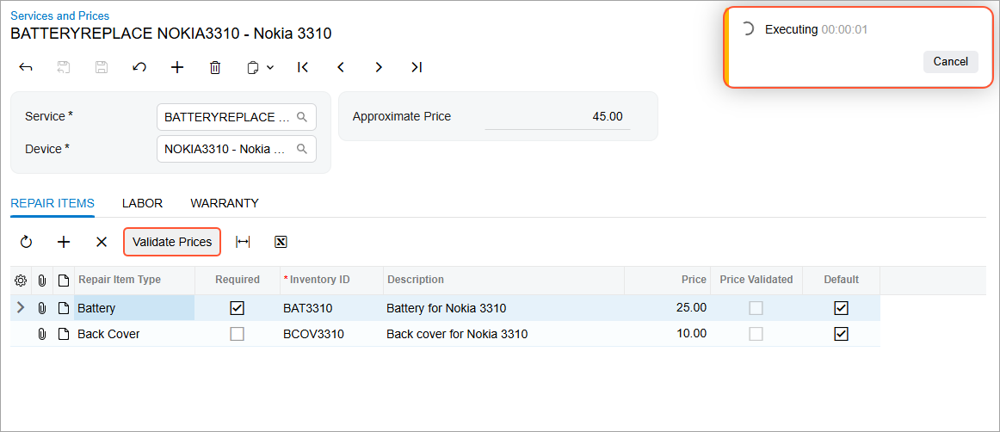
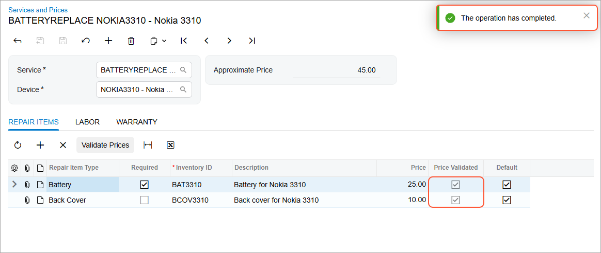

# Asynchronous Operations: To Implement an Asynchronous Operation {#_22d18d41-8307-48e7-8104-2bebfbe2f523 .task}

The following activity will walk you through the process of implementing a long-running action and executing it asynchronously.

## Story { .section}

Suppose that as part of the *PhoneRepairShop* customization project, you need to create an action that users can invoke to validate the prices of the repair items. These items are listed on the **Repair Items** tab of the Services and Prices \(RS203000\) form. Price validation will be performed by an external service and may take a long time to complete—so it should be executed asynchronously.

To implement this, you need to define an action in the graph of the form and configure the associated button on the table toolbar. You also need to write the code that will validate the prices and execute this code asynchronously by using the LongOperationManager.StartOperation method.

## Process Overview { .section}

In this activity, you will create an action \(and the associated button on the table toolbar\) and execute it asynchronously by performing the following steps:

1.  Adding the `IsPriceValidated` field \(which you’ll add to the database during system preparation\) to the `RSSVRepairItem` DAC, and updating the TypeScript file of the Services and Prices \(RS203000\) form. The system will display this field as the **Price Validated** column in the table on the **Repair Items** tab.
2.  Defining the logic that validates the repair item prices in the `ValidatePrices` method, implementing the `ValidateItemPrices` action to run the `ValidatePrices` method asynchronously, and creating the associated **Validate Prices** button on the table toolbar.
3.  Testing the **Validate Prices** button and the underlying action.

## System Preparation { .section}

Before you begin performing the steps of this activity, do the following:

1.  Prepare an Acumatica ERP instance by performing the [Test Instance for Customization: To Deploy an Instance with Custom Maintenance and Data Entry Forms](CodeCustomization_PrepareInstance_Activity_DeployInstanceT230.md) prerequisite activity.
2.  In SQL Server Management Studio, execute the `T230_AddColumn_RSSVRepairItem.sql` script.

    **Tip:** The script is provided in the `Customization\T230\SourceFiles\DBScripts` folder, which you’ve downloaded from Acumatica GitHub.

3.  To update the customization project, do the following in the Customization Project Editor opened for the *PhoneRepairShop* project:
    1.  In the navigation pane, click **Database Scripts**.
    2.  On the More menu of the [Database Scripts](../UserGuide/AU_20_90_00.md) page, which opens, click **Reload from Database**.

## Step 1: Updating the Services and Prices \(RS203000\) Form to Display the Price Validated Column and the Validate Prices Button { .section}

In this step, you’ll add the `IsPriceValidated` field to the `RSSVRepairItem` DAC. You’ll also update the corresponding TypeScript file to show the **Price Validated** column in the table and the **Validate Prices** button on the table toolbar of the **Repair Items** tab. Do the following:

1.  Add the following code to the `RSSVRepairItem.cs` file after the `BasePrice` field definition.

    ```language-csharp
            #region IsPriceValidated
            [PXDBBool]
            [PXDefault(false)]
            [PXUIField(DisplayName = "Price Validated", Enabled = false)]
            public virtual bool? IsPriceValidated { get; set; }
            public abstract class isPriceValidated :
    		          PX.Data.BQL.BqlBool.Field<isPriceValidated> { }
            #endregion
    ```

    Note that the field is disabled in the UI because it will be updated by an external service. The value is set to `false` by default.

2.  Open the `RS203000.ts` file in the **Modern UI Files** node of the Customization Project Editor, and do the following:
    1.  Add the following code in the `RSSVRepairItem` view class after the `BasePrice` field.

        ```language-javascript
        	IsPriceValidated: PXFieldState;
        ```

        This code has added the **Price Validated** column—which is represented by the `IsPriceValidated` DAC field—to the table on the **Repair Items** tab.

    2.  Specify the PXActionState property with the name of the `ValidateItemPrices` action \(which you’ll declare in Step 3\) in the `RSSVRepairItem` view class, as shown in the following code.

        ```language-javascript
            ValidateItemPrices: PXActionState;
        ```

        The code above adds the **Validate Prices** button to the table toolbar of the **Repair Items** tab.

    3.  Add PXActionState to the list of imports if it has not been added yet.
3.  Save your changes.

## Step 2: Defining the Logic Used to Validate Prices { .section}

Next, you’ll define the method in which the repair items prices are validated, and then you’ll call this method in the LongOperationManager.StartOperation method.

To define the method in which the repair items prices are validated, do the following:

1.  Add the `ValidatePrices` static method to the `RSSVRepairPriceMaint` graph. The `ValidatePrices` method validates the repair items prices for the selected record on the Services and Prices \(RS203000\) form.

    ```language-csharp
            private static void ValidatePrices(RSSVRepairPrice repairPriceItem)
            {
                // Create an instance of the RSSVRepairPriceMaint graph
                // and set the Current property of its RepairPrices view.
                var priceMaint = PXGraph.CreateInstance<RSSVRepairPriceMaint>();
                priceMaint.RepairPrices.Current = priceMaint.RepairPrices.
                 Search<RSSVRepairPrice.serviceID, RSSVRepairPrice.deviceID>
                 (repairPriceItem.ServiceID, repairPriceItem.DeviceID);
    
                // Set a delay to mimic connecting to an external service to validate the 
                // repair item prices.
                // In a real world scenario, you would connect to an actual external 
                // service and make an API request to validate the prices for 
                // the repair items.
                Thread.Sleep(3000);
    
                // Update the Price Validated field for each repair item on 
                // the Repair Items tab:
                // Here we are assuming that the validation was successful from the
                // external service and are setting IsPriceValidated to true for 
                // each repair item.     
                foreach (RSSVRepairItem item in priceMaint.RepairItems.Select())
                {
                    // Set IsPriceValidated to true for each repair item.
                    item.IsPriceValidated = true;
                    // Update the cache with the above change for each repair item.
                    priceMaint.RepairItems.Update(item);
                }
                // Trigger the Save action to save the changes stored in the cache 
                // to the database.
                priceMaint.Actions.PressSave();
            }
    ```

2.  Make sure the following `using` directives have been added to the `RSSVRepairPriceMaint.cs` file.

    ```language-csharp
    using System.Collections;
    using System.Collections.Generic;
    using System.Threading;
    ```


## Step 3: Defining the ValidateItemPrices Action { .section}

Now you’ll define the `ValidateItemPrices` action, which:

-   Defines the underlying action for the **Validate Prices** button on the table toolbar of the **Repair Items** tab
-   Invokes the LongOperationManager.StartOperation method, which executes the `ValidatePrices` method asynchronously.

Add the following code to the `RSSVRepairPriceMaint` graph.

```language-csharp
        #region Actions
        public PXAction<RSSVRepairPrice> ValidateItemPrices = null!;
        [PXButton(DisplayOnMainToolbar = false, CommitChanges = true)]
        [PXUIField(DisplayName = "Validate Prices", Enabled = true)]
        protected virtual IEnumerable validateItemPrices(PXAdapter adapter)
        {
            // Populate a local list variable.
            List<RSSVRepairPrice> list = new List<RSSVRepairPrice>();
            foreach (RSSVRepairPrice repairItemPrice in adapter.Get<RSSVRepairPrice>())
            {
                list.Add(repairItemPrice);
            }

            // Trigger the Save action to save changes in the database.
            Actions.PressSave();

            var repairPriceItem = RepairPrices.Current;
            // Execute the ValidatePrices method asynchronously by
            // using LongOperationManager.StartOperation
             LongOperationManager.StartOperation(cancellationToken =>
             {
                ValidatePrices(repairPriceItem);
             });

            // Return the local list variable.
            return list;
        }
        #endregion
```

**Attention:** To perform a background operation, an action method needs to have a parameter of the PXAdapter type and return IEnumerable.

## Step 4: Testing the Validate Prices Button and the Associated Action { .section}

To test the **Validate Prices** button and the underlying action, do the following:

1.  Rebuild the `PhoneRepairShop_Code` project in Visual Studio.
2.  In the Customization Project Editor, publish the customization project.
3.  In Acumatica ERP, open the Services and Prices \(RS203000\) form.
4.  Open any record that doesn’t have the **Price Validated** check box selected for any of the items on the **Repair Items** tab.

    Confirm that the **Validate Prices** button is available on the table toolbar of the **Repair Items** tab.

5.  On the table toolbar, click **Validate Prices**.

    A notification appears indicating the status of the processing, as shown below.

    

    When the process is complete, the **Price Validated** check box for each repair item is selected on the **Repair Items** tab, as shown below.

    


**Parent topic:**[Implementing an Asynchronous Operation](../StudioDeveloperGuide/CodeCustomization_AsynchronousOperation_Mapref.md)

