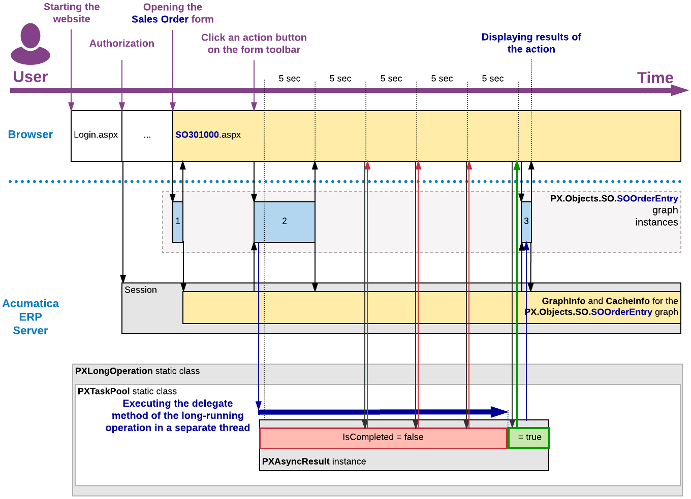
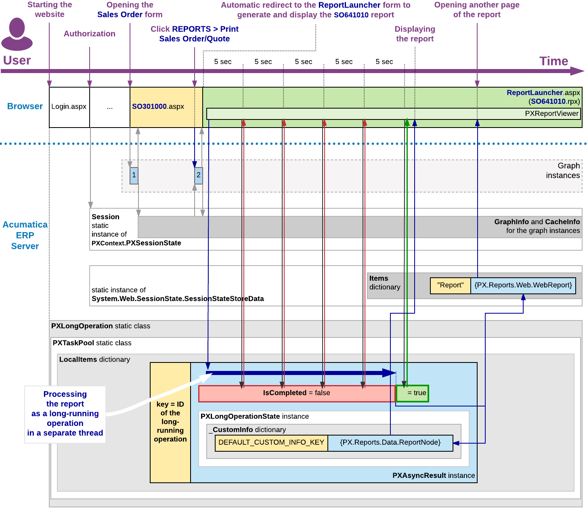
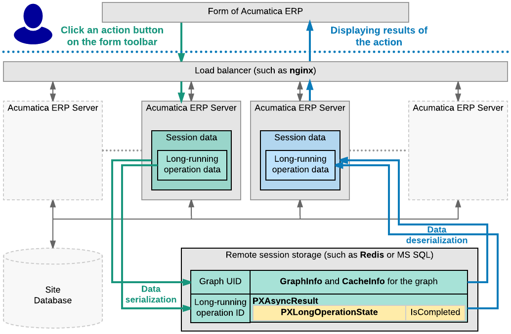

# Asynchronous Operations: How They are Handled in Acumatica ERP {#_97e2b9b6-4e6b-4816-a08a-9d13fb38a90e .concept}

The following sections describe Acumatica ERP handles asynchronous operations in various contexts.

## Executing a Processing Operation as a Long-Running Operation { .section}

When a user clicks a button or command on a form to start a processing operation, the data source control of the form generates a request to the Acumatica ERP server to execute the action delegate defined for the button. The server creates an instance of the graph, which provides the business logic for the form and invokes the action delegate method.

Because a processing operation is a long-running operation, in the action delegate method, the data processing code must be included in the PXLongOperation.StartOperation method call as the definition of the long-running operation delegate. When the action delegate method is executed, the StartOperation method creates an instance of the PXAsyncResult class to hold the data and state of the long-running operation; the method also initiates the execution of the long-running operation delegate asynchronously in a separate thread.

If the duration of the long-running operation is longer than five seconds, the server releases the graph instance. Then the form, which is still opened in the browser, generates requests to the server to get the results of the long-running operation every five seconds. For such a request, the server uses the ID of the long-running operation to check the operation's status. If the operation has completed, the server creates an instance of the graph and restores the graph state and the cache data to finish processing the action delegate and to return results to the form.

The following diagram shows how the server executes an action asynchronously and how it returns the results of the action to the form.

## Processing a Report as a Long-Running Operation {#_397e929e-f4b4-4441-9688-1e0a4ca7ab33 .section}

When the user launches a report, either from the report form or by clicking a button or command on the maintenance or entry form, the system redirects the user to the report launcher form \(`ReportLauncher.aspx`\), which is designed to automatically run a report for the received parameters. The ASPX page for this form contains the PXReportViewer control, whose JavaScript objects and functions are designed to get the report data and display the data on the form.

To run the report, the report launcher creates a request to the PX.Web.UI.PXReportViewer control on the server. To process the request, the server instantiates the PX.Reports.Web.WebReport class and invokes its Render method, which launches the report generation as a long-running operation in a separate thread.

The resulting report data is an object of the PX.Reports.Data.ReportNode type stored in the \_CustomInfo dictionary of the current long-running operation under the DEFAULT\_CUSTOM\_INFO\_KEY key. To provide quick access to the report data when the user views different pages of the report, the system saves the report data in the session as an object of the PX.Reports.Web.WebReport type.

After the long-running operation has completed, the PXReportViewer control gets the report data from the dictionary and displays the report on the report launcher form. For details on how the report is displayed and how the report data is retrieved, see [Display of Reports](CC__con_Rendering_of_Reports.md).

The following diagram shows how the server generates a report asynchronously and how it returns the resulting report data to the report launcher form.

## Executing a Long-Running Operation in a Cluster { .section}

If Acumatica ERP is configured to run in a cluster of application servers behind a load balancer, it is not possible to predict which application server will receive the next request from the client. In this model, session-specific data is serialized and stored in a high-performance remote server, such as Redis or MS SQL, to be shared between the application servers.

When the user clicks a button or command on a form to start a processing operation, the load balancer forwards the request to an Acumatica ERP server to execute the action delegate defined for the button or command. The server creates an instance of the graph, which provides the business logic for the form, and invokes the action delegate method.

When the action delegate method is executed, the StartOperation method creates an instance of the PXAsyncResult class to hold the data and state of the long-running operation, initiates the execution of the long-running operation delegate asynchronously in a separate thread, and stores the serialized data of the operation in the remote storage.

If the duration of the long-running operation is longer than five seconds, the server releases the graph instance, stores the serialized data of the graph in the remote storage, and continues processing the long-running operation in a separate thread. When the operation has completed, this server sets the operation status to `PXLongRunStatus.Completed` and updates the operation data in the remote session storage.

Until the form that is still opened in the browser obtains the request results, it generates requests to the site URL every five seconds to get these results. On every such request, the load balancer selects a server to be used to process the request and forwards the request to the server. The server uses the long-running operation ID, which is usually the same as the graph UID, to check the operation's status. If the operation is completed, the server creates an instance of the graph to finish processing the action delegate and to return results to the form.

The following diagram shows how the data of a user session and of a long-running operation are stored in the remote session storage of a cluster.

**Parent topic:**[Implementing an Asynchronous Operation](../StudioDeveloperGuide/CodeCustomization_AsynchronousOperation_Mapref.md)

