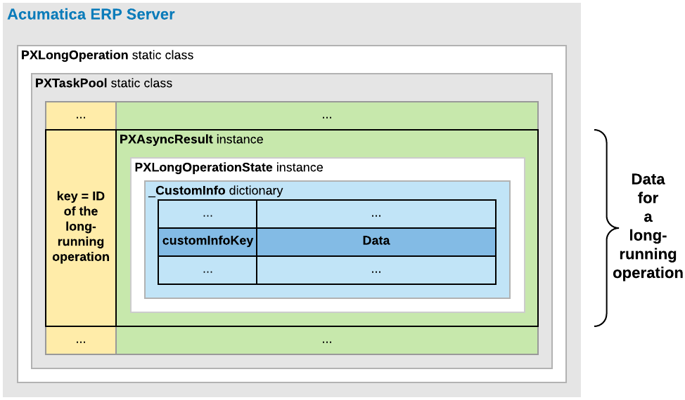

# Asynchronous Operations: Use of the Custom Information Dictionary {#_47ed9b26-afb6-42eb-8526-17cf1dd1396d .concept}

In the delegate method of a long-running operation, you can store a data object in the \_CustomInfo dictionary of the long-running operation and get the list of records processed by the method. You can add to the dictionary any data object needed for a long-running operation by using a SetCustomInfo method.

The following diagram shows that each long-running operation includes the \_CustomInfo dictionary, which can contain multiple key-value pairs with custom data.

For a processing operation, the system stores the PXProcessingMessagesCollection&lt;TTable&gt; list of messages in the dictionary. Each message in the list is of the PXProcessingMessage type, which includes a string message and an error level that is of the [PXErrorLevel](https://help.acumatica.com/(W(211))/Help?ScreenId=ShowWiki&pageid=6793a126-5afc-e89d-0d4c-0d444287f359) type.

See [New way to work with CustomInfo of PXLongOperation](https://asiablog.acumatica.com/index.php/2016/07/new-way-to-work-with-custominfo-of/) at [http://asiablog.acumatica.com](http://asiablog.acumatica.com) for more information about the use of the dictionary.

**Parent topic:**[Implementing an Asynchronous Operation](../StudioDeveloperGuide/CodeCustomization_AsynchronousOperation_Mapref.md)

