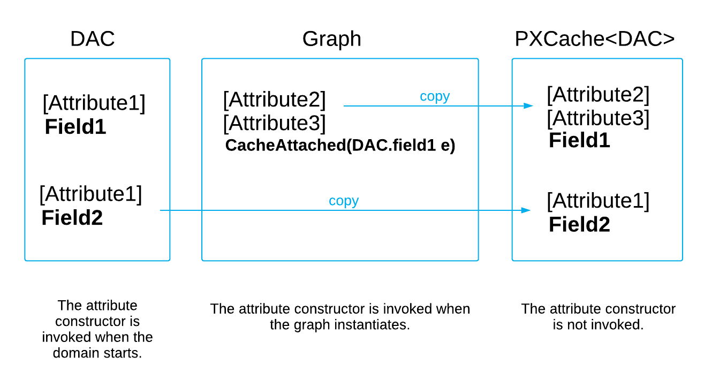

# CacheAttached: General Information {#_4ba5275c-853b-41cd-870c-6399ebde5bf4 .concept}

To replace attributes within a particular graph, you add new attributes to the `CacheAttached` event handler for the particular field defined in the graph.

## Learning Objectives { .section}

In this chapter, you will learn how to append and replace attributes on a specific data access class \(DAC\) field within a particular graph.

## Applicable Scenarios { .section}

You replace attributes within a particular graph if in this graph, you need attributes that differ from the attributes declared in the DAC.

## Attribute Replacement in a Graph { .section}

Attributes specified in a data access class apply to this class in every graph of the application unless a graph replaces them with other attributes. In some graphs, you may need attributes that differ from what is declared in the DAC. To replace attributes within a particular graph, you add new attributes to the `CacheAttached` event handler for the particular field defined in the graph, as the following code shows.

```
// The CustomerMaint graph
[PXDBString(40, IsUnicode = true)]
// The field label for the form that works with the CustomerMaint graph
// is set to "Company".
[PXUIField(DisplayName = "Company")]
protected virtual void _(Events.CacheAttached<Account.companyName> e)
{ // Empty method
}
```

When you replace attributes, you have to redefine all attributes, including the type attribute. Instead of completely replacing attributes, you can add the needed attributes to the fields by including the PXMergeAttributes attribute in the list of assigned attributes.

## Use of CacheAttached { .section}

The attributes that you add to a data field in the DAC are initialized once, during the startup of the domain. You can replace attributes for a particular field by defining the `CacheAttached` event handler for this field in a graph. These attributes are also initialized once, on the first initialization of the graph where you define this method.

**Attention:** The Acumatica Framework doesn't support overriding of `CacheAttached` event handlers. For details about the override mechanism, see [Override of Event Handlers](BL__con_Override_Handlers.md).

The system stores the attributes from the DAC and graphs \(which are called *domain-level* attributes\). On each round trip, the system copies the appropriate domain-level attributes to the cache object, creating *cache-level* attributes. Attribute constructors are not invoked; instead, the system invokes the CacheAttached\(PXCache\) method for each copy of an attribute. If you modify an attribute's properties in code for a particular data record, the cache object creates a *data-record* copy of the attribute.

In a graph, each PXCache object stores attributes for the corresponding DAC \(see the diagram below\). When a PXCache object is created, the framework searches for attributes of CacheAttached event handlers in the graph by using the DAC field name. Attributes specified for these event handlers are copied to PXCache objects. If there is no CacheAttached event handler defined for a DAC field, the attributes are copied from the data access class. The attributes of CacheAttached event handlers are instantiated once, on the first initialization of the graph in which you define this event handler. In the data access class, the attributes are instantiated when the application domain starts.

When you add an attribute to a DAC field, the attribute subscribes to particular events of the Acumatica Framework. In the corresponding event handlers, the attribute processes the field value based on the purpose of the attribute. For instance, the PXDefault attribute subscribes to the FieldDefaulting event and sets the default value every time the event is raised for the field. Multiple attributes can subscribe to the same event.



**Parent topic:**[Replacing Attributes for DAC Fields in CacheAttached](../StudioDeveloperGuide/CodeCustomization_CacheAttached_Mapref.md)

