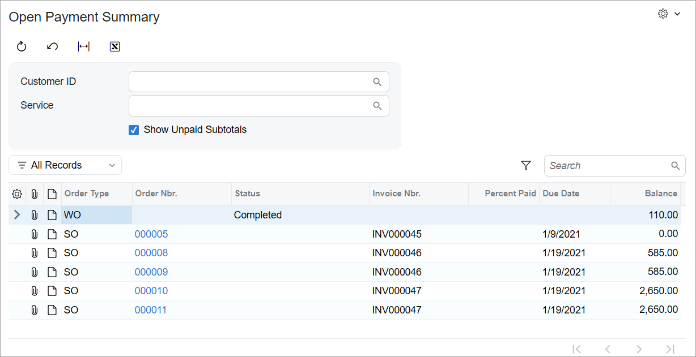

# Data Aggregation:To Retrieve Aggregated Data {#_6d4b6df8-b0c2-4869-b63d-bbadb7681f74 .task}

This activity will walk you through the process of retrieving aggregated data in a fluent BQL query for an inquiry form.

## Story { .section}

Suppose that you need to give users the ability to view subtotals for orders of each status on the Open Payment Summary \(RS401000\) inquiry form. You need to add a filtering parameter that’s represented by the **Show Unpaid Subtotals** check box on the inquiry form. If the check box is selected, the results in the grid need to be grouped by order status, and the subtotal amounts need to be calculated and shown for each status. You also need to update the dynamic queries in the data view delegate so that the appropriate query is triggered, depending on the state of the filtering parameter.

## Process Overview { .section}

In this activity, for the Open Payment Summary \(RS401000\) inquiry form, you’ll add the ability to view grouped data and subtotal amounts in the grid by performing the following steps:

1.  Adding a new filtering parameter to the inquiry form \(the **Show Unpaid Subtotals** check box\)
2.  Modifying the dynamic queries in the data view delegate
3.  Testing the aggregation of data on the inquiry form

## System Preparation { .section}

Make sure that you’ve configured your instance by performing the [Test Instance for Customization: To Deploy an Instance with a Custom Form that Implements a Workflow](CodeCustomization_PrepareInstance_Activity_DeployInstanceT240.md) prerequisite activity. Also, be sure that you have completed the steps described in the following prerequisite activities:

1.  [Inquiry Forms: To Set Up an Inquiry Form](../DeveloperGuide/UIDev_InquiryForm_Activity_SetupForm.md)
2.  [Inquiry Forms: To Create the UI of an Inquiry Form with Only a Grid](../DeveloperGuide/UIDev_InquiryForm_Activity_UI.md)
3.  [Filtering Parameters: To Add a Filter for an Inquiry Form](../DeveloperGuide/UIDev_FilteringParameters_Activity_ConfigureFilter.md)
4.  [Data View Delegates: To Add a Filtering Query Dynamically](CodeCustomization_DataViewDelegates_Activity_DynamicFilter.md)

## Step 1: Adding a Field for the Check Box to the DAC { .section}

To add a field for the **Show Unpaid Subtotals** check box to the DAC, do the following:

1.  In the `RSSVWorkOrderToPayFilter` DAC, add the field, as shown in the following code.

    ```language-csharp
            #region GroupByStatus
            [PXBool]
            [PXUIField(DisplayName = "Show Unpaid Subtotals")]
            public bool? GroupByStatus { get; set; }
            public abstract class groupByStatus :
                PX.Data.BQL.BqlBool.Field<groupByStatus>
            { }
            #endregion
    ```

2.  Build the project.

## Step 2: Changing UI Files of the Form { .section}

Now you need to add the field to the Selection area of the form. Proceed as follows:

1.  In the `RS401000.ts` file, in the `RSSVWorkOrderToPayFilter` view class, add the `GroupByStatus` field after the `ServiceID` field. Specify the CommitChanges property for the `GroupByStatus` field, as shown in the following code.

    ```language-javascript
    export class RSSVWorkOrderToPayFilter extends PXView {
    	CustomerID: PXFieldState<PXFieldOptions.CommitChanges>;
    	ServiceID: PXFieldState<PXFieldOptions.CommitChanges>;
    	GroupByStatus: PXFieldState<PXFieldOptions.CommitChanges>;
    }
    ```

2.  In the `RS401000.html` file, in the qp-fieldset element, add the `GroupByStatus` field after the `ServiceID` field, as shown in the following code.

    ```language-xml
            <qp-fieldset slot="A" id="columnFirst" view.bind="Filter">
                <field name="CustomerID"></field>
                <field name="ServiceID"></field>
                <field name="GroupByStatus"></field>
            </qp-fieldset>
    ```

3.  Publish the customization project.

## Step 3: Modifying the Data View Delegate { .section}

In the `detailsView` delegate, you need to use different queries, depending on the state of the **Show Unpaid Subtotals** check box. If the check box is selected, you need to group all the selected data by status and calculate the subtotal amounts to be paid for each status.

To group or aggregate records, you will append the `AggregateTo<>` clause to the statement and specify the grouping condition and aggregation function by using the GroupBy clause and the Sum aggregation function. To modify the data view delegate, do the following:

1.  In the `RSSVPaymentPlanInq` graph, replace the `detailsView` delegate with the following code.

    ```
            protected virtual IEnumerable detailsView()
            {
                PXDelegateResult delegResult = new PXDelegateResult
                {
                    IsResultFiltered = true,
                    IsResultTruncated = true,
                    IsResultSorted = true
                };
    
                var filter = Filter.Current;
    
                BqlCommand workOrderQuery = new
                    SelectFrom<RSSVWorkOrderToPay>.
                    InnerJoin<ARInvoice>.On<
                        ARInvoice.refNbr.IsEqual<RSSVWorkOrderToPay.invoiceNbr>>.
                    Where<RSSVWorkOrderToPay.status.
                            IsNotEqual<RSSVWorkOrderEntry_Workflow.States.paid>.
                        And<RSSVWorkOrderToPayFilter.customerID.FromCurrent.IsNull.
                            Or<RSSVWorkOrderToPay.customerID.IsEqual<
                                RSSVWorkOrderToPayFilter.customerID.FromCurrent>>>.
                        And<RSSVWorkOrderToPayFilter.serviceID.FromCurrent.IsNull.
                            Or<RSSVWorkOrderToPay.serviceID.IsEqual<
                                RSSVWorkOrderToPayFilter.serviceID.FromCurrent>>>>();
    
                if (filter.GroupByStatus == true)
                    workOrderQuery = workOrderQuery.AggregateNew<
                        Aggregate<
                        GroupBy<RSSVWorkOrderToPay.status,
                        Sum<ARInvoice.curyDocBal>>>>();
    
                var workOrderView = new PXView(this, true, workOrderQuery);
    
                var workOrders = workOrderView.SelectWithViewContext(null);
                foreach (PXResult<RSSVWorkOrderToPay, ARInvoice> order in workOrders)
                {
                    if (filter.GroupByStatus == true)
                    {
                        ((RSSVWorkOrderToPay)order[0]).OrderNbr = "";
                        ((RSSVWorkOrderToPay)order[0]).PercentPaid = null;
                        ((RSSVWorkOrderToPay)order[0]).InvoiceNbr = "";
                        ((ARInvoice)order[1]).DueDate = null;
                    }
                    delegResult.Add(order);
                }
    
                var sorderSelect = new
                    SelectFrom<SOOrderShipment>.
                    InnerJoin<ARInvoice>.On<
                        ARInvoice.refNbr.IsEqual<SOOrderShipment.invoiceNbr>>.
                    Where<
                        RSSVWorkOrderToPayFilter.customerID.FromCurrent.IsNull.
                        Or<SOOrderShipment.customerID.IsEqual<
                                RSSVWorkOrderToPayFilter.customerID.FromCurrent>>>.
                    View.ReadOnly(this);
    
                var sorders = sorderSelect.SelectWithViewContext();
                foreach (PXResult<SOOrderShipment, ARInvoice> order in sorders)
                {
                    SOOrderShipment soshipment = order;
                    ARInvoice invoice = order;
                    RSSVWorkOrderToPay workOrder = ToRSSVWorkOrderToPay(soshipment);
                    workOrder.OrderType = OrderTypeConstants.SalesOrder;
                    var result = new PXResult<RSSVWorkOrderToPay, ARInvoice>(
                        workOrder, invoice);
                    delegResult.Add(result);
                }
    
                return delegResult;
            }
    ```

    In the code above, you’ve assigned a value to the `workOrderQuery` variable that depends on whether the **Show Unpaid Subtotals** check box is selected. If it’s selected, you have constructed a query in which you group data by the `Status` field value by using the `AggregateTo` clause.

    In the AggregateTo clause, you have grouped data by the `RSSVWorkOrderToPay.status` value, and calculated the sum for each group. Then you’ve returned the results of the query.

    In the grid, you have not displayed values in the **Order Nbr**, **Percent Paid**, **Invoice Nbr**, and **Due Date** columns for aggregated data, because these values are not relevant to the subtotal rows.

2.  Build the project.

**Tip:** No sales orders are grouped because the **Status** column displays no data for sales orders. This happens because the sets of statuses for sales orders and repair work orders are different, and a status of a sales order cannot be converted to a status of a repair work order.

## Step 4: Testing the Aggregation of Data { .section}

To test how data is grouped and calculated on the Open Payment Summary \(RS401000\) form, do the following:

1.  In the Selection area of the Open Payment Summary form, select the **Show Unpaid Subtotals** check box.

    The form should look as shown below.

    

    Notice that the **Balance** column now displays the total amount to be paid for all orders of the status displayed in the **Status** column. The values of the **Balance** column will remain unaffected for the rows that don’t have a value in the **Status** column.


**Parent topic:**[Aggregating Data](../StudioDeveloperGuide/CodeCustomization_DataAggregation_Mapref.md)

