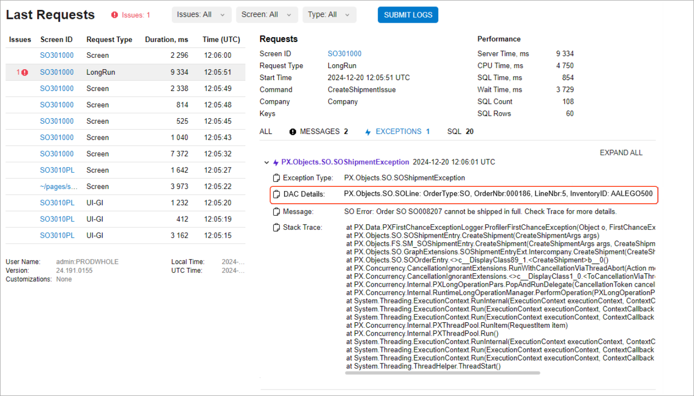

# Data Validation: Identifying Error-Causing Records with DAC Descriptors {#_2354c3d4-01c9-4195-9a01-f14ee60aba06 .concept}

The Acumatica Framework provides you with the ability to declare and retrieve descriptors of data access classes.

A *descriptor* is a textual representation of a record that’s generated in a standard format for consistency. DAC descriptors uniquely identify data records that cause errors, making debugging faster and more precise. In the context of data validation, you can use the information generated by a descriptor to provide clear and consistent error messaging to the user.

## Use of DAC Descriptors {#section_dly_hvr_tfc .section}

The main use case for DAC descriptors is providing information about an error-causing DAC record. When a DAC descriptor has been added to an exception and this exception is thrown:

-   The Trace mechanism logs the exception and captures information about its descriptor.
-   You can view the descriptor information on the Acumatica Trace page in the new **DAC Details** section of the **Exceptions** tab.

**Tip:** Many common exception types now include constructor overloads that accept DAC descriptors.

## A Use Case Example {#section_k5v_x4g_sfc .section}

Imagine a sales order with multiple lines, one of which is a stock item whose vendor is inactive. When a user tries to create a shipment for this sales order, they get a vague error message like this one:

*SO Error: Order &lt;Sales Order Number&gt; cannot be shipped in full. Check Trace for details.*

The user has no idea which line is causing the problem—and they’ll likely reach out for help.

To reproduce the error, you start by following the steps that led to the error. You then open the Acumatica Trace page by clicking **Settings** &gt; **Trace...** on the form title bar. In the **DAC Details** section, you’ll find the descriptor information \(see below\).



Thus, you'll be able to pinpoint the exact record that caused the problem. This means faster turnaround times for resolving blockers and support requests.

## The Anatomy of a DAC Descriptor { .section}

The Acumatica Framework uses a set of predefined options to add descriptors to exceptions. If the default options are used:

-   **All DAC key fields** are added to the descriptor.
-   The system also adds the **non-key fields** of the DAC that are marked with the PXFieldDescriptionAttribute attribute, which is available in the PX.Data.EP namespace.
-   Each field appears as a **name-value pair**.

You can also specify options \(see *Customization with the DacDescriptionCreationOptions Class*\) to customize the way the descriptor is generated for the DAC.

**Field Order and Limitations**

Key fields are listed first, followed by non-key fields. If multiple key fields are added to the descriptor, they are sorted based on their order of declaration. \(The same rule is applied to multiple non-key fields.\)

**Attention:** By design, DAC descriptors include only fields from the DAC itself—they don’t include values from DAC fields that belong to other related DACs. This avoids executing additional database queries and keeps descriptor generation efficient. The only exception is for DAC fields with the PXSelector attribute. Because selector fields often store values that aren’t user-friendly \(like GUIDs or integer identifiers\), the descriptor uses the selector’s substitute key instead. This may trigger a database query but usually doesn’t add excessive overhead unless many descriptors are generated at once.

**Descriptor Format**

A DAC descriptor consists of two parts:

1.  **The name of the DAC type** \(by default, the fully qualified name of the type from the source code that includes the namespace containing the type\)
2.  **Name-value pairs that represent the DAC fields included in the descriptor** \(comma-separated by default\)

**Example**

Suppose that you’ve declared a descriptor for the APInvoice DAC, whose fully qualified name is *PX.Objects.AP.APInvoice*. You’ve specified the PXFieldDescriptionAttribute attribute in this DAC for the non-key field named InventoryID.

The APInvoice DAC has the following key fields: DocType and RefNbr. You haven't declared the PXFieldDescriptionAttribute attribute for these key fields because they’re automatically included when the system uses the default options to generate a descriptor.

Suppose that a record of this DAC has these field values:

-   DocType: *Invoice*
-   RefNbr: *00003*
-   InventoryID: *000004*

The descriptor generates the following textual representation of a record of this DAC: `PX.Objects.AP.APInvoice: DocType: Invoice, RefNbr: 00003, InventoryID: 000004`.

## Customization with the DacDescriptionCreationOptions Class {#section_ysl_qfj_tfc .section}

You use the DacDescriptorCreationOptions class to customize the way a descriptor is generated for a DAC. Its options are summarized below.

**DacDescriptorCreationOptions.DacKeysInDacDescriptorStyle**

This option, which has one of the following values, specifies the policy for adding DAC key fields to the descriptor:

-   *AlwaysInclude* \(default\): All DAC key fields, regardless of whether the PXFieldDescription attribute has been added to them, should be added to the descriptor.
-   *KeysWithFieldDescriptionAttribute*: Only the DAC key fields with the PXFieldDescription attribute added to them should be included in the descriptor.
-   *NeverInclude*: DAC key fields should never be included in the descriptor.

**DacDescriptorCreationOptions.DacTypeNameInDacDescriptorStyle**

This option, which has the following values, determines the policy for adding the DAC type name to the descriptor:

-   *FullTypeName* \(default\): The fully qualified name of the DAC type \(including its namespace\) should be included in the descriptor.
-   *ShortTypeName*: Only the name of the DAC type \(excluding its namespace and all containing types\) should be included in the descriptor.
-   *UserFriendlyTypeName*: The user-friendly type name that is specified by PXCacheNameAttribute should be used as the name of the DAC type in the DAC descriptor. If PXCacheNameAttribute is not specified on a DAC type, *FullTypeName* will be used.

**DacDescriptorCreationOptions.FieldNamesInDacDescriptorStyle**

This option specifies how to indicate the cases in which field names should be included in the descriptor along with their values. It has the following values of the `enum` type, which are defined in the DacFieldNamesInDacDescriptorStyle enum:

-   *All* \(default\): The DAC field names should be included in the descriptor for all DAC fields.
-   *AllExceptKeys*: The DAC field names should be included in the descriptor for all non-key DAC fields.
-   *None*: The DAC field names should not be included for any of the DAC fields.

**DacDescriptorCreationOptions.NullOrEmptyValuesStyle**

This option determines how null or empty DAC field values should be processed. It has the following values of the `enum` type, which are defined in the NullOrEmptyDacFieldValuesStyle enum:

-   *UseFieldAttributes* \(default\): The value of the PXFieldDescriptionAttribute.IncludeNullAndEmptyValuesInDacDescriptor Boolean flag, whose default value is *true*, determines whether null or empty values are included. If a DAC field value is null or empty and only this field's value should be included in the descriptor, then this field's name will also be included, with the *null* string representing the field's value. The same rule applies to both key fields and non-key fields. Note that the *null* string is localizable.
-   *NeverInclude*: DAC fields with null and empty values should never be included in the descriptor.
-   *AlwaysInclude*: DAC fields with null and empty values should always be included in the descriptor.

The following edge cases should be considered with regard to null and empty values when the *AlwaysInclude* value is used for DacDescriptorCreationOptions.DacKeysInDacDescriptorStyle:

-   The *UseFieldAttributes* value is used for the DacDescriptorCreationOptions.NullOrEmptyValuesStyle option, and a DAC key field does not have the PXFieldDescription attribute added to it: The DAC key field will be added to the descriptor even if it has a null and empty value. The system will treat this case as if the DAC key field has a PXFieldDescription attribute with the IncludeNullAndEmptyValuesInDacDescriptor Boolean flag set to *true*.
-   The DacDescriptorCreationOptions.NullOrEmptyValuesStyle option is set to *NeverInclude* or *UseFieldAttributes*, and the value of the IncludeNullAndEmptyValuesInDacDescriptor Boolean flag is *false*: The null and empty DAC key field values will not be included, even if DacDescriptorCreationOptions.DacKeysInDacDescriptorStyle is set to *AlwaysInclude*. This may seem contradictory, but the policy to add all DAC key fields to a DAC descriptor applies only to how the system obtains the initial set of DAC fields for the descriptor. This policy overrides the need to mark a DAC key field with the `PXFieldDescription` attribute. However, after the system obtains the initial set of DAC fields to form a descriptor, this policy has no effect on the descriptor’s generation. Thus, the policy specified by the DacDescriptorCreationOptions.NullOrEmptyValuesStyle option overrides the policy specified by DacDescriptorCreationOptions.DacKeysInDacDescriptorStyle.

**DacDescriptorCreationOptions.DacTypeWithFieldValuesSeparator**

This option specifies the separator \(by default, a colon\) to be used between the DAC type name at the beginning of the descriptor and the remaining DAC fields.

**DacDescriptorCreationOptions.FieldsSeparator**

This option determines the separator \(a comma by default\) to be used between the fields generated by the descriptor.

**DacDescriptorCreationOptions.NameValueSeparatorInField**

This option specifies the separator \(by default, a colon\) to be used between a DAC field's name and its value.

## Retrieval of a DAC Descriptor {#section_kms_x2m_tfc .section}

To retrieve the descriptor for a data access class, you can call the GetDacDescriptor method of the PXGraph class. This method includes an optional input parameter of the DacDescriptionCreationOptions class.

If you don’t specify any properties for the parameter of the DacDescriptionCreationOptions class, the default options \(described in the previous section\) will be used. These options are specified by the DacDescriptorCreationOptions.Default property.

Suppose that you’ve configured a descriptor for a DAC. For this DAC, you want to display this descriptor on the Acumatica Trace page when a PXInvalidOperationException occurs while a record on a form is being updated. The following code shows how to get the descriptor by using the GetDacDescriptor method; you then pass it to the PXInvalidOperationException exception's constructor.

``` {#codeblock_lms_x2m_tfc .language-csharp}
DacDescriptor dacDescriptor = Graph.GetDacDescriptor(entity);
throw new PXInvalidOperationException(dacDescriptor, ErrorMessages.RowModificationAfterPersist);
 
```

Note that the GetDacDescriptor method does not return a string. You can obtain the text of the descriptor as a string by using the descriptor's Value property or by calling the ToString\(\) method. Alternatively, you can call the descriptor's GetDacDescriptorText method, which directly returns the string.

You may also use the GetNonEmptyDacDescriptor method, which returns either null or a DAC descriptor with non-empty text. Note that the GetDacDescriptorText and GetNonEmptyDacDescriptor are extension methods for PXGraph and PXCache. You can import these methods from the PX.Data namespace.

## Adding of a DAC Descriptor to Custom Exceptions {#section_rxb_fyk_tfc .section}

You may need to attach a DAC descriptor to a custom exception that you’ve created. To do this, you can simply implement the IExceptionWithDescriptor interface \(from the PX.Data.DacDescriptorGeneration namespace\) in your custom exception. With this interface implemented by the exception, the Trace mechanism can read the attached descriptors. The following code shows an example of passing a descriptor to an exception.

``` {#codeblock_owm_jfm_tfc .language-csharp}
DacDescriptor dacDescriptor = Graph.GetDacDescriptor(entity);
throw new PXInvalidOperationException(dacDescriptor, ErrorMessages.RowModificationAfterPersist);
 
```

## Adding of a DAC Descriptor to Third-Party Exceptions {#section_ils_t3q_tfc .section}

You can also attach a DAC descriptor to an exception that doesn’t belong to the Acumatica Framework, such as an exception of the .NET Framework. You can’t modify the code of these exceptions to implement the IExceptionWithDescriptor interface. You can’t change the exception type either because it may lead to a breaking change in your application's logic. Use the following extension methods, which are declared on the Exception type in the PX.Data namespace:

-   AddDacDescriptor
-   GetAttachedDacDescriptor

These methods work with any exception type and will add the descriptor to the Exception.Data collection property, which contains additional information for .NET Framework exceptions. The following code shows an example.

``` {#codeblock_t4l_vbl_tfc .language-csharp}
var dacDescriptor = cache.GetNonEmptyDacDescriptor(row);
string localizedErrorMsg = PXMessages.LocalizeNoPrefix(ErrorMessages.CannotMarkTheRecordAsUpdated);
var exception = new InvalidOperationException(localizedErrorMsg).AddDacDescriptor(dacDescriptor);
//Note the exception type above is a .Net InvalidOperationException exception
throw exception;
```

**Attention:** As a best practice, use the IExceptionWithDescriptor interface to attach a descriptor to an exception wherever possible.

## Exceptions that Support DAC Descriptors {#section_z2y_drk_tfc .section}

A DAC descriptor is frequently attached to a standard exception of the Acumatica Framework. When this exception is thrown, the descriptor's information will be displayed on the Acumatica Trace page. These commonly used exceptions of the Acumatica Framework support constructor overloads that accept DAC descriptors:

-   PXException
-   PXSetPropertyException
-   PXSetPropertyException&lt;TField&gt;
-   PXFieldProcessingException
-   PXForeignRecordDeletedException
-   PXOuterException
-   PXInvalidOperationException

## Adding of a DAC Descriptor to an Error Message {#section_vyl_mcl_tfc .section}

You can also add the contents of a DAC descriptor to an error message.

Suppose that you’ve configured a descriptor for a DAC. For this DAC, you want to enhance the following error message to include the information about the record where the error has occurred: *The value is incorrect.*. You want to modify this error message to the following: *The value is incorrect. The record with the error is \{0\}*. The *\{0\}* placeholder will be used to insert the text contained in the descriptor. The following code shows how you can get the descriptor by using the GetDacDescriptor method, and then update the error message.

``` {#codeblock_o42_2dl_tfc .language-csharp}
protected void _(Events.FieldVerifying<Record.field> e)
{
   if (e.NewValue == "A")
     {
       e.NewValue = "B";
       // Get the descriptor for the DAC.
       DacDescriptor descriptor = graph.GetDacDescriptor(dacRecord);
       throw PXSetPropertyException(e.Row, Messages.RecordFieldWrongValueErrorFormat,
                                    descriptor.Value);
     }
}
[PXLocalizable]
public static class Messages
{
     public const string RecordFieldWrongValueErrorFormat = 
     "The value is incorrect. The record with the error is {0}";
}
```

**Parent topic:**[Validating Data](../StudioDeveloperGuide/CodeCustomization_DataValidation_Mapref.md)

