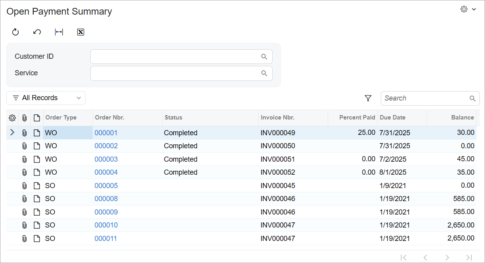
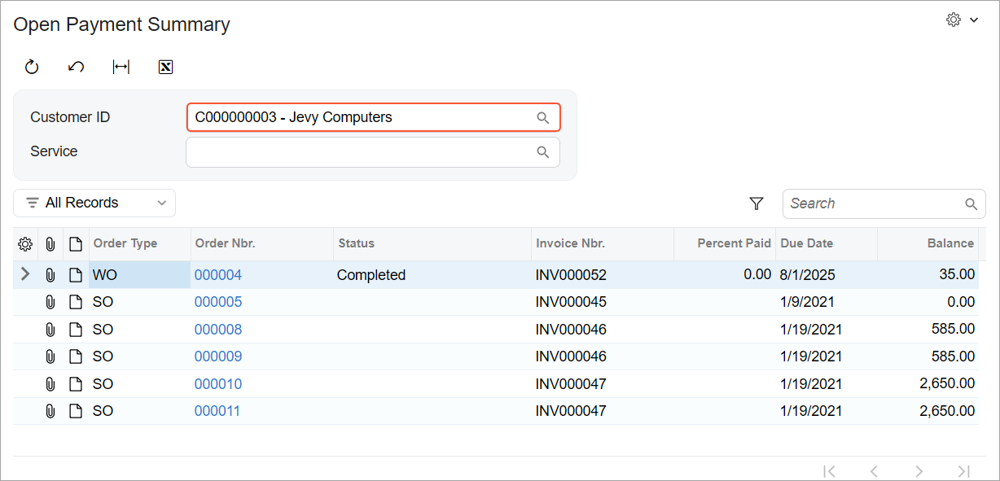

# Data View Delegates:To Add a Filtering Query Dynamically {#_a5fc2e9a-16c1-4486-abb3-216100466b37 .task}

This activity will walk you through the process of dynamically adding a filtering query in code for an inquiry form.

## Story { .section}

Suppose that you need to display both repair work orders and sales orders on the Open Payment Summary \(RS401000\) inquiry form. **You cannot use a single BQL query of a data view to implement the displaying of two different types of entities on a single form**. You need to compose a query for the form dynamically in code rather than specify the query in the definition of a data view.

## Process Overview { .section}

In this activity, you will dynamically add a filtering query in code for the Open Payment Summary \(RS401000\) inquiry form by performing the following steps:

1.  Adding a new field to the grid of the inquiry form to indicate whether the record is a repair work order or a sales order
2.  Defining the data view delegate to dynamically add a filtering query on the inquiry form
3.  Testing the dynamically added query on the inquiry form

## System Preparation { .section}

Before you begin performing the steps of this activity, do the following:

1.  Prepare an Acumatica ERP instance by performing the [Test Instance for Customization: To Deploy an Instance with a Custom Form that Implements a Workflow](CodeCustomization_PrepareInstance_Activity_DeployInstanceT240.md) prerequisite activity.
2.  Complete the steps described in the following prerequisite activities:
    1.  [Inquiry Forms: To Set Up an Inquiry Form](../DeveloperGuide/UIDev_InquiryForm_Activity_SetupForm.md)
    2.  [Inquiry Forms: To Create the UI of an Inquiry Form with Only a Grid](../DeveloperGuide/UIDev_InquiryForm_Activity_UI.md)
    3.  [Filtering Parameters: To Add a Filter for an Inquiry Form](../DeveloperGuide/UIDev_FilteringParameters_Activity_ConfigureFilter.md)

## Step 1: Adding a New Column to the Filtered Results { .section}

To distinguish between the sales orders and repair work orders that are listed on the Open Payment Summary \(RS401000\) form, you need to add a new column to the grid. This column will contain the identifier of the order type: *SO* if the order in the row is a sales order; and *WO* if the order in the row is a repair work order. To add this new column, do the following:

1.  In the `Constants.cs` file, add the class, as shown below.

    ```language-csharp
        public static class OrderTypeConstants
        {
            public const string SalesOrder = "SO";
            public const string WorkOrder = "WO";
        }
    ```

2.  In the `Messages.cs` file, add the following strings to the `Messages` class.

    ```language-csharp
            // Order types
            public const string SalesOrder = "SO";
            public const string WorkOrder = "WO";
    ```

3.  Add the following field to the `RSSVWorkOrderToPay` DAC.

    ```language-csharp
            #region OrderType
            [PXString(IsKey = true)]
            [PXUIField(DisplayName = "Order Type")]
            [PXUnboundDefault(OrderTypeConstants.WorkOrder)]
            [PXStringList(
              new string[]
              {
                  OrderTypeConstants.SalesOrder,
                  OrderTypeConstants.WorkOrder
              },
              new string[]
              {
                  Messages.SalesOrder,
                  Messages.WorkOrder
              })]
            public virtual string? OrderType { get; set; }
            public abstract class orderType :
                PX.Data.BQL.BqlString.Field<orderType>
            { }
            #endregion
    ```

4.  Build the project.
5.  In the `RS401000.ts` file, add the field indicated in the following code before the `OrderNbr` field.

    ```language-javascript
    	OrderType: PXFieldState;
    ```

    Because you’ve added the field to the view class for the grid, you don’t need to edit the HTML file of the form. By default, all fields specified in the data view for the grid are displayed in the table on the form.

6.  Publish the customization project.

## Step 2: Defining the Data View Delegate { .section}

To display both sales orders and repair work orders in one grid, you need to define a data view delegate in which you use two separate queries: a query to select sales orders, and a query to select repair work orders. To define this data view delegate, do the following:

1.  To compose a query that selects the sales orders and the invoices created for these sales orders, learn the names of the DACs that you’ll use in the query.

    In Acumatica ERP, an invoice cannot be created directly for a sales order; a user first creates a shipment and then creates an invoice for the shipment. The invoice number is stored in the shipment record. Therefore, you need to use the DAC that contains information about shipments. To learn the DAC name, do the following:

    1.  In Acumatica ERP, open the [Sales Orders](../UserGuide/SO_30_10_00.md) \(SO301000\) form.
    2.  Open the **Shipments** tab, which contains information about shipments and the corresponding invoices.
    3.  On the Settings menu, click **Element Inspector** and then click the **Invoice Nbr.** column.

        In the **Element Properties** dialog box, which opens, note that the DAC name is `SOOrderShipment` and that the field name of the **Invoice Nbr.** column is `InvoiceNbr`.

2.  Use the **DAC Schema Browser** or open the source code of the `SOOrderShipment` DAC to investigate its fields. You can see that the DAC contains both the sales order number \(in the `OrderNbr` field\) and the invoice number \(in the `InvoiceNbr` field\). You will use this information later to construct a fluent BQL statement.
3.  In the `RSSVPaymentPlanInq` graph, define a method \(as shown in the following code\) that converts an object of the `SOOrderShipment` DAC to an object of the `RSSVWorkOrderToPay` DAC.

    ```language-csharp
            public static RSSVWorkOrderToPay ToRSSVWorkOrderToPay
                (SOOrderShipment shipment) =>
            new RSSVWorkOrderToPay
            {
                OrderNbr = shipment.OrderNbr,
                InvoiceNbr = shipment.InvoiceNbr
            };
    ```

4.  Add the following delegate method. The method has the same name as the data view, except that it uses a different case for the first letter.

    ```
            protected virtual IEnumerable detailsView()
            {
                PXDelegateResult delegResult = new PXDelegateResult
                {
                    IsResultFiltered = true,
                    IsResultTruncated = true,
                    IsResultSorted = true
                };
    
                var workOrderSelect = new
                    SelectFrom<RSSVWorkOrderToPay>.
                    InnerJoin<ARInvoice>.On<
                        ARInvoice.refNbr.IsEqual<RSSVWorkOrderToPay.invoiceNbr>>.
                    Where<
                        RSSVWorkOrderToPay.status.IsNotEqual<
                            RSSVWorkOrderEntry_Workflow.States.paid>.
                        And<RSSVWorkOrderToPayFilter.customerID.FromCurrent.IsNull.
                              Or<RSSVWorkOrderToPay.customerID.IsEqual<
                                   RSSVWorkOrderToPayFilter.customerID.FromCurrent>>>.
                        And<RSSVWorkOrderToPayFilter.serviceID.FromCurrent.IsNull.
                              Or<RSSVWorkOrderToPay.serviceID.IsEqual<
                                   RSSVWorkOrderToPayFilter.serviceID.FromCurrent>>>>.
                    View.ReadOnly(this);
    
                var workOrders = workOrderSelect.SelectWithViewContext();
                delegResult.AddRange(workOrders);
    
                var sorderSelect = new
                    SelectFrom<SOOrderShipment>.
                    InnerJoin<ARInvoice>.On<
                        ARInvoice.refNbr.IsEqual<SOOrderShipment.invoiceNbr>>.
                    Where<
                        RSSVWorkOrderToPayFilter.customerID.FromCurrent.IsNull.
                        Or<SOOrderShipment.customerID.IsEqual<
                             RSSVWorkOrderToPayFilter.customerID.FromCurrent>>>.
                    View.ReadOnly(this);
    
                var sorders = sorderSelect.SelectWithViewContext();
                foreach (PXResult<SOOrderShipment, ARInvoice> order in sorders)
                {
                    SOOrderShipment soshipment = order;
                    ARInvoice invoice = order;
                    RSSVWorkOrderToPay workOrder = ToRSSVWorkOrderToPay(soshipment);
                    workOrder.OrderType = OrderTypeConstants.SalesOrder;
                    var result = new PXResult<RSSVWorkOrderToPay, ARInvoice>(
                        workOrder, invoice);
                    delegResult.Add(result);
                }
    
                return delegResult;
            }
    ```

    In the code above, you have used the SelectWithViewContext method to select work orders and information about sales orders from shipments. You’ve returned the result by using a PXDelegateResult object with the IsResultFiltered, IsResultTruncated, and IsResultSorted properties set to *true*.

5.  Add the required `using` directives, which are shown in the following code.

    ```language-csharp
    using PX.Objects.SO;
    using System.Collections;
    ```

6.  Build the project.

## Step 3: Testing the Dynamically Added Filter { .section}

To test the dynamically added filter on the Open Payment Summary \(RS401000\) form, do the following:

1.  In Acumatica ERP, open the Open Payment Summary form.

    The form should list both repair work orders and sales orders, as shown in the **Order Type** column \(shown below\).

    

2.  In the **Customer ID** box, select the *C000000003* customer.

    The results should look as shown below.

    


**Parent topic:**[Filtering Records Dynamically with Data View Delegates](../StudioDeveloperGuide/CodeCustomization_DataViewDelegates_Mapref.md)

