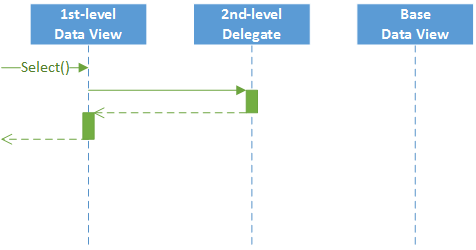
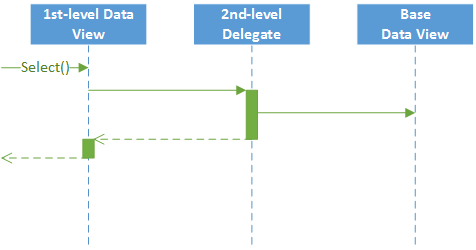
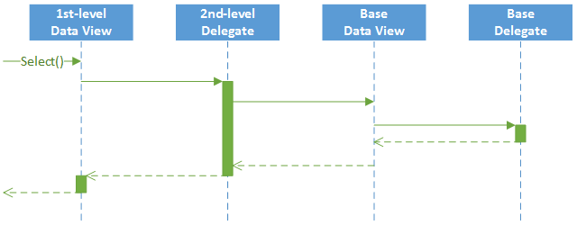

# Data View Delegates: Customization of a Data View {#_b1faf924-c742-4eb2-9a88-0fe299cf6137 .concept}

The platform provides a way to alter or extend the data views defined in a graph.

**Tip:** A data view may contain a delegate, which is an optional graph method that executes when the data view is requested. Every data view is represented by the PXView object and placed in the *Views* collection of the appropriate graph. To construct an instance of the PXView class, you use a PXSelect BQL expression and an optional delegate from the highest-level extension discovered.

Suppose that you’ve declared the Objects data view within the base graph, as shown below.

```language-csharp
public class BaseGraph : PXGraph<BaseGraph, DAC>
{
    public PXSelect<DAC> Objects;
}
```

You can alter a data view within a graph extension in the following ways, which are described in the remainder of this topic:

-   By altering the data view within a graph extension
-   By declaring or altering the data view delegate in a graph extension

## By Altering the Data View Within a Graph Extension { .section}

A data view that is redeclared within a graph extension replaces the base data view in the *Views* collection of the graph instance. Consider the following example of a first-level graph extension.

```language-csharp
public class BaseGraphExt : PXGraphExtension<BaseGraph>
{
    public PXSelectOrderBy<DAC, 
               OrderBy<Asc<DAC.field>>> Objects;
}
```

The *Views* collection of a graph instance contains the PXView object, which uses the Objects data view declared within the first-level extension instead of the data view declared within the base graph.

**Attention:** A data view redeclared within a graph extension completely replaces the base data view within the *Views* collection of a graph instance, including all attributes attached to the data view declared within the base graph. You can either attach the same set of attributes to the data view or completely redeclare the attributes.

## By Declaring or Altering the Data View Delegate in a Graph Extension { .section}

The new delegate is attached to the corresponding data view. Consider the following example of a second-level graph extension.

```language-csharp
public class BaseGraphExtOnExt : PXGraphExtension<BaseGraphExt, BaseGraph>
{
    protected IEnumerable objects()
    {
        return PXSelect<DAC>.Select(Base);
    }
}
```

The *Views* collection of a graph instance contains the PXView object, which uses the Objects data view declared within the first-level extension, with the objects\(\) delegate declared within the second-level extension \(see the diagram below\).



To query a data view declared within the base graph or a lower-level extension from the data view delegate, you should redeclare the data view within a graph extension. You do not need to redeclare a data member when it isn’t meant to be used from the data view delegate. Consider the following example of a second-level graph extension.

```language-csharp
public class BaseGraphExtOnExt : PXGraphExtension<BaseGraphExt, BaseGraph>
{
    protected IEnumerable objects()
    {
        return Base.Objects.Select();
    }
}
```

The new delegate queries the data view declared within the base graph. Having redeclared the data view within the first-level extension, you prevent the data view execution from an infinite loop \(see the following diagram\).



**Attention:** If a data view declared within the base graph contains a delegate, this delegate also gets invoked when the data view is queried from the new delegate \(see the following diagram\).



**Parent topic:**[Filtering Records Dynamically with Data View Delegates](../StudioDeveloperGuide/CodeCustomization_DataViewDelegates_Mapref.md)

