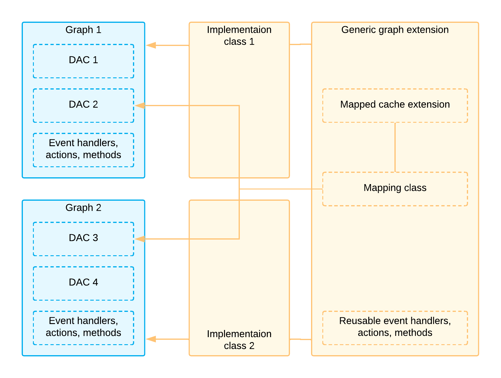
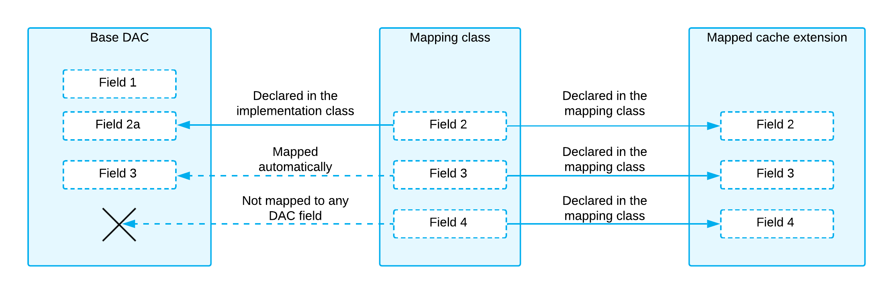

# Generic Graph Extensions: General Information {#_bbc04253-7686-41dd-898b-aca47c1c6789 .concept}

Suppose that you want to use the same business logic in multiple places in your application—that is, you need to insert the logic in at least two graphs. The graphs operate with data in the data access classes \(DACs\) and implement business logic through event handlers, actions, and other methods.

You can encapsulate the business logic that you want to reuse in a *generic graph extension*, which is a graph extension that doesn’t relate to any particular graph and can be used with any base graph.

## Applicable Scenarios { .section}

-   You want to reuse logic that’s implemented in Acumatica ERP, such as multicurrency functionality, on a form that you’re creating.
-   You’re implementing business logic and want to use it in multiple places in your application.

## Implementation of Generic Graph Extensions { .section}

A generic graph extension works with data by using the *mapped cache extensions*, which are cache extensions that aren’t bound to any particular DAC and can extend any DAC.

To connect the mapped cache extensions to a particular DAC, you use a *mapping class*, which maps the fields of a mapped cache extension to the fields of a DAC. To connect the generic graph extension to a particular base graph, in the base graph, you define an *implementation class*, which inherits the generic graph extension.

In the following diagram, yellow rectangles represent the classes you need to implement to reuse the business logic.



These classes are described in detail in the sections below. \(For details on the implementation of the classes, see [To Implement Reusable Business Logic](BL__how_Create_Reusable_Logic.md#) and [To Insert Reusable Business Logic That Has Already Been Declared](BL__how_Insert_Reusable_Business_Logic.md#).\)

## Mapped Cache Extension {#_efcb1dec-e793-4a88-b333-e647c6ff2b5e .section}

A mapped cache extension is an analog of a data access class \(DAC\) for a generic graph extension. In the mapped cache extension, you include the main fields that are used in the reusable business logic implementation. You map the fields of the mapped cache extension to the fields of a base DAC by using the mapping class, which is described in the next section.

The mapped cache extension can also include fields that aren’t mapped to any base DAC fields. \(For details, see [Mapped Cache Extensions and the Application Database](CodeCustomization_GenericExtension_HowItWorks.md#_e6b5f118-69f6-49fe-b41b-7091f10e00fc).\)

The class of a mapped cache extension inherits from the PXMappedCacheExtension `abstract` class, which derives from PXCacheExtension and IBqlTable.

The declaration of a field of a mapped cache extension includes two required members, which are the same as the required members of a DAC field. For details about the declaration, see [Data Access Classes in Fluent BQL](AD__con_DACs_in_FBQL.md).

**Tip:** The system applies the [PXMergeAttributes](https://help.acumatica.com/Help?ScreenId=ShowWiki&pageid=dce254b6-4fff-887a-4d0c-914284b2ad8b) attribute with MergeMethod.Merge to each field of a mapped cache extension automatically. If you define the PXMergeAttributes attribute for a field of a mapped cache extension explicitly, the explicitly defined attribute overrides the automatically defined one. You can also define any other attributes for the property field of the mapped cache extension, or not define attributes at all.

The following code shows an example of a mapped cache extension.

```language-csharp
//Mapped cache extension
public class Document : PXMappedCacheExtension
{
  //BAccountID field
  public abstract class bAccountID : PX.Data.BQL.BqlInt.Field<bAccountID> { }
  {
  }
  protected Int32? _BAccountID;

  public virtual Int32? BAccountID
  {
    get
    {
      return _BAccountID;
    }
    set
    {
      _BAccountID = value;
    }
  }

  //CuryID field
  public abstract class curyID : PX.Data.BQL.BqlString.Field<curyID> { }
  {
  }
  protected String _CuryID;

  public virtual String CuryID
  {
    get
    {
      return _CuryID;
    }
    set
    {
      _CuryID = value;
    }
  }

  ...
}
```

## Mapping Class {#_07af458f-a094-4b51-8859-a8204ccb196e .section}

A mapping class is a `protected` class that defines the mapping between the fields of a mapped cache extension and the fields of a DAC. In a generic graph extension, you declare a mapping class for each mapped cache extension that you need to use in the reusable logic implementation.

A mapping class implements the [IBqlMapping](https://help.acumatica.com/(W(22))/Help?ScreenId=ShowWiki&pageid=b13ff4d1-0cf4-b110-5f50-fe4e232a763c) interface, which has the following two properties:

-   Extension: The mapped cache extension
-   Table: The DAC to which the extension is mapped

In the declaration of the mapping class, you also include declarations of the properties for each field of the mapped cache extension that you want to map to a field of the DAC, as the following code shows.

```language-csharp
//A mapping class
protected class DocumentMapping : IBqlMapping
{
  public Type Extension => typeof(Document);
  protected Type _table;
  public Type Table => _table;

  public DocumentMapping(Type table)
  {
    _table = table;
  }
  public Type BAccountID = typeof(Document.bAccountID);
  public Type CuryInfoID = typeof(Document.curyInfoID);
  public Type CuryID = typeof(Document.curyID);
  public Type DocumentDate = typeof(Document.documentDate);
}
```

The DAC fields are mapped as follows:

-   If the name of a property field of the DAC is the same as the name of the mapping class property, the DAC field will be automatically mapped to the field of the mapped cache extension by the implementation class \(which is described below\).
-   If the name of a property field of the DAC differs from the name of the mapping class field, you redefine the mapping manually in the implementation class.
-   If no field in the DAC has the name of the mapping class field and no mapping is defined in the implementation class, the field of the mapped cache extension isn’t mapped to any base DAC field, as shown below.



## Generic Graph Extension { .section}

A generic graph extension is a `public abstract` class encapsulating business logic that can be used in multiple places of an Acumatica Framework-based application. The class inherits from the PXGraphExtension&lt;TGraph&gt; class and can include multiple base DACs as their type parameters.

In the generic graph extension, you declare the following items:

-   The mapped cache extensions.
-   The mapping classes.
-   The `protected abstract` methods that return the mapping classes. You have to override these methods in the implementation class.
-   The views that can have either a mapping-based declaration or a standard declaration. You declare a mapping-based view by using the PXSelectExtension&lt;Table&gt; class.
-   The event handlers, actions, and other methods.

The following code shows an example of a generic graph extension. Notice that the code includes simplified versions of the generic graph extension, which have fewer type parameters.

```language-csharp
// A generic graph extension
public abstract partial class SalesPriceGraph<
    TGraph, TDocument, TDetailOpt, TPriceClassSourceOpt> : 
    PXGraphExtension<TGraph>
        where TGraph : PXGraph
        where TDocument : class, IBqlTable, new()
        where TDetailOpt : class, IBqlTable
        where TPriceClassSourceOpt : class, IBqlTable
{
    // Mapped cache extensions
    public class Document : PXMappedCacheExtension
    public class Detail : PXMappedCacheExtension
    public class PriceClassSource : PXMappedCacheExtension

    // Mapping classes
    protected class DocumentMapping : IBqlMapping
    protected class DetailMapping : IBqlMapping
    protected class PriceClassSourceMapping : IBqlMapping
}

// Simplified versions of the generic graph extension
public abstract class SalesPriceGraph<TGraph, TPrimary> : 
    SalesPriceGraph<TGraph, TPrimary, IBqlTable, IBqlTable>
    where TGraph : PXGraph
    where TPrimary : class, IBqlTable, new()
{ }

public abstract class SalesPriceGraph<TGraph, TDocument, TDetail> : 
    SalesPriceGraph<TGraph, TDocument, TDetail, IBqlTable>
    where TGraph : PXGraph
    where TDocument : class, IBqlTable, new()
    where TDetail : class, IBqlTable, new()
{ }
```

## Implementation Class { .section}

An implementation class defines the implementation of a generic graph extension for a particular graph. You declare the implementation class as a class that derives from the generic graph extension class with the following type parameters:

-   The base graph to which you add reusable logic
-   The main DAC of the primary data view of the base graph
-   Other DACs that correspond to the type parameters of the generic graph extension

In this class, you can override the mapping defined by the mapping class, override other methods of the base class, and insert your own views, methods, and event handlers, as the following code shows.

```language-csharp
public class MultiCurrency : MultiCurrencyGraph<OpportunityMaint, CROpportunity>
{   
  protected override DocumentMapping GetDocumentMapping()
  {
    return new DocumentMapping(typeof(CROpportunity)) 
    {
      DocumentDate =  typeof(CROpportunity.closeDate)
    };
  }  

  protected override CurySourceMapping GetCurySourceMapping()
  {
    return new CurySourceMapping(typeof(Customer));
  }

  public PXSelect<CRSetup> crCurrency;
  protected PXSelectExtension<CurySource> SourceSetup => 
   new PXSelectExtension<CurySource>(crCurrency);

  protected virtual CurySourceMapping GetSourceSetupMapping()
  { 
    return new CurySourceMapping(typeof(CRSetup)) 
    {
      CuryID = typeof(CRSetup.defaultCuryID), 
       CuryRateTypeID = typeof(CRSetup.defaultRateTypeID)
    };        
  }

  protected override CurySource CurrentSourceSelect()
  {
    ...
  }
}
```

You can define multiple implementation classes in one graph as follows \(shown in the code below\):

-   In the `SalesPrice` implementation class, you map the Detail mapped cache extension to the `RSSVOrderActual` DAC.
-   In the `SalesPriceActual` implementation class, you map the Detail mapped cache extension to the `RSSVOrderDetail` DAC.

```language-csharp
public abstract class SalesPriceWithoutDetail<TDetail> : 
    SalesPriceGraph<RSSVOrderEntry, RSSVOrder, TDetail>
    where TDetail : class, IBqlTable, new()
{
    #region Initialization

    protected override DocumentMapping GetDocumentMapping()
    {
        return new DocumentMapping(typeof(RSSVOrder))
        {
            BAccountID = typeof(RSSVOrder.customerID),
            DocumentDate = typeof(RSSVOrder.docDate),
        };
    }

    protected override PriceClassSourceMapping GetPriceClassSourceMapping()
    {
        return new PriceClassSourceMapping(typeof(Location))
        {
            PriceClassID = typeof(Location.cPriceClassID)
        };
    }
    #endregion

    protected override void RecalculateMarkup(PXCache sender, Detail row) { }
}

public class SalesPrice : SalesPriceWithoutDetail<RSSVOrderDetail>
{
    public static bool IsActive() => true;

    protected override DetailMapping GetDetailMapping()
    {
        return new DetailMapping(typeof(RSSVOrderDetail))
        {
            LocationID = typeof(RSSVOrderDetail.customerLocationID),
            CuryLineAmount = typeof(RSSVOrderDetail.curyExtPrice),
            Descr = typeof(RSSVOrderDetail.tranDesc),
            Quantity = typeof(RSSVOrderDetail.estimatedQty)
        };
    }
}

public class SalesPriceActual : SalesPriceWithoutDetail<RSSVOrderActual>
{
    public static bool IsActive() => true;

    protected override DetailMapping GetDetailMapping()
    {
        return new DetailMapping(typeof(RSSVOrderActual))
        {
            LocationID = typeof(RSSVOrderActual.customerLocationID),
            CuryLineAmount = typeof(RSSVOrderActual.curyExtPrice),
            Descr = typeof(RSSVOrderActual.description),
            Quantity = typeof(RSSVOrderActual.actualQty),
            CuryUnitCost = typeof(RSSVOrderActual.curyStdCost),
            CuryUnitPrice = typeof(RSSVOrderActual.curyUnitPrice),
        };
    }
}
```

**Parent topic:**[Reusing Business Logic with Generic Graph Extensions](../StudioDeveloperGuide/CodeCustomization_GenericExtension_Mapref.md)

