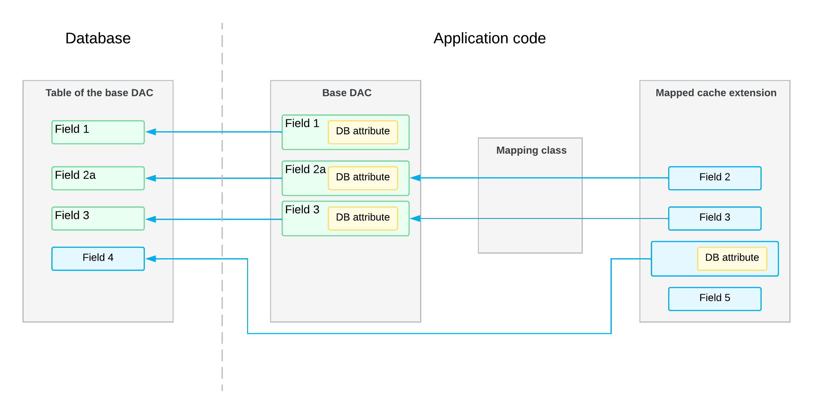
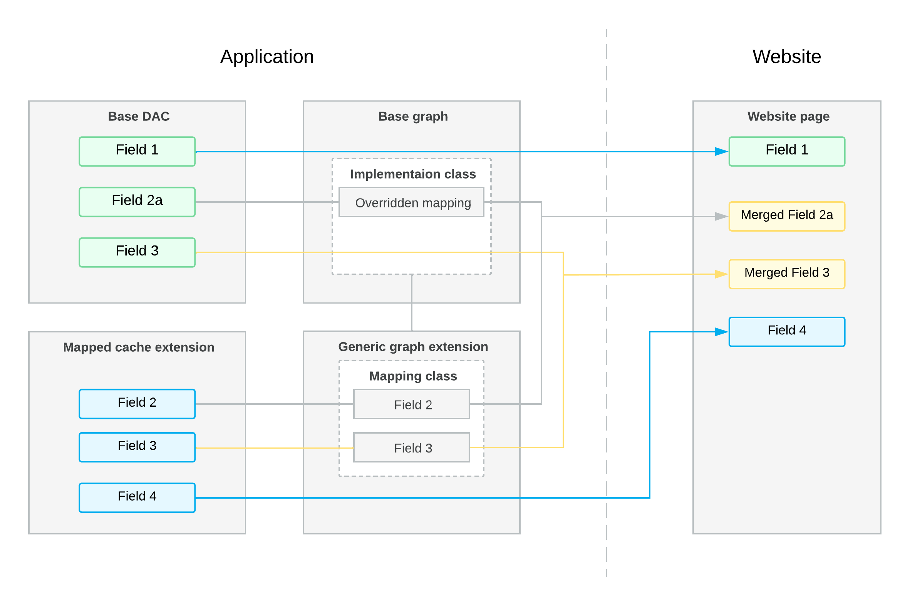
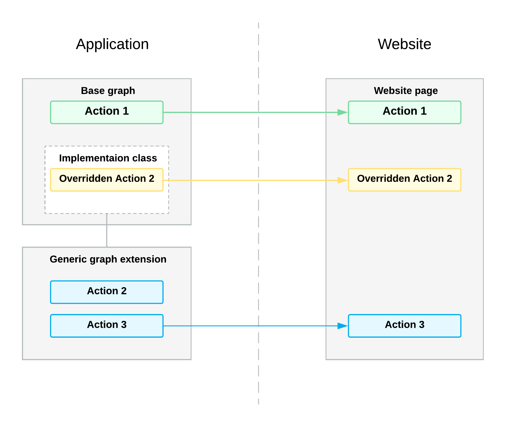
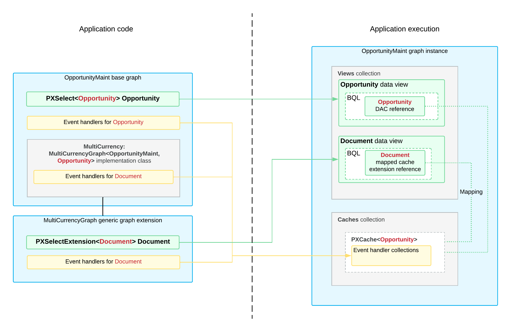

# Generic Graph Extensions: How Generic Graph Extensions Work {#_32b15a19-b9ce-4de7-abb8-2d3b9b3a07e1 .concept}

In this topic, you’ll learn how Acumatica ERP works with generic graph extensions.

## Mapped Cache Extensions and the Application Database {#_e6b5f118-69f6-49fe-b41b-7091f10e00fc .section}

Some fields in a mapped cache extension are mapped to fields in a base data access class \(DAC\). The system uses these extension fields to work with the database columns to which the base DAC fields are bound.

If a mapped cache extension defines database-bound fields \(that is, fields with type attributes derived from the PXDBFieldAttribute class, such as PXDBString\), the base DAC’s database table must include these fields. Thus, the table must include the database-bound fields defined in both the base DAC and the mapped cache extension, as shown below.

## Reusable Business Logic and the Application Website { .section}

If a field of a mapped cache extension is mapped to a field of the base DAC, you can use the merged field—that is, the base field with merged attributes of the base field and the mapped cache extension field—to configure the UI elements of the webpage. If a field of the mapped cache extension isn’t mapped to a base DAC field, you can use the extension field in the webpage, as shown below.

The system automatically adds the actions defined in the base graph, the generic graph extension, and the implementation class to the webpage, as shown below. The implementation class can override the actions declared in the generic graph extension.

## Initialization of a Graph Instance That Includes Reusable Logic { .section}

During the initialization of a graph instance that includes reusable logic, the system adds to the data view collection the data views declared in the base graph, including those declared in the implementation class or the generic graph extension from which the implementation class inherits. The mapping classes define the PXCache&lt;Table&gt; objects in which the mapping-based views keep data records.

The system adds event handlers declared in the base graph, implementation class, and generic graph extension to the collections of event handlers in the corresponding PXCache object. The event handlers defined for the fields or rows of the mapped cache extension are added to the PXCache object of the base DAC type to which the extension is mapped.

The following diagram illustrates the initialization of a sample `OpportunityMaint` graph instance that includes reusable logic.

**Parent topic:**[Reusing Business Logic with Generic Graph Extensions](../StudioDeveloperGuide/CodeCustomization_GenericExtension_Mapref.md)

